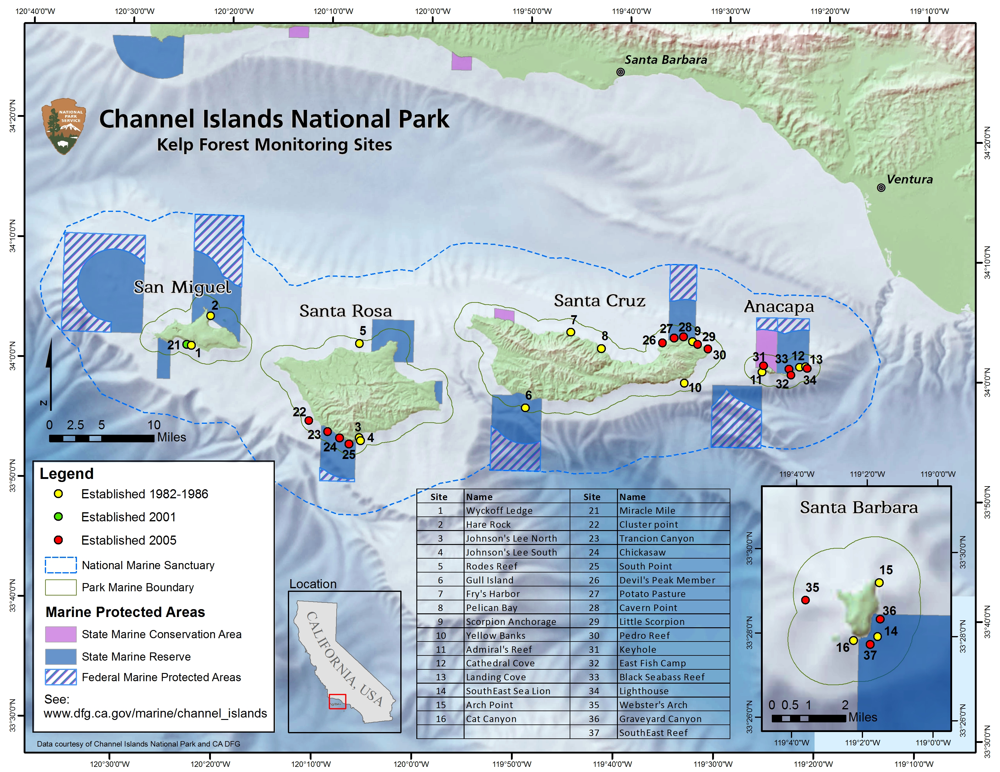
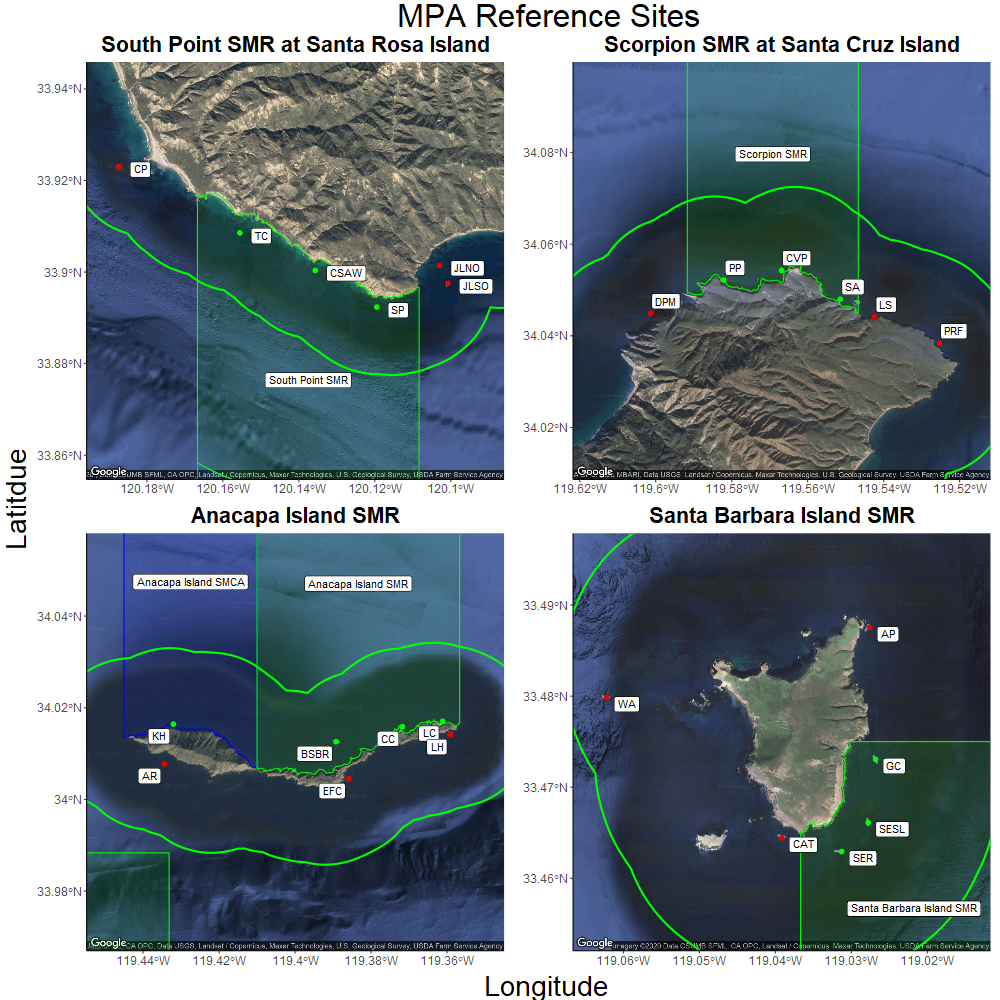

```{r Notes, include=FALSE}

# Should plots be colorblind friendly?

# Green ab biomass?

# non-MPA sites included somehow? Maybe 2 sections in report, an MPA comparison and non-MPA specific. Maybe 2 reports??
# 6/29 beginning to think this is a really good idea since this is turning into an MPA report. I think that's okay since it or/and the blob (and differential outcomes) are literally the most significant thing to consider since 2005 but we might also need to do a general report on all the data (basically take out all the MPA parts and run this again?)

# Not enough rugosity data from finescale bathymetry. Consider doing day trips to Anacapa to conduct rugosity surveys at the 6 reference sites to use with models. David has rugosity data from 90's? not enough for MPA comparison but is a start maybe

# Biomass Data... FIXED... 21 missing values (11 have NHSF so using that for density) for Pisaster in 2018/2019. Need to fill database with zeros (WTF?). Tegula started sampling in 2006 so 5016 MPA values instead of 5040. Lithopoma Handbook data management says 1985 (sporadic sampling) what does that mean? 1 m data missing from only RR and only 1985... also RR is missing data from 1 quad of Patiria in 1985. Need to correct in DB.


# Visibility and surge data for fish counts? Stats?

# Understory algae cover and benthic densities... Does benthic invert density or diversity go down when algae cover goes up?
# need to get understory algae from RPC data

# ENSO data... Temp logger data...

# Note for "Notes"... see commented notes in Data Cleaning below for pending things to update and decisions made

# Think about the potential issues of outputs being FSC by month - IE a survey done in june is going to have a lower FSC than a survey done in september. This is within a season and the coefficients look pretty close, so maybe it's not a big deal, but this sounds like maybe not an apples/apples situation. Discussed this with roommates, thought that averaging out the slopes from may-sept might provide a reasonable "season-level" estimate of biomass, given that the SBC model is calculating NPP based on the notion of mass-specific growth rates, and FSC is broken up into submerged and canopy sections (or combined to whole FSC which are the coefficients used here), so while stipe count doesn't increase by much within a season, the total biomass associated with that individual over the summer's growth greatly increases (obviously submerged portion on canopy forming individuals doesn't change much as depth is fixed, but a larger proportion of the individual is on the surface). I think we can basically "convert it to midsummer" using the average coefficient over the season, allowing for between site comparisons within a year. 6/24/20 I did it this way for now as a placeholder 6/30 we think this is defensible

  # 6/30/2020 is this worth splitting hairs over density vs biomass for inverts? I initially say yes because that indicates some size-structure differences (ie recruitment events if you had a density spike but not much biomass change), but maybe we don't care about this as much for inverts, 
  
  # 6/30/2020 calculate biomass ratios inside/outside MPAs like Josh did for fish in his 2016 talk. One could argue that those plots could replace everything we've done for biomass but that doesn't really show the effects of reserve status and island over time like our current GLMMs and plot sets do.
  
  #Similarly, I want to combine the benthic and fish diversity by site and year with kelp biomass, but I don't calculate those until later.    6/24/20 I added this below fish diversity (since that's the first point running from top down where I have the data I want, even though it feels like it should be up here in the "cleanup")
  # 7/9 Diversity and Community Similarity have consumed us and this has become the main thrust of the first part of the results, as of 7/9 we're joining all the diversity and similarity stuff between benthic and fish.

# Cite ONI DATA
```

```{r Data Cleaning, include=FALSE}
knitr::opts_chunk$set(echo = FALSE)
source("global_markdown.R")

{ # SST Anomaly ONI and PDO  ----
SST_Anomaly_Index <- readr::read_csv("Tidy_Data_Dont_Touch/SST_Anomaly_Index.csv") 

annual_mean_oni <- SST_Anomaly_Index %>% 
      # dplyr::filter(SurveyYear > 2004, Date < glue("{Year_to_Filter_Data_by}-2-1")) %>% 
  dplyr::select(SurveyYear, Mean_ONI_ANOM) %>% 
  # dplyr::mutate(SurveyYear = factor(SurveyYear)) %>%
  dplyr::distinct(SurveyYear, .keep_all = TRUE)

annual_mean_pdo <- SST_Anomaly_Index %>% 
      # dplyr::filter(SurveyYear > 2004, Date < glue("{Year_to_Filter_Data_by}-2-1")) %>% 
  dplyr::select(SurveyYear, Mean_PDO_ANOM) %>% 
  dplyr::distinct(SurveyYear, .keep_all = TRUE)
}

{ # Benthic Site level Counts   ----
  Benthic_Counts_Wide <- readr::read_csv("Tidy_Data_Dont_Touch/Benthic_Counts.csv")
}

{ # Fish Site level Counts ----
  Fish_Counts_Wide <- readr::read_csv("Tidy_Data_Dont_Touch/Fish_Counts.csv")
}

{ # Benthic Plus Fish Counts for Diversity  ----
  All_Community_Counts_Wide <- Fish_Counts_Wide %>%
    dplyr::select(-'Alloclinus holderi', # duplicate fish on quads and RDFC
                  -'Coryphopterus nicholsi', # duplicate fish on quads and RDFC
                  -'Lythrypnus dalli', # duplicate fish on quads and RDFC
                  -'Sebastes') %>% # useless/meaningless category
    full_join(Benthic_Counts_Wide, by = c('IslandCode', 'IslandName', 'SiteCode',
                                   'SiteName','SurveyYear', 'ReserveStatus')) %>%
    mutate(IslandName = gsub(" Island", "", IslandName),
           IslandName = factor(IslandName, levels = MPA_Levels))
}

{ # Benthic Biomass Wide for Models ----
  Benthic_Biomass_Wide <- readr::read_csv("Tidy_Data_Dont_Touch/Benthic_Biomass_Wide.csv")  %>% 
     dplyr::mutate(Date = base::as.Date(base::ISOdate(SurveyYear, 1, 1)))
}

{ # Benthic Biomass Long for Plots  ----
  Benthic_Biomass_Long <- readr::read_csv("Tidy_Data_Dont_Touch/Benthic_Biomass_Long.csv") %>% 
    dplyr::mutate(IslandName = factor(IslandName, levels = MPA_Levels))
}

{ # Fish Biomass Wide for Models   ----
  Fish_Biomass_Wide <- readr::read_csv("Tidy_Data_Dont_Touch/Fish_Biomass_Wide.csv") %>% 
     dplyr::mutate(IslandName = factor(IslandName, levels = MPA_Levels),
                  Date = base::as.Date(base::ISOdate(SurveyYear, 1, 1)))
}

{ # Fish Biomass Long for Plots  ----
  Fish_Biomass_Long <- readr::read_csv("Tidy_Data_Dont_Touch/Fish_Biomass_Long.csv") %>% 
    dplyr::mutate(IslandName = factor(IslandName, levels = MPA_Levels),
                  CommonName = factor(CommonName))
}

{ # RPCs Percent Cover Wide  ----
  RPC_Cover_Wide <- readr::read_csv("Tidy_Data_Dont_Touch/rpcs_Percent_Cover_Wide.csv") 
  
  names(RPC_Cover_Wide) <- str_replace_all(names(RPC_Cover_Wide), c(" " = "_" , "," = "" )) 
}

{ # Shannon Index Calculation   ----
  Shannon_Index <- All_Community_Counts_Wide %>%
    dplyr::select(-IslandCode, -IslandName, -SiteCode, -SiteName, 
                  -SurveyYear, -ReserveStatus) %>%
    vegan::diversity()
  
  Diversity <- dplyr::select(All_Community_Counts_Wide, IslandCode, IslandName,
                             SiteCode, SiteName, SurveyYear, ReserveStatus) %>%
    cbind("ShannonIndex" = Shannon_Index) %>%
    dplyr::mutate(Date = base::as.Date(base::ISOdate(SurveyYear, 1, 1)),
                  ReserveStatus = factor(ReserveStatus),
                  IslandName = factor(IslandName, levels = MPA_Levels),
                  # SurveyYear = factor(as.character(SurveyYear)),
                  IslandName = gsub(" Island", "", IslandName)) %>%
    dplyr::left_join(annual_mean_oni, by = c("SurveyYear"))
}  

{ # 1-Simpsons Index Calculation and Analyses ----
  Simpson_Index <- RPC_Cover_Wide %>%
    dplyr::select(-IslandCode, -IslandName, -SiteCode, -SiteName, 
                  -SurveyYear, -ReserveStatus) %>%
    vegan::diversity(index= "simpson")
  
  Simp_Diversity <- dplyr::select(RPC_Cover_Wide, IslandCode, IslandName,
                             SiteCode, SiteName, SurveyYear, ReserveStatus) %>%
    cbind("SimpsonIndex" = Simpson_Index) %>%
    dplyr::mutate(Date = base::as.Date(base::ISOdate(SurveyYear, 1, 1)),
                  IslandName = gsub(" Island", "", IslandName),
                  IslandName = factor(IslandName, levels = MPA_Levels)) %>%
    dplyr::left_join(annual_mean_oni, by = c("SurveyYear"))
}  

{ # Mixed Data For Random Forest Model     ----
  # (% cover, Count, Biomass, Shannon Index, Simpson Index)
  All_Mixed_Data_Wide <- readr::read_csv("Tidy_Data_Dont_Touch/All_Mixed_Data_Wide.csv") %>% 
    dplyr::left_join(dplyr::select(
      Diversity, SurveyYear, SiteCode, ShannonIndex)) %>% 
    dplyr::left_join(dplyr::select(
      Simp_Diversity, SurveyYear, SiteCode, SimpsonIndex))
}
```

```{r Model Construction and Analyses, include=FALSE}
{ # Diversity Analysis 
  div <- car::Anova(
    test = "F",
    lme4::lmer(
      data = Diversity,
      ShannonIndex ~ ReserveStatus * IslandCode + Mean_ONI_ANOM + (1 | SurveyYear)))
  
  simpsons <- car::Anova(
    test = "F",
    lme4::lmer(
      data = Simp_Diversity,
      (1-SimpsonIndex) ~ ReserveStatus * IslandCode + Mean_ONI_ANOM + (1 | SurveyYear)))
}

{ # Benthic Biomass Analyses   ---- 
  # comparing biomass by MPA status, Island, ONI, and MPA-Island (analogous to diversity models)
  
  fsc <- car::Anova(
    test = "F", 
    lme4::lmer(
      data = Benthic_Biomass_Wide,
      Macrocystis_pyrifera ~ ReserveStatus * IslandCode + Mean_ONI_ANOM + (1 | SurveyYear)))
  
  strpur <- car::Anova(
    test = "F",
    lme4::lmer(
      data = Benthic_Biomass_Wide,
      Strongylocentrotus_purpuratus ~ ReserveStatus * IslandCode + Mean_ONI_ANOM + (1 | SurveyYear)))
  
  mesfra <- car::Anova(
    test = "F",
    lme4::lmer(
      data = Benthic_Biomass_Wide,
      Strongylocentrotus_franciscanus ~ ReserveStatus * IslandCode + Mean_ONI_ANOM + (1 | SurveyYear)))
  
  pisgig <- car::Anova(
    test = "F",
    lme4::lmer(
      data = Benthic_Biomass_Wide,
      Pisaster_giganteus ~ ReserveStatus * IslandCode + Mean_ONI_ANOM + (1 | SurveyYear)))
  
  pychel <- car::Anova(
    test = "F",
    lme4::lmer(
      data = Benthic_Biomass_Wide,
      Pycnopodia_helianthoides ~ ReserveStatus * IslandCode + Mean_ONI_ANOM + (1 | SurveyYear)))
  
  patmin <- car::Anova(
    test = "F",
    lme4::lmer(
      data = Benthic_Biomass_Wide,
      Patiria_miniata ~ ReserveStatus * IslandCode + Mean_ONI_ANOM + (1 | SurveyYear)))
  
  halruf <- car::Anova(
    test = "F",
    lme4::lmer(
      data = Benthic_Biomass_Wide,
      Haliotis_rufescens ~ ReserveStatus * IslandCode + Mean_ONI_ANOM + (1 | SurveyYear)))
   
  tetaur <- car::Anova(
    test = "F",
    lme4::lmer(
      data = Benthic_Biomass_Wide,
      Tethya_aurantia ~ ReserveStatus * IslandCode + Mean_ONI_ANOM + (1 | SurveyYear)))
  
  # cencor <- car::Anova(
  #   test = "F",
  #   lme4::lmer(
  #     data = Benthic_Biomass_Wide,
  #     Centrostephanus_coronatus ~ ReserveStatus * IslandCode + Mean_ONI_ANOM + (1 | SurveyYear)))
  # 
  # lopchi <- car::Anova(
  #   test = "F",
  #   lme4::lmer(
  #     data = Benthic_Biomass_Wide,
  #     Lophogorgia_chilensis ~ ReserveStatus * IslandCode + Mean_ONI_ANOM + (1 | SurveyYear)))
  # 
  # stymon <- car::Anova(
  #   test = "F",
  #   lme4::lmer(
  #     data = Benthic_Biomass_Wide,
  #     Styela_montereyensis ~ ReserveStatus * IslandCode + Mean_ONI_ANOM + (1 | SurveyYear)))
  # 
  # urtlof <- car::Anova(
  #   test = "F",
  #   lme4::lmer(
  #     data = Benthic_Biomass_Wide,
  #     Urticina_lofotensis ~ ReserveStatus * IslandCode + Mean_ONI_ANOM + (1 | SurveyYear)))
}

{ # Fish Biomass Analyses   ---- 
  
  hyprub <- car::Anova(
    test = "F",
    lme4::lmer(
      data = Fish_Biomass_Wide,
      Hypsypops_rubicundus ~ ReserveStatus * IslandCode + Mean_ONI_ANOM + (1 | SurveyYear)))
  
  halsem <- car::Anova(
    test = "F",
    lme4::lmer(
      data = Fish_Biomass_Wide,
      Halichoeres_semicinctus ~ ReserveStatus * IslandCode + Mean_ONI_ANOM + (1 | SurveyYear)))
  
  sempul <- car::Anova(
    test = "F",
    lme4::lmer(
      data = Fish_Biomass_Wide,
      Semicossyphus_pulcher ~ ReserveStatus * IslandCode + Mean_ONI_ANOM + (1 | SurveyYear)))

}

{ # P values for text  ----
  div_MPA_p_val <- round(div$`Pr(>F)`[[1]], 3)
  div_Isl_p_val <- round(div$`Pr(>F)`[[2]], 3)
  div_ONI_p_val <- round(div$`Pr(>F)`[[3]], 3)
  div_MPA_Isl_p_val <- round(div$`Pr(>F)`[[4]], 3)
  
  fsc_MPA_p_val <- round(fsc$`Pr(>F)`[[1]], 3)
  fsc_Isl_p_val <- round(fsc$`Pr(>F)`[[2]], 3)
  fsc_ONI_p_val <- round(fsc$`Pr(>F)`[[3]], 3)
  fsc_MPA_Isl_p_val <- round(fsc$`Pr(>F)`[[4]], 3)
  
  strpur_MPA_p_val <- round(strpur$`Pr(>F)`[[1]], 3)
  strpur_Isl_p_val <- round(strpur$`Pr(>F)`[[2]], 3)
  strpur_ONI_p_val <- round(strpur$`Pr(>F)`[[3]], 3)
  strpur_MPA_Isl_p_val <- round(strpur$`Pr(>F)`[[4]], 3)
  
  mesfra_MPA_p_val <- round(mesfra$`Pr(>F)`[[1]], 3)
  mesfra_Isl_p_val <- round(mesfra$`Pr(>F)`[[2]], 3)
  mesfra_ONI_p_val <- round(mesfra$`Pr(>F)`[[3]], 3)
  mesfra_MPA_Isl_p_val <- round(mesfra$`Pr(>F)`[[4]], 3)
  
  pisgig_MPA_p_val <- round(pisgig$`Pr(>F)`[[1]], 3)
  pisgig_Isl_p_val <- round(pisgig$`Pr(>F)`[[2]], 3)
  pisgig_ONI_p_val <- round(pisgig$`Pr(>F)`[[3]], 3)
  pisgig_MPA_Isl_p_val <- round(pisgig$`Pr(>F)`[[4]], 3)
  
  pychel_MPA_p_val <- round(pychel$`Pr(>F)`[[1]], 3)
  pychel_Isl_p_val <- round(pychel$`Pr(>F)`[[2]], 3)
  pychel_ONI_p_val <- round(pychel$`Pr(>F)`[[3]], 3)
  pychel_MPA_Isl_p_val <- round(pychel$`Pr(>F)`[[4]], 3)
  
  patmin_MPA_p_val <- round(patmin$`Pr(>F)`[[1]], 3)
  patmin_Isl_p_val <- round(patmin$`Pr(>F)`[[2]], 3)
  patmin_ONI_p_val <- round(patmin$`Pr(>F)`[[3]], 3)
  patmin_MPA_Isl_p_val <- round(patmin$`Pr(>F)`[[4]], 3)
  
  halruf_MPA_p_val <- round(halruf$`Pr(>F)`[[1]], 3)
  halruf_Isl_p_val <- round(halruf$`Pr(>F)`[[2]], 3)
  halruf_ONI_p_val <- round(halruf$`Pr(>F)`[[3]], 3)
  halruf_MPA_Isl_p_val <- round(halruf$`Pr(>F)`[[4]], 3)
  
  tetaur_MPA_p_val <- round(tetaur$`Pr(>F)`[[1]], 3)
  tetaur_Isl_p_val <- round(tetaur$`Pr(>F)`[[2]], 3)
  tetaur_ONI_p_val <- round(tetaur$`Pr(>F)`[[3]], 3)
  tetaur_MPA_Isl_p_val <- round(tetaur$`Pr(>F)`[[4]], 3)
  
  hyprub_MPA_p_val <- round(hyprub$`Pr(>F)`[[1]], 3)
  hyprub_Isl_p_val <- round(hyprub$`Pr(>F)`[[2]], 3)
  hyprub_ONI_p_val <- round(hyprub$`Pr(>F)`[[3]], 3)
  hyprub_MPA_Isl_p_val <- round(hyprub$`Pr(>F)`[[4]], 3)
  
  halsem_MPA_p_val <- round(halsem$`Pr(>F)`[[1]], 3)
  halsem_Isl_p_val <- round(halsem$`Pr(>F)`[[2]], 3)
  halsem_ONI_p_val <- round(halsem$`Pr(>F)`[[3]], 3)
  halsem_MPA_Isl_p_val <- round(halsem$`Pr(>F)`[[4]], 3)
  
  sempul_MPA_p_val <- round(sempul$`Pr(>F)`[[1]], 3)
  sempul_Isl_p_val <- round(sempul$`Pr(>F)`[[2]], 3)
  sempul_ONI_p_val <- round(sempul$`Pr(>F)`[[3]], 3)
  sempul_MPA_Isl_p_val <- round(sempul$`Pr(>F)`[[4]], 3)
  
}

```

```{r Random Forest, fig.height=8.5, fig.width=11}
Random_Kelp_Forest <- All_Mixed_Data_Wide %>%
  dplyr::rename("KGBC_YOY" = `Sebastes_atrovirens/carnatus/caurinus/chrysomelas`,
                "OY_YOY" = `Sebastes_serranoides/flavidus`,
                "BG_YOY" = `Sebastes_chrysomelas/carnatus`,
                "Misc_Invert" = `Miscellaneous_Invertebrates_excluding_Ophiothrix_spiculata`) %>%
  dplyr::mutate(SiteCode = factor(SiteCode, levels = siteInfo1$SiteCode),
                IslandCode = factor(IslandCode),
                ReserveStatus = factor(ReserveStatus)) %>% 
  dplyr::select(-SiteName, 
                # -IslandName,
                -IslandCode,
                -SiteCode) 

set.seed(100)
train <- sample(nrow(Random_Kelp_Forest), 
                0.7 * nrow(Random_Kelp_Forest), replace = FALSE)

TrainSet <- Random_Kelp_Forest[train,]
ValidSet <- Random_Kelp_Forest[-train,]

RF_Reserve_Model <- randomForest::randomForest(
  data = Random_Kelp_Forest,
  ReserveStatus ~ ., ntree = 2500, mtry = 8,
  importance = TRUE, proximity = TRUE, keep.forest = TRUE)

# Predicting on train set
predTrain <- predict(RF_Reserve_Model, TrainSet, type = "class")
# Checking classification accuracy
table(predTrain, TrainSet$ReserveStatus) 
# Predicting on Validation set
predValid <- predict(RF_Reserve_Model, ValidSet, type = "class")
# Checking classification accuracy
mean(predValid == ValidSet$ReserveStatus)                    
table(predValid, ValidSet$ReserveStatus)

RF_Reserve_Model
# 
# RF_Importance <- importance(RF_Reserve_Model) %>%
#   as.data.frame() %>% 
#   tibble::rownames_to_column("ScientificName") %>%
#   dplyr::arrange(desc(MeanDecreaseAccuracy))
# Important_Variables <- RF_Importance$ScientificName[1:11] # <== Choose the top number of variables
# 
# for (i in seq_along(Important_Variables)) {
#   a <- partial(RF_Reserve_Model, pred.var = Important_Variables[i], train = Random_Kelp_Forest)
#   p <- plotPartial(a)
#   print(p)
# }
```

```{r RF Error and Importance, fig.height=8.5, fig.width=11}
# plot(RF_Reserve_Model, log="y")
randomForest::varImpPlot(RF_Reserve_Model, n.var = 30)
```

```{r RF Partial Importance, warning=FALSE, message=FALSE, fig.height=11, fig.width=8.5}
RF_Importance <- importance(RF_Reserve_Model) %>%
  as.data.frame() %>%
  tibble::rownames_to_column("ScientificName") %>%
  dplyr::arrange(desc(MeanDecreaseAccuracy)) 

Important_Variables <- RF_Importance$ScientificName[1:30] # <== Choose the top number of variables

Mixed_Data_xRef <- readr::read_csv("Meta_Data/Mixed_Data_xref.csv") %>% 
  dplyr::filter(ScientificName %in% Important_Variables)
q <- 1
for (i in seq_along(Important_Variables)) {
  a <- partial(RF_Reserve_Model, 
               pred.var = Important_Variables[i], 
               train = Random_Kelp_Forest,
               plot = TRUE, rug = TRUE, 
               plot.engine = "ggplot2") +
    labs(title = gsub("_", " ", Important_Variables[i]), 
         x = Mixed_Data_xRef[i, 2], y = NULL) +
    theme_classic() +
    theme(plot.title = element_text(hjust = .5, size = 10),
          axis.title = element_text(size = 9))
  unique_plotname <- paste("PDP_", q, sep = "")
  assign(unique_plotname, a)
  q <- q + 1
}

PDP_Grid_1 <- ggpubr::ggarrange(
  PDP_1, PDP_2, PDP_3,
  PDP_4, PDP_5, PDP_6,
  PDP_7, PDP_8, PDP_9,
  PDP_10, PDP_11, PDP_12,
  PDP_13, PDP_14, PDP_15,
  ncol = 3, nrow = 5, align = "v")

PDP_Grid_2 <- ggpubr::ggarrange(
  PDP_16, PDP_17, PDP_18,
  PDP_19, PDP_20, PDP_21,
  PDP_22, PDP_23, PDP_24,
  PDP_25, PDP_26, PDP_27,
  PDP_28, PDP_29, PDP_30,
  ncol = 3, nrow = 5, align = "v")

PDP_annotated1 <- ggpubr::annotate_figure(
  PDP_Grid_1,
  bottom = ggpubr::text_grob(
    "Lines that trend upwards indicate importance of variable in determining 'inside' reserve status\nLines that trend downwards indicate importance of variable in determining 'outside' reserve status",
    color = "black", size = 11, hjust = 0, x = 0))

PDP_annotated2 <- ggpubr::annotate_figure(
  PDP_Grid_2,
  bottom = ggpubr::text_grob(
    "Lines that trend upwards indicate importance of variable in determining 'inside' reserve status\nLines that trend downwards indicate importance of variable in determining 'outside' reserve status",
    color = "black", size = 11, hjust = 0, x = 0))

print(PDP_annotated1)
print(PDP_annotated2)

```

```{r RF 3D MDS, include=FALSE}
# library(plotly)
# 
# x <- randomForest::MDSplot(
#   RF_Reserve_Model, fac = Random_Kelp_Forest$ReserveStatus,
#   k=3, palette = rep(1, 2),
#   pch = as.numeric(Random_Kelp_Forest$ReserveStatus))
# 
# x <- unlist(x$points) %>%
#   as.data.frame() %>%
#   cbind(dplyr::select(
#     All_Mixed_Data_Wide, SiteCode, SiteName, IslandName, ReserveStatus, SurveyYear))
# 
# fig <-
#   plotly::plot_ly(x, x = ~`Dim 1`, y = ~`Dim 2`, z = ~`Dim 3`,
#                        frame = ~SurveyYear, text = ~SiteName, hoverinfo = "text",
#                        color = ~IslandName, colors = Island_Colors) %>%
#   plotly::add_markers(symbol = ~ReserveStatus,
#                       symbols = c('Inside' = "cross-open", 'Outside' = "square")) %>%
#   plotly::add_text(text = ~SiteCode) %>%
#   plotly::layout(scene = list(xaxis = list(title = 'Dim 1'),
#                               yaxis = list(title = 'Dim 2'),
#                               zaxis = list(title = 'Dim 3'))) %>%
#   plotly::animation_opts(1500, easing = "linear")
# fig
```

```{r RF MDS animation, include=FALSE, fig.height=8.5, fig.width=11}
# library(gganimate)
# library(gifski)
# 
# rf.nMDS <- ggplot(data = x, aes(x = `Dim 1`, y = `Dim 2`)) +
#   geom_point(size = 4, aes(shape = ReserveStatus, color = IslandName)) +
#   scale_colour_manual(values = Island_Colors) +
#   labs(color = 'Island') +
#   ggnewscale::new_scale_color() +
#   geom_text(size = 4, vjust = 2, aes(label = SiteCode)) +
#   stat_stars(aes(color = ReserveStatus)) +
#   stat_ellipse(aes(color = ReserveStatus), type = "t", level = .92 ) +
#   scale_colour_manual(values = Island_Colors) +
#   coord_fixed() +
#   coord_flip() +
#   transition_time(SurveyYear) +
#   view_follow() +
#   theme_bw() +
#   labs(color = "Reserve Status",
#        title = "Year: {frame_time}",
#        shape = "Reserve Status") +
#   theme(plot.title = element_text(size = 18, hjust = 0.5),
#         axis.text = element_blank(),
#         axis.ticks = element_blank(),
#         axis.title = element_blank(),
#         panel.background = element_blank(),
#         panel.grid.major = element_blank(),
#         panel.grid.minor = element_blank(),
#         plot.background = element_blank(),
#         legend.title = element_text(size=14, hjust = 0),
#         legend.text = element_text(size=12, hjust = 0),
#         aspect.ratio=1)
# animate(rf.nMDS, width = 1000, height = 800, nframes = 600, fps = 10)
# anim_save(filename = "Animations/rf_reserve_nMDS.gif", animation = last_animation())
```

# Figures
Page 

# Tables
Page

# Appendicies
Page

# Executive Summary

Channel Islands National Park (CINP) has conducted long-term ecological monitoring of the kelp forests around San Miguel, Santa Rosa, Santa Cruz, Anacapa and Santa Barbara Islands since 1982. The original permanent transects were established at 16 sites between 1981 and 1986 with the first sampling beginning in 1982. An additional site, Miracle Mile, was established at San Miguel Island in 2001 by a commercial fisherman with assistance from the park. Miracle Mile was partially monitored from 2002-2004, and then fully monitored (using all KFM protocols) since 2005. In 2005, 16 additional permanent sites were established to collect baseline data from inside and adjacent to four marine reserves that were established in 2003. Each reserve has 6 reference sites, three inside the reserve and 3 outside and adjacent to the reserve. This gives a total of 24 sampling locations at 4 of the 5 park islands that can be used to analyze the effects of marine reserves. Sampling results from these 24 sites mentioned above are included in this report. Funding for the Kelp Forest Monitoring Program (KFM) has been provided by the National Park Service (NPS). 

The 2005-2019 monitoring efforts utilized BLANK days of vessel time to conduct BLANK dives for a total of BLANK hours of bottom time. Population dynamics of a select list of 71 “indicator species” (consisting of taxa or categories of algae, fish, and invertebrates) were measured at the 33 permanent sites. In addition, population dynamics were measured for all additional species of fish observed at the sites during the roving diver fish count. Survey techniques follow the CINP Kelp Forest Monitoring Protocol Handbooks (Davis et al., 1997, and Kushner and Sprague, I/P). The techniques utilize SCUBA and surface-supplied-air to conduct the following monitoring protocols: 1 m² quadrats, 5 m² quadrats, band transects, random point contacts, fish transects, roving diver fish counts, video transects, size frequency measurements, and artificial recruitment modules. Hourly temperature data were collected using remote temperature loggers at 32 sites, the exception being Miracle Mile where there is no temperature logger installed. 

This community trend report was compiled using a subset of the data collected from a subset of the monitoring protocols. This report contains a summary of the relevant survey methods, the analytical methods used, the results of analysis, and a discussion of the results.

The status of kelp forests... inside trends vs outside trends... SSWD... Urchin disease

2005-2019 broad oceanographic and meteorological trends... ONI, PDO, blob, temp loggers, other

```{r ONI plot, message=FALSE, warning=FALSE, fig.height=4, fig.width=8.5}
oni <- read.table( # Read in  ONI to be added to all data
      "https://origin.cpc.ncep.noaa.gov/products/analysis_monitoring/ensostuff/detrend.nino34.ascii.txt",
      header = T) %>%
      dplyr::mutate(Date = as.Date(ISOdate(YR, MON, 1)),
                    DateStart = as.Date(ISOdate(YR, MON, 1)),
                    DateEnd = ceiling_date(DateStart, "month")) %>%
      dplyr::rename(ONI_ANOM = ANOM,
                    Month = MON,
                    SurveyYear = YR)
ggplot(oni, aes(x = Date, y = ONI_ANOM, fill = ONI_ANOM)) +
  geom_hline(size = 1, yintercept = c(-2, -1.5, -1, -.5, 0, .5, 1, 1.5, 2, 2.5),
             color = c("blue4", "blue","deepskyblue2", "white", "black", 
                       "white", "gold2", "orange2", "red", "red4")) +
  geom_bar(stat = "identity") +
  # geom_smooth(se = FALSE, span = 0.75, color = "deeppink") +
  scale_x_date(date_labels = "%Y", date_breaks = "2 year",
               expand = c(0.01,0)) +
  labs(title = "Oceanic Nino Index (ONI)",
       subtitle = "Nino Region 3.4 (5°N-5°S,120°-170°W)",
       fill = "Anomaly Intensity (°C)",
       x = NULL, y = "Sea Surface Temperature Anomaly (°C)") +
  scale_y_continuous(
    breaks = c(-2, -1.5, -1, -.5, 0, .5, 1, 1.5, 2, 2.5),
    labels = c(-2, -1.5, -1, -.5, 0, .5, 1, 1.5, 2, 2.5),
    sec.axis = sec_axis(
      ~. * 1,
      breaks = c(-2, -1.5, -1, -.5, 0, .5, 1, 1.5, 2, 2.5),
      labels = c("-2", "Strong La Nina", "Moderate La Nina", 
                 "Weak La Nina", "Neutral", "Weak El Nino",
                 "Moderate El Nino", "Strong El Nino", 
                 "Very Strong El Nino", "2.5"))) +
  scale_fill_gradient2(low = "blue", high = "red", mid = "white", midpoint = 0) +
  geom_vline(size = 1, xintercept = as.Date("1978-01-01", format = "%Y-%m-%d")) +
  geom_label(x = as.Date("1978-01-01", format = "%Y-%m-%d"),
             y = Inf, aes(label = "Old MPA"),
             hjust = 1, vjust = 1, size = 3, inherit.aes = FALSE) +
  geom_vline(size = 1, xintercept = as.Date("1982-01-01", format = "%Y-%m-%d")) +
  geom_label(x = as.Date("1982-01-01", format = "%Y-%m-%d"),
             y = Inf, aes(label = "KFM begins"),
             hjust = 0, vjust = 1, size = 3, inherit.aes = FALSE) +
  geom_vline(size = 1, xintercept = as.Date("2003-01-01", format = "%Y-%m-%d")) +
  geom_label(x = as.Date("2003-01-01", format = "%Y-%m-%d"),
             y = Inf, aes(label = "New MPAs"),
             hjust = 1, vjust = 1, size = 3, inherit.aes = FALSE) +
  geom_vline(size = 1, xintercept = as.Date("2005-01-01", format = "%Y-%m-%d")) +
  geom_label(x = as.Date("2005-01-01", format = "%Y-%m-%d"),
             y = Inf, aes(label = "New Sites"),
             hjust = 0, vjust = 1, size = 3, inherit.aes = FALSE) +
  theme_dark()+
  theme(legend.position = "none",
        plot.title = element_text(hjust = 0.5, size = 15),
        plot.subtitle = element_text(hjust = 0.5, size = 13),
        axis.title = element_text(size = 12),
        axis.text.y = element_text(angle = 0, size = 10),
        axis.text.x = element_text(angle = 45, hjust = 1, vjust = 1, size = 10),
        panel.grid.major = element_blank(),
        panel.grid.minor = element_blank(),
        axis.line = element_line(colour = "black"))
```

```{r PDO plot, message=FALSE, warning=FALSE, fig.height=4, fig.width=8.5}
pdo <- read.table(
      "https://www.cpc.ncep.noaa.gov/products/GODAS/PDO/pdo_h300_pac_current.txt",
      header = T)  %>%
      dplyr::mutate(Date = as.Date(ISOdate(Year, Month, 1)),
                    DateStart = as.Date(ISOdate(Year, Month, 1)),
                    DateEnd = ceiling_date(DateStart, "month")) %>%
      dplyr::rename(PDO_ANOM = PDO,
                    SurveyYear = Year)
ggplot(pdo, aes(x = Date, y = PDO_ANOM, fill = PDO_ANOM)) +
  geom_hline(size = 1, yintercept = c(-2.5, -2, -1.5, -1, -.5, 0, .5, 1, 1.5, 2, 2.5),
             color = c("darkblue", "blue2", "dodgerblue2","deepskyblue2", "white", "black", 
                       "white", "gold2", "orange2", "red", "red4")) +
  geom_col() +
  geom_smooth(se = FALSE, span = 0.75, color = "deeppink") +
  scale_x_date(date_labels = "%Y", date_breaks = "2 year",
               expand = c(0.01,0)) +
  labs(title = "H300 based Pacific Decadal Oscillation (HPDO)",
       # subtitle = "Nino Region 3.4 (5°N-5°S,120°-170°W)",
       fill = "Anomaly Intensity (°C)",
       x = NULL, y = "Monthly Mean H300 Anomalies") +
  scale_y_continuous(
    breaks = c(-2.5, -2, -1.5, -1, -.5, 0, .5, 1, 1.5, 2, 2.5),
    labels = c(-2.5, -2, -1.5, -1, -.5, 0, .5, 1, 1.5, 2, 2.5),
    ) +
  scale_fill_gradient2(low = "blue", high = "red", mid = "white", midpoint = 0) +
  geom_vline(size = 1, xintercept = as.Date("1978-01-01", format = "%Y-%m-%d")) +
  geom_label(x = as.Date("1978-01-01", format = "%Y-%m-%d"),
             y = Inf, aes(label = "Old MPA"),
             hjust = 1, vjust = 1, size = 3, inherit.aes = FALSE) +
  geom_vline(size = 1, xintercept = as.Date("1982-01-01", format = "%Y-%m-%d")) +
  geom_label(x = as.Date("1982-01-01", format = "%Y-%m-%d"),
             y = Inf, aes(label = "KFM begins"),
             hjust = 0, vjust = 1, size = 3, inherit.aes = FALSE) +
  geom_vline(size = 1, xintercept = as.Date("2003-01-01", format = "%Y-%m-%d")) +
  geom_label(x = as.Date("2003-01-01", format = "%Y-%m-%d"),
             y = Inf, aes(label = "New MPAs"),
             hjust = 1, vjust = 1, size = 3, inherit.aes = FALSE) +
  geom_vline(size = 1, xintercept = as.Date("2005-01-01", format = "%Y-%m-%d")) +
  geom_label(x = as.Date("2005-01-01", format = "%Y-%m-%d"),
             y = Inf, aes(label = "New Sites"),
             hjust = 0, vjust = 1, size = 3, inherit.aes = FALSE) +
  theme_dark()+
  theme(legend.position = "none",
        plot.title = element_text(hjust = 0.5, size = 15),
        plot.subtitle = element_text(hjust = 0.5, size = 13),
        axis.title = element_text(size = 12),
        axis.text.y = element_text(angle = 0, size = 10),
        axis.text.x = element_text(angle = 45, hjust = 1, vjust = 1, size = 10),
        panel.grid.major = element_blank(),
        panel.grid.minor = element_blank(),
        axis.line = element_line(colour = "black"))
```

SR 2005-2019 broad trends...

SC 2005-2019 broad trends...

AN 2005-2019 broad trends...

SB 2005-2019 broad trends...

# Acknowledgments 

Funding for the kelp forest monitoring program for 2005-2019 was entirely provided by the U.S. National Park Service (NPS) with most funding coming from the Stewardship of New Marine Protected Areas and some from the Inventory and Monitoring Program. The monitoring program is conducted in cooperation with the California Department of Fish and Wildlife (CDFW) and the U.S. Department of Commerce, National Oceanographic and Atmospheric Administration (NOAA), Marine Sanctuary Program. 

We are deeply indebted to the many divers who have participated in this program. All volunteer divers were trained and/or certified with other agencies such as NOAA, CDFW, Aquariums and/or Universities. Without this volunteer base of well-trained and qualified divers it would be impossible to conduct this program at its current funding level. We also greatly appreciate the efforts of our boat captains and Park Dive Officers for ensuring that all our operations run safely and successfully. We would like to especially thank our incredible NPS Seasonal Kelp Forest Monitoring Biological Science Technicians.

# List of Acronyms 

| **Acronym** | **Definition** |
|:------|:-----|
| ARM | Artificial Recruitment Module |
| CDFW | California Department of Fish and Wildlife |
| CINMS | Channel Islands National Marine Sanctuary |
| CINP | Channel Islands National Park |
| CPC | Climate Prediction Center |
| ENSO | El Niño-Southern Oscillation | 
| FSC | Foliar Standing Crop | 
| KFM | Kelp Forest Monitoring |
| MPA | Marine Protected Area |
| nMDS | Non-metric Multidimensional Scaling |
| NOAA | National Oceanic and Atmospheric Administration |
| NPS | National Park Service |
| NRPP | Natural Resources Preservation Program |
| PDO | Pacific Decadal Oscillation |
| PISCO | The Partnership for Interdisciplinary Studies of Coastal Oceans |
| ONI | Oceanic Niño Index  |
| RCCA | Reef Check California |
| SBC LTER | Santa Barbara Coastal Term Ecological Research |
| SST | Sea Surface Temperature |
| SSWD | Sea Star Wasting Disease |
| SMCA | State Marine Conservation Area |
| SMR | State Marine Reserve | 
| RPC | Random Point Contact |
| UCSB | University of California, Santa Barbara |

# Introduction

Kelp forests constitute one of the largest, most complex, and most threatened ecosystems in the Channel Islands National Park (CINP). Located at the boundary of two major biogeographical provinces and near unusually persistent upwelling features, the park is endowed with marine ecosystems of exceptional diversity. The five park islands are surrounded by extensive kelp forest habitat that is highly productive and relatively isolated from the mainland making them among the best examples of this important ecosystem in southern California.

The park boundary extends one nautical mile around each of the five islands, including the waters and submerged lands therein. These waters constitute less than 3% of California’s coastal zone, yet they are responsible for about 15% of the State’s coastal fishery harvests (source*). Despite defined fishing seasons, individual size and bag limits, and restricted uses in some areas, there are still no limits on total harvest of fish, lobster, algae, and other marine organisms from park waters. With the impact of harvesting and the threat of chronic and acute pollution from mainland waste disposal and adjacent offshore petroleum development, the potential for major anthropogenic disturbances exacerbated by overfishing of these ecosystems is of great concern. Natural disturbances also play an important role in the park, yet very little information on the long-term dynamics of the system is available. Providing the information required to manage these resources effectively is a challenge, but without the knowledge, there is a risk of losing these resources. Managing and conserving kelp forests requires innovative approaches and a better understanding of the long term dynamics of the ecosystem than currently exists.

Channel Islands National Park Kelp Forest Monitoring (KFM) Program began in 1981 with the establishment of 13 permanent long-term monitoring sites located at the five northernmost Channel Islands. Multiple additional sites were established in subsequent years, with 16 being added in 2005 to assist the State of California in assessing the effectiveness of the newly established Marine Protected Areas (MPAs) around the Channel Islands. These 16 sites were installed to collect baseline data from areas both inside and adjacent to the Marine Reserves for later evaluation. Since their establishment, each KFM site has been visited at least once every year to collect data on selected indicator species of algae, invertebrates and fish. The KFM Program now monitors up to 33 sites annually, providing the longest set of fishery independent data along the west coast.


Fig 1. Channel Islands National Park Kelp Forest Monitoring Program sites.

The sites added to the KFM program included numerous sites at each island (except Miguel?) to be used as reference sites for MPA comparison. Within each site, there are various protocols to collect abundance, biomass, and presence/absence data on the various invertebrate, fish, and algae taxa commonly found at the Channel Islands. Certain species have been labeled as “indicator species” based on the following criteria, at the discretion of the program managers:

- specifically mentioned in the park's enabling legislation or protected by law (e.g. threatened or endangered)
-	legally harvested
-	exceptionally common or characteristic of entire communities
-	alien to the park/invasive species
-	endemic to the park, or extremely limited in distribution
-	well known or "charismatic"

Species-specific characteristics, such as ease of locating and counting, relative abundance, life history, and growth rate determine what protocols are used to survey each organism. An organism may change what protocols it is counted on, or be counted on multiple protocols, at the discretion of the lead scientist if they feel the organism would be better represented on another protocol. Data consistency is of the utmost importance; organism biomass and percent cover indices are still comparable between survey methods since they still give a metric of either kg/m2 or a percent cover of the substrate, and are more efficiently or accurately represented on another protocol. Often, as an organism is going to be transitioned to a different protocol, it is counted on two protocols for a probationary period to assure the change keeps the data consistent and represents an actual change in biomass or percent cover.

The sampling methods are listed as follows: 1m quads, 5m quads, band transects, RPC, Visual fish transects, Fish size frequency, Roving diver fish count, natural habitat size frequency, and artificial recruitment modules. Temperature data is also recorded, but is not used in the subsequent analysis. (yet...still getting to this)

Through other long term monitoring projects in addition to the KFM program (PISCO, SBC LTER, Reef Check, etc), we have been able to detect trends in kelp forest communities that are also shown in our data/trends. One of the most drastic shift is that from Sea Star Wasting Disease (SSWD) that began a dramatic sea star die-off around 2014 (citation here). The stark decline in number of individuals/biomass is ubiquitous across sites and MPA status and happened in a relatively short time period. Additional trends include urchin and brittle star barrens, kelp deforestation, and abalone population declines (citations here). By consistently tracking sites through time, we are able to detect changes from a normal oscillation, which can often operate at the decadal scale.

In these analyses, we compare changes in diversity and biomass within kelp forest communities at KFM MPA reference sites beginning in 2005. While we focused on invertebrate, fish, and algal community changes through time in this analysis, there are larger scale environmental changes as well as site specific changes that are also addressed when relevant. Examples include food availability causing behavioral shifts in herbivores and thus different counts, population changes heavily linked to ENSO events, and site-specific characteristics causing data abnormalities. To test the efficacy of Marine Protected Areas across the Channel Islands National Park, we analyzed the diversity, biomass and percent cover (did we, should we?) across the five islands in the park (did we exclude Miguel?), and between MPA and non-MPA status. 

# Methods
## Sampling Locations

Paragraph describing Selected MPA study sites


Fig 2. South Point SMR at Santa Rosa Island (top left), Scorpion SMR at Santa Cruz Island (top right), Anacapa Island SMR at Anacapa Island (bottom left), and Santa Barbara Island SMR at Santa Barbara Island (bottom right). Within-MPA sites indicated with green points, and outside-MPA "reference" sites indicated with red points. Locations of SMRs relative to the Channel Islands indicated in insets.

## Survey Methods

The National Parks Service Kelp Forest Monitoring project employs many different survey methods to characterize benthic and fish communities, as well as the surrounding physical environment. Each methodology is aimed at best capturing the most precise and accurate representation of the abundance and size frequency distribution of each species. Given that all surveys are conducted on SCUBA at depths ranging from 4m to 18m, there are logistical considerations of data collection that must be taken into account when examining the locations, areas, times, and organisms that were sampled. Since the monitoring program’s inception, monitoring has taken place between April and October each year, with the exception of 2020 due to COVID-19. Each site has a permanent 100m transect cable which each survey is conducted off of.

There are seven survey methods which will be covered here: 1m quadrats, 5m quadrats, Band Transects, Roving Diver Fish Counts (RDFC), Fish Size Frequency (FSF), Random Point Contacts (RPC), and Natural Habitat Size Frequency (NHSF). The 1m, 5m, and Band surveys all characterize the abundance of sedentary and mobile invertebrate species, cryptic fish, and algae on the benthos. RDFC surveys and FSF surveys characterize the abundance and size frequency of fishes found in all habitats (cryptic, water column and canopy dwelling). From these data, biomass can be obtained, thus giving a well-rounded snapshot of the fish community. NHSF surveys, as their name predicts, yield a size distribution for each indicator species which are used to get biomass estimates of invertebrates and giant kelp.

### 1m Quadrats

Two divers sample a 1m² area, side by side at twelve equidistant, random points along the 100m main transect line. Since each quadrat covers an area of 1m², a total of 24m² are covered between the two divers. Quadrats are placed in a “hopscotch” pattern, where a quadrat is placed and subsequently returned to after an amount of time that allows for cryptic fish to reemerge. In this pattern, divers set out quadrats at the first location on the transect tape, then set out another pair of quadrats at the second location on the tape. Then, they sample the first location, move that quadrat to the third location, then sample the second location, and so forth. The initial starting point on the transect line is chosen at random between numbers 0-7, and then quadrats are spaced out evenly along the transect line. This random starting point and equal spacing technique is used across many KFM surveys, and will be referenced throughout the methods. Other surveys have more points along the 100m main transect, so the sampling points in those surveys are spaced closer together.

From the species list for the 1m quadrat survey, divers count each individual found within the 1m² area. There are species that may have been left off the datasheet due to space considerations but can be counted as write-in species if agreed upon before the first data is taken. Invasive sampling is never conducted; however, shells and pebbles can be cleaned off only to help identify individuals. Rocks should not be overturned to search for organisms. Adults and juveniles are not distinguished for any species except for algae.

### 5m Quadrats

In this survey, each diver samples along the transect using a 1m long PVC stick for reference on opposite sides of the transect line, thus each diver samples 100m². Divers swim side by side towards the 100 m end of the transect and record the total number of each species using the meter sticks to determine the width of each quadrat. An organism must be 50% or more inside of quadrat to be counted. No organisms are sized during this survey. This survey method helps more accurately sample rare, clumped and/or sedentary species because it covers a larger total area (200m²) than 1m quadrats. This protocol also helps better track recruitment cohorts of giant kelp, *Macrocystis pyrifera* and the invasive algae *Sargassum horneri* since the area sampled is the same from year to year.  For simplicity in sampling, the 100 m transect is divided into 40 quadrats 5 m in length and 1 m wide. Each quadrat is marked with red electrical tape at each 5 m increment along the 100 m transect line. The first quadrat is 0-5 m, the second quadrat is 5-10 m, etc. such that divers must only count organisms for 5m at a time.

### Band Transects

Divers begin their sampling transects at twelve points along the transect line using a systematically random start point, with equal spacing in between points. At each sampling point, they attach a transect tape to the line and swim out 10m perpendicular to the main transect. They then sample for the organisms counted on this protocol within 1.5m of the tape on either side, for a 3m x 10m survey area per survey point per diver. Their dive buddy swims this same band on the opposite side of the permanent transect at each of the 12 survey points. These surveys thus cover the largest area of all benthic surveys, an area in total of 720m². 

Like 1m quadrats and all KFM surveys, no divers conduct invasive sampling like turning over rocks in order to count organisms. Additionally, write-in species also apply to this protocol. These species are very rare and are not listed on the datasheet since there is not enough room to include them. If one is observed on band transects it can be written into the blank row at the bottom of the datasheet. For example, all rare abalone species such as the endangered white abalone, *Haliotis sorenseni*, should be counted on band transects if observed.

### Random Point Contacts (RPCs)

The purpose of this survey is to estimate substrate composition and percent cover of selected algal and invertebrate taxa. Using surface supplied air into a full-face mask, the RPC diver samples 40 points at each of the 15 systematically spaced meter numbers (for a total of 600 points). This spacing is like the other protocols in which a starting point is randomly chosen, and 15 points are evenly spaced down the transect line.

The diver carries an RPC bar and begins sampling at the first random sampling point. This bar is a 1.5 m rebar-filled PVC rod with 2 strings attached, each string with 5 knots. One string is 1.8 m long and the other is 1.2 m long. The long string attaches to the ends of the bar and the short string attaches 25 cm from each end. Knots are at least 20 cm apart and are colored with a bright red or orange marker for easy identification. The knots mark each exact sampling location. 

The diver stretches the string taught at each knot and visualizes a line running vertically from the point to 1m above the substratum. Through the full-face mask, the diver relays all layers of organisms that intersect this imaginary line to the line tender on the boat, who then records data on a datasheet. Attached (e.g. epibionts such as spirorbid worms) or sessile animals providing cover are recorded as “miscellaneous invertebrates”, unless specifically listed on the data sheet. Mobile invertebrates are not counted except for the spiny brittle star, *Ophiothrix spiculata* and the red sea cucumber, *Pachythyone rubra*; instead they are moved to determine what is underneath. These two species are counted as their species names instead of the category “misc invertebrates” due to their significance and frequently high abundances. Indicator species should only be counted once per point even if encountered multiple times (e.g. encrusting bryozoans on a kelp blade but then also on the rocky substrate below are only called off once.) Divers do not distinguish between juvenile, subadult, or adult phases for organisms surveyed on RPC.

The type of substrate at each knot is also called off, where: “sand” is sediment that one can push a finger into up to first knuckle without hitting rock, “cobble” is free-moving, less than fist-sized, and “rock” is substrate that is larger than first-sized. “Bare” is used when the substrate is devoid of any apparent living organisms and can be used in combination with any substrate type.

### Roving Diver Fish Count (RDFC)

The purpose of the RDFC is to estimate species diversity and abundance of fishes within the entire transect area. RDFC surveys are conducted using from three to seven observers for each site. Each of the three to seven observers collects replicate data. During the RDFC, divers gradually swim around the transect line covering the entire transect area in 30 minutes while counting all fish they encounter in that area. The sampling area encompasses ten meters on both sides of the line from the bottom to the top of the water column yielding a total sampling bottom area of 2000 m². Throughout the fish count, each observer should attempt to search in all habitats (i.e. bottom, midwater, under ledges, kelp canopy, etc). It is best to perform a kelp canopy count either just before descent at the beginning of the dive or during ascent at the end of the dive, depending on whether the RDFC is the last task for the dive. Divers do not count the same individual fish more than once, they instead take note of features such as fin or body damage, coloration, size, and even the number of copepods on a fish in order to distinguish between individuals.

In addition to listing and counting all identifiable fish, each diver will search for all original indicator fish species and note if they are absent during the RDFC. By actively searching for all indicator fish species, zeroes in the database indicate that the particular indicator species of fish was not observed during the fish count and is likely not present at the site.

Each observer’s data is an individual count and each observer does not point out species to other observers. If a diver is unable to identify a fish species, careful notes related to size, shape, color, etc. are taken for later identification. Males, females, and juveniles should also be counted individually when applicable. 

### Fish Size Frequency

As with the RDFC, the observer will sample as much of the 2000 m² area (ten meters on either side of the 100 m permanent transect line) as possible. Within this area and time, fish of all species are sized, however, species in the table below are given higher priority than other species if there are so many fish that not all can be measured. This method is performed with a minimum sampling time of 30 minutes, however, the goal is to measure all the fish in the sampling area or at least have a high enough sample size to represent the size structure at the site.  The time it takes to do this may vary with diver as a function of experience. Observers must be proficient in sizing fish to within 20% of the actual total length.

Observers estimate total length of small fish (<15 cm) to the nearest centimeter and larger fish (>15 cm) within 20%, for example plus or minus 1.5 cm for a 15 cm fish, 2 cm for a 20 cm fish, etc. In the case where there are relatively high densities of certain species (e.g. Chromis punctipinnis, blacksmith), a size range measurement for the entire school is recorded in parentheses followed by a count. If gender is visually distinguishable (e.g. California sheephead or rock wrasse), that data is kept separate and recorded as well. Like the RDFC method, each observer searches all habitats (i.e. bottom, midwater, under ledges, water column, canopy, etc.); however, cryptic species are not measured. A minimum of 30 minutes is required to cover a site and collect an adequate sample size of indicator species present. More time can be used, if necessary, to acquire a larger sample size.

No cryptic species are not measured for size (e.g. *Alloclinus holderi*, *Gibbonsia* spp., *Citharichthys* spp, *Coryphopterus nicholsii*, *Cottidae* spp, *Leiocottus hirundo*, *Lythrypnus dalli* and *L. zebra*, etc.). Schooling baitfish such as sardines, anchovies and smelt are not sized. All other species can be measured, but the ones listed in the table below should be measured and are prioritized if not enough time allows for the measurement of all species at a site. These species are among those that will be prioritized for measurement with 1 being higher priority than 2 and so on. Typically, a well-trained experienced observer can measure all fish of these species at a site in 30 minutes.

### Natural Habitat Size Frequency (NHSF)

The purpose of this protocol is to estimate population age structure to help identify and monitor recruitment cohorts. Size frequency distributions of species are representations of the proportion of individual sizes to their relative abundance in the population. To reduce the observer bias of this proportion, every individual of the target species present in the study plot is located and measured until at least the minimum sample size is encountered. In some cases, there may be less than the prescribed sample size (see the table below for minimum sample sizes) at a site in which case all individuals present are measured. Divers note the number that were found and if the entire transect was searched on their data sheet in order to get an accurate area covered. 

During this method, a diver performs a swath over an area of approximately 5-10 m by 2 arm-lengths while swimming parallel or perpendicular to the main transect similar to the search made in the Band Transect protocol. These swaths are evenly spaced along the main transect to gather a representative sample from the entire 100 m transect line. For example, three swaths may be made: one at the 0 m end, one at the 100 m end, and one around the 50 m mark. The spacing and number of swaths made depends on the abundance and sample size of the target species, therefore this decision is at the discretion of the diver. For example, some species that are highly aggregated such as purple sea urchins (sample size is a minimum of 200), divers measure approximately 1/3 (~67 purple sea urchins) from three areas, taking care to measure the first ~67 they encounter from each area.  These areas should be roughly evenly dispersed along the transect such as at the 0, 50 and 100 m or 20, 50 and 80 m.

*Macrocystis pyrifera* is measured along the entire length of the main transect. The area sampled varies depending on density. The number of stipes one meter above the bottom are counted. Width for gorgonians and California hydrocoral are made to the nearest centimeter; all other invertebrate measurements are made to the nearest millimeter. Measurements are made in situ with minimal disturbance to the organisms, except for sea urchins which can be removed to check under the spine canopy of large adults for juveniles. 

*Haliotis* spp. have become rare at most sites and small, live *Haliotis* spp. are difficult to locate for measurement since they are cryptic; because of these difficulties, shells are measured. All *Haliotis* spp. shells at a site should be collected during regular monitoring activities, brought to the surface, identified, and measured.  Data is noted as a fresh shell (new fresh shiny nacreous layer with no growth on the inside of the shell) or an old shell (growth on the inside or dull nacreous layer).  Since there are no live emergent *Haliotis* spp. at many of the sites, the data collected on shells could be the first indication that these populations may or may not be recovering.

### Additional Notes

Some organisms may also switch between survey methods as their prevalence increases or decreases rapidly, but this switching is minimized in order to cause the least noise in the data. An example of this shift is in the invasive algae, *Sargassum horneri*. It was originally seen by KFM in 2004 and was counted on 1m quadrats in order to best detect the small individuals that were seen. As its abundance increased rapidly through certain areas of the park, it began to be counted on 5m and band transects as well in order to get a larger covering of sampling area. 

Some species are counted on multiple sampling protocols. Typically these species are added to a new protocol to better asses there density based on an evaluation of the previous methods ability to detect changes for those species as well as to select the best protocol to effectively search there habitat. These species tend to be continued on the previous protocol to provide consistency. For this analysis we selected the best survey method for each species based for each year.

### Table of protocols used in analysis for species monitored on more than one prtotocol.
| **Species** | **1 m² quadrats** |**5 m² quadrats**|**band transects**|**RPCs**|
|:------|:-----|:-----|:-----|:-----|
| *Pisaster giganteus* | 1982-1995 | 1995-2013 | 2014-2019 | NA |
| *Pisaster ochraceus* | NA | 1995-2013 | 2014-2019 | NA |
| *Macrocystis pyrifera* | 1982-1995 | 1995-2019 | NA | NA |
| *Eisenia arborea* | 1982-2019 | NA | NA | NA |
| *Pterygophora californica* | 1982-2019 | NA | NA | NA |
| *Laminaria farlowii* | 1982-2019 | NA | NA | NA |
| *Undaria pinnatifida* | NA | NA | 2016-2019 | NA |

## Data Analyses and Calculations

In these analyses, we began by analyzing the trends within benthic and fish communities at KFMP MPA reference sites since 2005, using community diversity and community similarity, then used indicator species analysis to identify the species which uniquely characterized each set of communities. We then analysed biomass or density trends over time for these important species, compared trends between related species (ie kelp and urchin biomass), and compared biomass or density ratios (inside/outside MPAs) for targeted and non-targeted species. 

For the benthic community, we compiled data from each benthic survey type described above - 1m quadrats, 5m quadrats, and band transects, and eliminated redundant species between survey types, using only the "best" survey for each species. We then corrected for sampling areas between survey types by calculating estimated total site abundances, with
$\text{density (#/m²)} * \text{2000 m²} = \text{estimated site count}$
Roving Diver Fish Counts, however, occur over the entirety of the site, so we included these counts directly. Hereafter, this dataset of "site-level" counts for each benthic and fish species, at each site, for each year, is referred to as "community data". Since Random Point Contact surveys (RPCs) are frequency, and not count data, we excluded substrate types (rock, sand, etc) and calculated percent cover for all species and taxonomic categories.

To test for differences in diversity between islands and MPA protection status, we calculated Shannon Index scores from our community dataset (see "Equations Used" below) for each site and year combination, using the "vegan" package in R (Oksanen et al. 2019). Similarly, we calculated Simpson's index (similar to Shannon Index, commonly used for percent cover data) from the RPCs data to analyse algal diversity. To test whether MPA reserve status, island, their interaction, or seawater temperature anomaly had a significant effect on community diversity over time, we used a pair of generalized linear mixed models with Shannon or Simpson Indicies as the independent variables, Reserve Status, Island, Oceanic Nino Index (ONI), and the interaction of Reserve Status and Island as fixed effects, and Survey Year as a random effect, using the "lme4" package in R (Bates et al. 2015). From our community dataset, we then conducted non-metric multidimensional scaling (nMDS) to visualize the structure and grouping of site communities, and used analysis of similarity (ANOSIM) to test for significant differences in groupings between islands. To conduct these analyses, we used the "vegan" package in R (Oksanen et al. 2019).  

After our nMDS analyses, we used Indicator Species Analyses (ISA), on the inside-MPA and outside-MPA data, respectively, to identify the species significantly associated with each island and MPA protection grouping, for each year. One of the advantages of ISA is that it accounts for both the abundance and frequency of species, is calculated separately for each species in the assemblage, and can be applied to many experimental designs, including a priori classifications like levels of a categorical variable (Bakker 2008, Dufrêne & Legendre 1997; McGeoch & Chown 1998). We then compiled the results from ISA from each year, and assembled paired heatmaps of inside- and outside-MPA data for each island, where a given species in a given year displays as red if it was not significant, or if significant displays as shades of green indicating the strength of association statistic.  Thus, these heatmaps identify and visualize the trends in species importance over time associated with changes in community diversity and similiarity. We conducted ISA tests using the "indicspecies" package in R (De Caceres and Legendre, 2009). 

Following our community-level analyses, we calculated biomass (see "Equations Used" below) for several species identified as significant from ISA, as well as during our literature review (eg. kelp declines, urchin proliferation, SSWD-associated star declines, and abalone declines), as well as some "iconic" species (eg Garibaldi, California Sheephead). To test whether MPA reserve status, island, their interaction, or seawater temperature anomaly had a significant effect on these species' biomasses over time, we used a series of generalized linear mixed models with Biomass as the independent variable, Reserve Status, Island, Oceanic Nino Index (ONI), and the interaction of Reserve Status and Island as fixed effects, and Survey Year as a random effect, using the "lme4" package in R (Bates et al. 2015). We also used bootstrapping to derive 95% confidence intervals for fish and invertebrate biomass ratios between Reserve statuses (ie inside biomass/outside biomass), and compared these ratios between targeted and non-targeted fishery species. The bootstrapping process randomly resamples the dataset with replacement, calculates a user-defined statistic (such as the biomass ratio), iterates through this process many times, and derives a 95% confidence interval using the derived distribution's 2.5th and 97.5th percentiles (Percentile Method, Cite_A_Source_Here...Rdocumentation?). Since bootstrapping is a non-parametric process, it is capable of estimating 95% confidence intervals without requiring data transformations, and provides a more accurate estimate of the data's underlying distribution than lumped averages based on small sample sizes (n=4, one inside/outside ratio per island per year). For our bootstrapping process, we calculated biomass ratios for each bootstrap subsample (equal numbers of inside and outside MPA sites were sampled in each bootstrap iteration) for 1000 iterations using the "boot" package in R (Citation for Boot), and assessed significance by comparing whether our confidence intervals contained 1 (equal biomasses inside and outside reserves). Since dividing by or with zero results in undefined values, we removed any species in a given year where biomass was zero for all inside or outside- MPA sites. 

### Equations Used

$\text{Shannon's Diversity Index} = -\sum\limits_{i=1}^{s} \ P_i * ln(P_i)$

Where

+ $s$ is the total number of species in the community (species richness)
+ $P_i$ is the proportion of the total # of individuals in the community of species $i$

$\text{Biomass} = \sum\limits_{i=1}^{n} \frac{c}{n} * b * d$

Where

+ $c$ is the total number at a given size
+ $n$ is the total number measured
+ $b$ is the biomass in grams for an individual at a given size
+ $d$ is the density in #/$m^{2}$ for a given site, species, and year

$\text{Foliar Standing Crop} = 0.0848*\sum\limits_{i=1}^{n} \frac{c}{n} * d$

Where

+ $0.0848$ is the regression coefficient relating stipe density to foliar standing crop (after Rassweiler et al. 2018)
+ $c$ is the total stipe count at a given size
+ $n$ is the total stipe count
+ $d$ is the density in #/$m^{2}$ for a given site, species, and year

# Results

## Community Diversity

### Benthic Invertebrate and Fish Communities - Shannon Index

Our generalized linear mixed model indicated significant effects on benthic and fish community diversity (Shannon Index) of MPA status (P=`r div_MPA_p_val`), Island (P=`r div_Isl_p_val`), their interaction (P=`r div_MPA_Isl_p_val`), and the Oceanic Nino Index (ONI), a measurement of seawater temperature anomaly P=`r div_ONI_p_val`; Table 1). Significant effects of MPA status have occured in recent years (2017-2018, Fig 3 top), whereas Santa Rosa Island had significantly higher diversity than other islands until 2013, then significantly lower diversity after 2016 (Fig 3 middle), occurring just prior to the 2014-15 El Nino event.

#### Table 1
```{r Shannon Index Summary Tables (GLMM), results = 'asis'}
knitr::kable(div, caption= "Model Formula: Shannon Index = Reserve Status * Island + ONI + (1 | Survey Year)")
```

```{r Shannon Index Plots, warning=FALSE, message=FALSE, fig.height=10, fig.width=7.5}
timeseries_top_theme <- function () {
  ggpubr::theme_classic2() +
    ggplot2::theme(text = element_text(color="black", family ="Cambria"),
                   plot.caption = element_text(size = 11),
                   legend.justification = c(0, 0.5),
                   legend.key.width = unit(.75, "cm"),
                   legend.title = element_text(size = 12, color = "black"),
                   legend.text = element_text(size = 11, color = "black"),
                   axis.title = element_text(size = 12, color="black"),
                   axis.text.y = element_text(size = 12, color="black"),
                   axis.text.x = element_blank(),
                   panel.grid.major= element_line())
}
#theme set and get
timeseries_bottom_theme <- function (){
  ggpubr::theme_classic2() +
    ggplot2::theme(text = element_text(color="black", family ="Cambria"),
                   plot.caption = element_text(size = 13),
                   legend.justification = c(0, 0.5),
                   legend.key.width = unit(.75, "cm"),
                   legend.title = element_text(size = 12, color = "black"),
                   legend.text = element_text(size = 11, color = "black"),
                   legend.margin = unit(0.1, "cm"),
                   axis.title = element_text(size = 12, color = "black"),
                   axis.text.y = element_text(size = 12, color = "black"),
                   axis.text.x = element_text(angle = 45, hjust = 1, vjust = 1, size = 11, color="black"),
                   axis.line.x = element_blank(),
                   panel.grid.major= element_line())
}

p1 <- ggplot2::ggplot(Diversity, aes(x = Date, y = ShannonIndex, linetype=ReserveStatus)) +
  ggplot2::stat_smooth(geom='ribbon', aes(ymin = ifelse(..ymin.. <0, 0, ..ymin..)), alpha = .2) +
  ggplot2::geom_smooth(se = FALSE, aes(color = ReserveStatus)) +
  ggplot2::scale_x_date(date_labels = "%Y", date_breaks = "year", expand = c(0,0)) +
  ggplot2::scale_y_continuous(limits= c(0,NA), expand= c(0,0)) +
  ggplot2::scale_colour_manual(values = Island_Colors) +
  ggplot2::labs(x = NULL, y = NULL,
                linetype = "Reserve Status",
                color = "Reserve Status") +
  timeseries_top_theme()

p2 <- ggplot2::ggplot(data = Diversity, aes(x = Date, y = ShannonIndex, color = IslandName)) +
  ggplot2::stat_smooth(geom='ribbon', alpha = .2, linetype = 0, 
                       aes(ymin = ifelse(..ymin.. <0, 0, ..ymin..))) +
  ggplot2::geom_smooth(se = FALSE) +
  ggplot2::scale_x_date(date_labels = "%Y", date_breaks = "year", expand = c(0,0)) +
  ggplot2::scale_y_continuous(limits= c(0,NA), expand= c(0,0)) +
  ggplot2::scale_colour_manual(values = Island_Colors) +
  ggplot2::labs(x = NULL, y = NULL,
                color = "Island") +
  timeseries_top_theme()

p3 <- ggplot2::ggplot() +
  geom_rect(data = SST_Anomaly_Index, aes(xmin = DateStart, xmax = DateEnd, ymin = -Inf, ymax = 0, fill = ONI_ANOM)) +
  scale_fill_gradient2(high = "darkred", mid = "white", low = "navyblue", midpoint = 0,
                       guide = guide_colorbar(direction = "horizontal", title.position = "top",
                                              order = 3, barheight = unit(.2, "cm"))) +
  ggplot2::geom_smooth(data = Diversity, aes(x = Date, y = ShannonIndex, color = IslandName, linetype = ReserveStatus),
                       method = 'loess', formula = 'y~x', se = F) +
  ggplot2::geom_hline(aes(yintercept = 0)) +
  ggplot2::scale_x_date(date_labels = "%Y", date_breaks = "year", expand = c(0,0)) +
  ggplot2::scale_y_continuous(expand = expansion(mult = c(0.1, 0))) +
  ggplot2::guides(color = guide_legend(order = 1), linetype = guide_legend(order = 2, override.aes = list(col = 'black'))) +
  ggplot2::scale_colour_manual(values = Island_Colors) +
  ggplot2::labs(x = "Survey Year", y = NULL,
                color = "Island Code",
                fill = "Oceanic Nino Index",
                linetype = "Reserve Status") +
  timeseries_bottom_theme() 
Diversity_Plot <-ggarrange(p1, p2, p3, ncol = 1, align = "v")
Diversity_annotated <- ggpubr::annotate_figure(
  Diversity_Plot,
  bottom = text_grob(paste(" Fig 3. Community diversity by reserve status across all reference sites (Top), diversity by island",
                           "\n",
                           "across all reference sites (Middle), and diversity by island and reserve status across all ",
                           "\n",
                           "reference sites (Bottom); grey intervals indicate 95% confidence ranges with LOESS smoothing.",
                           "\n",
                           "Oceanic Nino Index (ONI) is a measure of El Nino oscillation and strength, in units of *C."),
                     family ="Cambria", color = "black", size = 12, hjust = 0, x = 0),
  left = text_grob("Shannon Index (Diversity)", family ="Cambria", color = "black", rot = 90, size = 13)
)
print(Diversity_annotated)
```

### Algal and Benthic Cover Communities - Simpson's Index

Our generalized linear mixed model indicated significant effects on algal community diversity (1-Simpson's Index) of MPA status (P=``round(Simpsons$`Pr(>F)`[[1]], 3)``), Island (P=``round(Simpsons$`Pr(>F)`[[2]], 3)``), their interaction (P=``round(Simpsons$`Pr(>F)`[[4]], 3)``), however ONI did not significantly affect algal community diversity in our model (P=``round(Simpsons$`Pr(>F)`[[3]], 3)``; Table 2). Algal diversity inside MPAs became significantly higher than outside MPAs in 2013 (Fig 4 top), just prior to the 2014-15 El Nino event. Between islands, Santa Rosa previously had significantly higher algal diversity, and Santa Barbara had lower diversity, until all islands converged between 2012 and 2014 (Fig 4 middle).

#### Table 2
```{r Simpsons Index Summary Tables (GLMM), results = 'asis'}
knitr::kable(simpsons, caption= "Model Formula: Simpson's Index = Reserve Status * Island + ONI + (1 | Survey Year)")
```

```{r Simpsons Index Plots, warning=FALSE, message=FALSE, fig.height=10, fig.width=7.5}

p1 <- ggplot2::ggplot(Simp_Diversity, aes(x = Date, y = SimpsonIndex, linetype=ReserveStatus)) +
  ggplot2::stat_smooth(geom='ribbon', aes(ymin = ifelse(..ymin.. <0, 0, ..ymin..)), alpha = .2) +
  ggplot2::geom_smooth(se = FALSE, aes(color = ReserveStatus)) +
  ggplot2::scale_x_date(date_labels = "%Y", date_breaks = "year", expand = c(0,0)) +
  ggplot2::scale_y_continuous(limits= c(0,NA), expand= c(0,0)) +
  ggplot2::scale_colour_manual(values = Island_Colors) +
  ggplot2::labs(x = NULL, y = NULL,
                linetype = "Reserve Status",
                color = "Reserve Status") +
  timeseries_top_theme()

p2 <- ggplot2::ggplot(Simp_Diversity, aes(x = Date, y = SimpsonIndex, color = IslandName)) +
  ggplot2::stat_smooth(geom='ribbon', alpha = .2, linetype = 0, 
                       aes(ymin = ifelse(..ymin.. <0, 0, ..ymin..))) +
  ggplot2::geom_smooth(se = FALSE) +
  ggplot2::scale_x_date(date_labels = "%Y", date_breaks = "year", expand = c(0,0)) +
  ggplot2::scale_y_continuous(limits= c(0,NA), expand= c(0,0)) +
  ggplot2::scale_colour_manual(values = Island_Colors) +
  ggplot2::labs(x = NULL, y = NULL,
                color = "Island") +
  timeseries_top_theme()

p3 <- ggplot2::ggplot() +
  geom_rect(data = SST_Anomaly_Index, aes(xmin = DateStart, xmax = DateEnd, ymin = -.25, ymax = 0, fill = ONI_ANOM)) +
  scale_fill_gradient2(high = "darkred", mid = "white", low = "navyblue", midpoint = 0,
                       guide = guide_colorbar(direction = "horizontal", title.position = "top",
                                              order = 3, barheight = unit(.2, "cm"))) +
  ggplot2::geom_smooth(data = Simp_Diversity, aes(x = Date, y = SimpsonIndex, color = IslandName, linetype = ReserveStatus),
                       method = 'loess', formula = 'y~x', se = F) +
  ggplot2::geom_hline(aes(yintercept = 0)) +
  ggplot2::scale_x_date(date_labels = "%Y", date_breaks = "year", expand = c(0,0)) +
  ggplot2::scale_y_continuous(limits= c(-.25,NA), expand= c(0,0)) +
  ggplot2::guides(color = guide_legend(order = 1), 
                  linetype = guide_legend(order = 2, override.aes = list(col = 'black'))) +
  ggplot2::scale_colour_manual(values = Island_Colors) +
  ggplot2::labs(x = "Survey Year", y = NULL,
                color = "Island Code",
                fill = "Oceanic Nino Index",
                linetype = "Reserve Status") +
  timeseries_bottom_theme() 
Simp_Diversity_Plot <-ggarrange(p1, p2, p3, ncol = 1, align = "v")
Simp_Diversity_annotated <- ggpubr::annotate_figure(
  Simp_Diversity_Plot,
  bottom = text_grob(paste(" Fig 4. Simpson's diversity by reserve status across all reference sites (Top), diversity by island",
                           "\n",
                           "across all reference sites (Middle), and diversity by island and reserve status across all ",
                           "\n",
                           "reference sites (Bottom); grey intervals indicate 95% confidence ranges with LOESS smoothing.",
                           "\n",
                           "Oceanic Nino Index (ONI) is a measure of El Nino oscillation and strength, in units of *C."),
                     family ="Cambria", color = "black", size = 12, hjust = 0, x = 0),
  left = text_grob("Shannon Index (Diversity)", family ="Cambria", color = "black", rot = 90, size = 13)
)
print(Simp_Diversity_annotated)
```

## Community Similarity

Communities were significantly different at Santa Rosa Island between 2005 and 2010 (P < 0.01), before converging with the cluster comprised of Santa Cruz, Anacapa, and Santa Barbara Islands from 2012-2015, concurrent with the 2014-15 El Nino event (Fig 5), indicated by lower R values. Following 2015, the communities at Santa Rosa Island again become more distinctly separate, but the overlap between Santa Cruz, Anacapa, and Santa Barbara islands is higher than prior to the El Nino event (Fig 5).

```{r Community Similarity (nMDS plot, stress, ANOSIM) Calculations, warning= FALSE, message= FALSE, include=FALSE, fig.keep='none'}
anosim_table <- data.frame(Year = integer(), P_val = double(), R_statistic = double())
for (k in unique(All_Community_Counts_Wide$SurveyYear)) {
  nMDS_Table <- All_Community_Counts_Wide %>%
    filter(SurveyYear %in% k)  %>%
    arrange(IslandName)
  
  nMDS <- nMDS_Table %>%
    dplyr::select(-IslandCode, - IslandName, -SiteCode, -SiteName, - SurveyYear, - ReserveStatus) %>%
    metaMDS(k = 2, trymax = 100)
  stress_score <- nMDS$stress
  
  data_scores <- as.data.frame(scores(nMDS))
  data_scores$site <- nMDS_Table$SiteCode
  data_scores$island <- nMDS_Table$IslandName
  data_scores$reserve <- nMDS_Table$ReserveStatus
  
  plot.new() #this is here because ordiellipse pops an error that plot.new() hasn't been opened yet
  ellipses <- ordiellipse(nMDS, nMDS_Table$IslandName, display = "sites", kind = "sd", conf = 0.95, label = T)
  
  df_ellipse <- data.frame()
  veganCovEllipse <- function (cov, center = c(0, 0), scale = 1, npoints = 100) 
  {
    theta <- (0:npoints) * 2 * pi/npoints
    Circle <- cbind(cos(theta), sin(theta))
    t(center + scale * t(Circle %*% chol(cov)))
  }
  
  for(g in unique(nMDS_Table$IslandName)){
    df_ellipse <- rbind(df_ellipse, 
                        cbind(as.data.frame(with(
                          nMDS_Table[nMDS_Table$IslandName == g,],
                          veganCovEllipse(ellipses[[g]]$cov, ellipses[[g]]$center, ellipses[[g]]$scale))),
                          IslandName=g))
  }
  
  anosim_output <- nMDS_Table %>%
    dplyr::select(-IslandCode, -IslandName, -SiteCode, -SiteName, -SurveyYear, -ReserveStatus) %>%
    anosim(nMDS_Table$IslandName)
  #anosim_output
  #summary(anosim_output)
  
  anosim_table <- anosim_table %>%
    add_row(Year = k, P_val = anosim_output$signif, R_statistic= anosim_output$statistic)
  
  nMDS.plot <- ggplot() + 
    geom_path(data = df_ellipse, size = 1, 
              aes(x = NMDS1, y = NMDS2, color = IslandName)) +
    geom_point(data = data_scores, size = 2, 
               aes(x = NMDS1, y = NMDS2, shape = reserve, colour = island)) + 
    geom_text(data = data_scores, size = 2, vjust = 2, 
              aes(x = NMDS1, y = NMDS2, label = site)) +  
    scale_colour_manual(values = Island_Colors) +
    coord_fixed() +
    theme_bw() + 
    labs(title = glue("{k}"), 
         caption = glue::glue("P-Value: {round(anosim_output$signif, 3)}  R: {round(anosim_output$statistic, 3)}"),
         color = "Island",
         shape = "Reserve Status") +
    theme(plot.title = element_text(size = 10, hjust = 0.5),
          axis.text = element_blank(), 
          axis.ticks = element_blank(), 
          axis.title = element_blank(), 
          panel.background = element_blank(), 
          panel.grid.major = element_blank(),  
          panel.grid.minor = element_blank(),  
          plot.background = element_blank(),
          plot.caption = element_text(size=9, hjust = 0),
          aspect.ratio=1)
  print(nMDS.plot)
  unique_plotname <- paste("nMDS.plot.", k, sep = "")
  assign(unique_plotname, nMDS.plot)
  #stressplot(nMDS)
}
```

```{r Community Similarity Plots (nMDS) and statistical results (ANOSIM), warning=FALSE, message=FALSE, fig.height=8.5, fig.width=11}
nMDS_Plot1 <- ggpubr::ggarrange(
  nMDS.plot.2005, nMDS.plot.2006, nMDS.plot.2007, nMDS.plot.2008, nMDS.plot.2009,
  nMDS.plot.2010, nMDS.plot.2011, nMDS.plot.2012, nMDS.plot.2013, nMDS.plot.2014,
  nMDS.plot.2015, nMDS.plot.2016, nMDS.plot.2017, nMDS.plot.2018, nMDS.plot.2019,
  ncol = 5, nrow = 3, common.legend = TRUE, legend = "bottom", align = "hv")

nMDS_annotated1 <- ggpubr::annotate_figure(
  nMDS_Plot1, 
  bottom = ggpubr::text_grob(
    paste(" Fig 5. nMDS plots for community similarity from 2005-2019, grouped by island. Symbols represent reserve status, ellipses represent 95% confidence regions,",
          "\n",
          "ANOSIM R statistics and P-values are shown."),
    color = "black", size = 11, hjust = 0, x = 0))

print(nMDS_annotated1)
```

```{r SC-AN Community Similarity (nMDS plot, stress, ANOSIM) Calculations, warning= FALSE, message= FALSE, include=FALSE, fig.keep='none'}
All_Community_Data2 <- All_Community_Counts_Wide %>% 
  filter(IslandName != "Santa Rosa", IslandName != "Santa Barbara") %>% 
  droplevels()
anosim_table <- data.frame(Year= integer(), P_val=double(), R_statistic=double())
for (k in unique(All_Community_Data2$SurveyYear)) {
  nMDS_Table <- All_Community_Data2 %>%
    filter(SurveyYear %in% k)  %>%
    arrange(IslandName)
  
  nMDS <- nMDS_Table %>%
    dplyr::select(-IslandCode, - IslandName, -SiteCode, -SiteName, - SurveyYear, - ReserveStatus) %>%
    metaMDS(k=2, trymax=100)
  stress_score <- nMDS$stress
  
  data_scores <- as.data.frame(scores(nMDS))
  data_scores$site <- nMDS_Table$SiteCode
  data_scores$island <- nMDS_Table$IslandName
  data_scores$reserve <- nMDS_Table$ReserveStatus
  
  plot.new() #this is here because ordiellipse pops an error that plot.new() hasn't been opened yet
  ellipses <- ordiellipse(nMDS, nMDS_Table$ReserveStatus, display = "sites", kind = "sd", conf = 0.95, label = T)
  
  df_ellipse <- data.frame()
  veganCovEllipse <- function (cov, center = c(0, 0), scale = 1, npoints = 100) 
  {
    theta <- (0:npoints) * 2 * pi/npoints
    Circle <- cbind(cos(theta), sin(theta))
    t(center + scale * t(Circle %*% chol(cov)))
  }
  
  for(g in unique(nMDS_Table$ReserveStatus)){
    df_ellipse <- rbind(df_ellipse, 
                        cbind(as.data.frame(with(
                          nMDS_Table[nMDS_Table$ReserveStatus == g,],
                          veganCovEllipse(ellipses[[g]]$cov, ellipses[[g]]$center, ellipses[[g]]$scale))),
                          ReserveStatus=g))
  }
  
  anosim_output <- nMDS_Table %>%
    dplyr::select(-IslandCode, - IslandName, -SiteCode, -SiteName, - SurveyYear, - ReserveStatus) %>%
    anosim(nMDS_Table$IslandName)
  
  anosim_table <- anosim_table %>%
    add_row(Year=k, P_val= anosim_output$signif, R_statistic= anosim_output$statistic)
  
  nMDS.plot <- ggplot2::ggplot() + 
    ggplot2::geom_path(data = df_ellipse, aes(x = NMDS1, y = NMDS2, color = ReserveStatus), size = 1) +
    ggplot2::labs(color = "Reserve Status",
                  shape = "Reserve Status") + 
    ggplot2::scale_colour_manual(values = Island_Colors) +
    ggnewscale::new_scale_color() +
    ggplot2::geom_point(data = data_scores, size = 2, 
                        aes(x = NMDS1, y = NMDS2, shape = reserve, colour = island)) + 
    ggplot2::geom_text(data = data_scores, aes(x = NMDS1, y = NMDS2, label = site), size = 2, vjust = 2) +  
    ggplot2::scale_colour_manual(values = Island_Colors) +
    ggplot2::coord_fixed() +
    ggplot2::theme_bw() + 
    ggplot2::labs(title = glue("{k}"), 
                  caption = glue::glue("P-Value: {round(anosim_output$signif, 3)
                                       }  R: {round(anosim_output$statistic, 3)}"),
                  color = "Island") +
    ggplot2::theme(plot.title = element_text(size = 10, hjust = 0.5),
                   axis.text = element_blank(), 
                   axis.ticks = element_blank(), 
                   axis.title = element_blank(), 
                   panel.background = element_blank(), 
                   panel.grid.major = element_blank(),  
                   panel.grid.minor = element_blank(),  
                   plot.background = element_blank(),
                   plot.caption = element_text(size=9, hjust = 0),
                   aspect.ratio=1)
  print(nMDS.plot)
  unique_plotname <- paste("SC.AN.nMDS.plot.", k, sep = "")
  assign(unique_plotname, nMDS.plot)
}
```

```{r SC-AN Community Similarity Plots (nMDS) and statistical results (ANOSIM), fig.height=8.5, fig.width=11, message=FALSE, warning=FALSE}
SC.AN.nMDS_Plot1 <- ggpubr::ggarrange(SC.AN.nMDS.plot.2005, SC.AN.nMDS.plot.2006, SC.AN.nMDS.plot.2007,
                                SC.AN.nMDS.plot.2008, SC.AN.nMDS.plot.2009, SC.AN.nMDS.plot.2010,
                                SC.AN.nMDS.plot.2011, SC.AN.nMDS.plot.2012, SC.AN.nMDS.plot.2013, 
                                SC.AN.nMDS.plot.2014, SC.AN.nMDS.plot.2015, SC.AN.nMDS.plot.2016,
                                SC.AN.nMDS.plot.2017, SC.AN.nMDS.plot.2018, SC.AN.nMDS.plot.2019,
                                ncol = 5, nrow = 3, common.legend = TRUE, legend = "bottom", align = "hv")

SC.AN.nMDS_annotated1 <- ggpubr::annotate_figure(
  SC.AN.nMDS_Plot1, 
  bottom = ggpubr::text_grob(
    paste(" nMDS plots for community similarity from 2005-2010, grouped by island. Symbols represent reserve",
          "\n",
          "status, ellipses represent 95% confidence regions, ANOSIM R statistics and P-values are shown."),
    color = "black", size = 11, hjust = 0, x = 0))

print(SC.AN.nMDS_annotated1)
```

## Indicator Species Analysis

Indicator Species analysis identified several species that were significant indicators to only inside, or outside MPA communities, as well as several which were indicators for both types of communities within an island. For the fish community at Santa Rosa Island, Embiotoca lateralis (striped surfperch), Sebastes atrovirens (Kelp rockfish), S. chrysomelas (Black and Yellow rockfish), and S. serranoides (Olive rockfish) were indicator species for both inside- and outside-MPA communities for most years, while Oxyliebus pictus (painted greenling) have been indicator species consistently since 2014/15 (Fig 6). The Santa Rosa Island invertebrate community similarly had indicator species consistent between reserve statuses; Urticina lofotensis (white-spotted rose anemone) was a significant indicator species for all years in both communities (Fig 6). Additional invertebrate indicator species include Tethya aurantia (orange puffball sponge), which was significant for all years except 2011-2012 outside of MPAs, but significant only in 2005, 2006, 2008, and 2018-2019 inside MPAs (Fig 6). Pycnopodia helianthoides (sunflower star) was significant for both reserve statuses every year until 2013, while Strongylocentrotus purpuratus and Mesocentrotus franciscanus (purple and red urchins, respectively) began consistently indicating inside-MPA communities since 2015, and also outside-MPA communities in 2016-2018 (purples) and 2018 (reds; Fig 6). Patiria miniata (bat star) were significant for every year inside MPA communities, but only in 2013, and 2015-2018 outside of MPAs (Fig 6).  Lastly, Pterygophora californica was a significant algal indicator species for outside-MPA communities for most years, until 2014 (Fig 6). 

For Santa Cruz Island, the fish community inside MPAs was indicated by Halichoeres simicinctus (rock wrasse) in 2005-2008, 2010-2011, and 2016, whereas it indicated outside-MPA communities in 2006-2007, and 2009 (Fig 7). Hypsypops rubicundus (Garibaldi) were indicators for outside-MPA communities in 2005, 2008, and 2013, whereas they never indicated inside-MPA communities at Santa Cruz island (Fig 7). Lythrypnus dalli (blue-banded goby) has recently (since 2016) indicated outside-MPA communities, whereas they indicated inside-MPAs only in 2016, indicating a possible recruitment event in that year. For the invertebrate community, Lophogorgia chilensis (red gorogonian) has indicated outside-MPA communities at Santa Cruz Island for all years except 2019, but has not been an indicator species in any year for inside-MPA communities (Fig 7). Lastly, Sargassum horneri, an invasive species, indicated the outside-MPA communities at Santa Cruz in 2019 (Fig 7).

Anacapa Island exhibited similar trends to Santa Cruz Island overall, the fish community inside-MPAs was significantly indicated by H. simicinctus in 2006-2008, 2010-2011, 2014, and 2016, whereas they also indicated outside-MPA communities in 2006-2007, and 2009 (Fig 8). The outside-MPA community at Anacapa was indicated by Centrostephanus coronatus (coronado urchin), Muricea fruticosa (brown gorogonian), and Muricea californica (california golden gorogonian) for most years analysed, whereas these species never indicated inside-MPA communities (Fig 8). Similar to Santa Cruz Island, S. horneri also indicated outside-MPA communities at Anacapa for 2019 (Fig 8). 

Lastly, communities at Santa Barbara Island showed similar trends to the other warmer islands (Santa Cruz and Anacapa) for fish communities; H. rubicundus indicated outside-MPA communities in 2005, 2009, and 2013, but never indicated inside-MPA communities (Fig 9). However, the invertebrate community inside-MPAs was significantly indicated by M. californica every year until 2018, but M. californica never indicated outside-MPA communities (Fig 9), the opposite pattern from Anacapa Island. Tegula regina (Queen Tegula) indicated outside-MPA communities in 2006, 2008-2011, 2013-2016, but never indicated inside-MPA communities (Fig 9).

(For these species described we probably should say the year that they were most significant and the p-value for that year (fill = in heatmap), if that wouldn't muddy this up too much more? or, are the trends as described (different than the interpretation in the discussion) sufficient here?)
Also now why is AN printing after SB again? Ignore the figure number cross-up for now, the intent is that this goes in SR - SC - AN - SB order
Also it feels right to make fish names have their common names but some of the invert names are super colloquial (sunflower stars, red and purple urchins, etc whereas others like Tethya, Urticina, Tegula, etc less so... which should we do? no common names feels really dense to the avg reader, but with them it feels unnecessarily clunky)

```{r Indicator Species Analysis, warning=FALSE, message=FALSE, fig.height=8.5, fig.width=11}
indic_spp_table <- dplyr::data_frame(ScientificName = character(), s.SR = double(), s.SC = double(), s.AN = double(), s.SB = double(),
                                     index = integer(), stat = double(), p.value = double(), Year = integer(), ReserveStatus = character())
for (h in base::unique(All_Community_Counts_Wide$ReserveStatus)) {
  for (k in base::unique(All_Community_Counts_Wide$SurveyYear)) {
    Indic_Spp <- All_Community_Counts_Wide %>%
      dplyr::filter(ReserveStatus %in% h) %>%
      dplyr::rename('KGBC YOY' = 'Sebastes atrovirens/carnatus/caurinus/chrysomelas')%>%  
      dplyr::filter(SurveyYear %in% k) %>%
      dplyr::select(-IslandCode, - IslandName, -SiteCode, -SiteName, - SurveyYear, - ReserveStatus) %>%
      indicspecies::multipatt(multipatt_island_list, func = "r.g", control = how(nperm = 1000)) %>% 
      .$sign %>%
      tibble::rownames_to_column("ScientificName") %>%
      dplyr::mutate(Year = k, ReserveStatus = h) %>%
      dplyr::filter(p.value < 0.05) 
    indic_spp_table <- base::rbind(indic_spp_table, Indic_Spp)
  }
}

indic_sites <- c("s.SR", "s.SC", "s.AN", "s.SB")
for (h in base::unique(All_Community_Counts_Wide$ReserveStatus)) {
  for (i in indic_sites) {
    Spp_List <- indic_spp_table %>%
      dplyr::filter(!!as.symbol(i) == 1, ReserveStatus %in% h) %>%
      .$ScientificName %>%
      base::unique() 
    
    unique_spplist <- base::paste(h, i, "_Spp_List", sep = "")
    base::assign(unique_spplist, Spp_List)
  }
}

heat_map_data <- base::data.frame(ScientificName = character(), stat = double(), p.value = double(), year = integer(), IslandName = character(), ReserveStatus = character())
for (h in base::unique(All_Community_Counts_Wide$ReserveStatus)) {
  for (z in indic_sites) {
    Spp_Scores <- indic_spp_table %>%
      dplyr::filter(!!as.symbol(z) == 1, ReserveStatus %in% h) %>%
      dplyr::mutate(IslandName = z, ReserveStatus = h)
    heat_map_data <- heat_map_data %>%
      base::rbind(Spp_Scores)
  }
}
heat_map_data <- dplyr::select(heat_map_data, ScientificName, stat, p.value, Year, IslandName, ReserveStatus)

Outside_Heat_Species <- base::rep(c(Outsides.SR_Spp_List, Outsides.SC_Spp_List, Outsides.AN_Spp_List, Outsides.SB_Spp_List), 
                                  times = base::length(unique(heat_map_data$Year)))
Inside_Heat_Species <- base::rep(c(Insides.SR_Spp_List, Insides.SC_Spp_List, Insides.AN_Spp_List, Insides.SB_Spp_List), 
                                 times = base::length(unique(heat_map_data$Year)))

Outside_Heat_Sites <- base::rep(c((base::rep("s.SR", each = length(Outsides.SR_Spp_List))), 
                                  (base::rep("s.SC", each = base::length(Outsides.SC_Spp_List))), 
                                  (base::rep("s.AN", each = base::length(Outsides.AN_Spp_List))), 
                                  (base::rep("s.SB", each = base::length(Outsides.SB_Spp_List)))),
                                times = base::length(base::unique(heat_map_data$Year)))
Inside_Heat_Sites <- base::rep(c((base::rep("s.SR", each = length(Insides.SR_Spp_List))), 
                                 (base::rep("s.SC", each = base::length(Insides.SC_Spp_List))), 
                                 (base::rep("s.AN", each = base::length(Insides.AN_Spp_List))), 
                                 (base::rep("s.SB", each = base::length(Insides.SB_Spp_List)))),
                               times = base::length(base::unique(heat_map_data$Year)))

Outside_Heat_Year <- base::rep((base::unique(heat_map_data$Year)), each = 
                                 ((base::length(Outsides.SR_Spp_List))+
                                    (base::length(Outsides.SC_Spp_List))+
                                    (base::length(Outsides.AN_Spp_List))+
                                    (base::length(Outsides.SB_Spp_List))))
Inside_Heat_Year <- base::rep((base::unique(heat_map_data$Year)), each = 
                                ((base::length(Insides.SR_Spp_List))+
                                   (base::length(Insides.SC_Spp_List))+
                                   (base::length(Insides.AN_Spp_List))+
                                   (base::length(Insides.SB_Spp_List))))

Outside_full_heat_table <-  base::data.frame(
  IslandName = Outside_Heat_Sites, Year = Outside_Heat_Year, 
  ScientificName = Outside_Heat_Species, ReserveStatus = "Outside")
Inside_full_heat_table <-  base::data.frame(
  IslandName = Inside_Heat_Sites, Year = Inside_Heat_Year, 
  ScientificName = Inside_Heat_Species, ReserveStatus = "Inside")

full_heat_table <- rbind(Outside_full_heat_table, Inside_full_heat_table)

short_names <- Species_Info %>% 
  dplyr::select(ScientificName, ScientificName_Short_Form, Classification, Class_Short) %>% 
  dplyr::filter(ScientificName %in% unique(indic_spp_table$ScientificName)) %>% 
  dplyr::distinct()

heat_map <- dplyr::left_join(full_heat_table, heat_map_data, 
                             by=c("IslandName", "Year", "ScientificName", "ReserveStatus")) %>%
  dplyr::mutate(IslandName = dplyr::recode_factor(
    IslandName, s.SR ="Santa Rosa Island", s.SC ="Santa Cruz Island",
    s.AN ="Anacapa Island", s.SB ="Santa Barbara Island")) %>% 
  dplyr::group_by(IslandName, ScientificName, ReserveStatus) %>% 
  dplyr::mutate(frequency = length(stat[!is.na(stat)])) %>% 
  dplyr::ungroup() %>% 
  dplyr::left_join(short_names) %>%
  dplyr::arrange(desc(Class_Short), desc(frequency), desc(ReserveStatus)) 

fig_counter <- 6
for(i in unique(heat_map$IslandName)) {
  Island_Heat_Data <- heat_map %>% 
    dplyr::filter(IslandName == i) 
  
  Island_Heat_Data$ScientificName_Short_Form =  fct_rev(factor(Island_Heat_Data$ScientificName_Short_Form,
                                                               levels = unique(Island_Heat_Data$ScientificName_Short_Form)))
  Island_Heat_Data$Classification =  factor(Island_Heat_Data$Classification,
                                            levels = c("Fish", "Invertebrates", "Algae"))
  p <- ggplot() +
    geom_tile(data = Island_Heat_Data,
              aes(x = Year, y = ScientificName_Short_Form, fill = stat), color="black") +
    ggplot2::scale_x_continuous(breaks = 2005:Year_to_Filter_Data_by, expand = c(0,0)) +
    ggplot2::scale_y_discrete(expand = c(0,0)) +
    ggplot2::scale_fill_gradient2(low = scales::muted("lightgreen"), 
                                  high = "forestgreen", na.value = scales::muted("firebrick")) + 
    ggplot2::facet_grid(rows = vars(Classification), cols = vars(ReserveStatus), scales = "free", space = "free") +
    ggplot2::theme_bw() + 
    ggplot2::labs(title = i, x = "Year", y = "Species/Taxa", 
                  fill = paste("Strength of", "\n", "Association")) +
    ggplot2::theme(plot.title = element_text(size = 16, hjust = 0.5),
                   axis.text.x = element_text(size = 10.5, color = "black", angle = 45, hjust = 1, vjust = 1),
                   axis.text.y = element_text(size = 11, color = "black", face = "italic"),
                   axis.title = element_text(size = 14),
                   legend.position = "right",
                   legend.text = element_text(size = 10, color = "black"),
                   legend.title = element_text(size = 12),
                   panel.grid.major = element_blank(),  
                   panel.grid.minor = element_blank())
  
  ISA_Heatmap_Annotated <- ggpubr::annotate_figure(
    p,
    bottom = text_grob(paste(" Fig", 
                             fig_counter, 
                             ". Indicator Species Analysis (ISA) for sites at", i, ". ISA indicates species significantly associated with nMDS clustering groups.",
                             "\n",
                             "Values shown in heatmap indicate ISA strengths of associations scaled in green if significant, or display as red if insignficant."),
                       color = "black", size = 12, hjust = 0, x = 0)
  )
  print(ISA_Heatmap_Annotated) 
  fig_counter <- fig_counter + 1
}
```

### Table 3
```{r Heat Map Summary and Cross Reference Tables}
heat_table <- heat_map %>%
  tidyr::drop_na() %>%
  dplyr::group_by(ScientificName, Year) %>%
  dplyr::mutate(Distribution = n()) %>%
  dplyr::ungroup() %>%
  dplyr::filter(Distribution == 1) %>%
  dplyr::distinct(ScientificName, IslandName, Year) %>%
  dplyr::select(ScientificName, IslandName, Year) %>%
  tidyr::pivot_wider(names_from = IslandName, values_from = Year, values_fn = list)

sr_perf_indicators <- heat_table %>% 
  dplyr::select(ScientificName, `Santa Rosa Island`) %>% 
  dplyr::filter(!purrr::map_lgl(`Santa Rosa Island`, is.null))

sc_perf_indicators <- heat_table %>% 
  dplyr::select(ScientificName, `Santa Cruz Island`) %>% 
  dplyr::filter(!purrr::map_lgl(`Santa Cruz Island`, is.null))

an_perf_indicators <- heat_table %>% 
  dplyr::select(ScientificName, `Anacapa Island`) %>% 
  dplyr::filter(!purrr::map_lgl(`Anacapa Island`, is.null))

sb_perf_indicators <- heat_table %>% 
  dplyr::select(ScientificName, `Santa Barbara Island`) %>% 
  dplyr::filter(!purrr::map_lgl(`Santa Barbara Island`, is.null))

heat_table_summary <- heat_map %>% # USE ME
  tidyr::drop_na() %>% 
  dplyr::group_by(ScientificName, Year) %>%
  dplyr::mutate(Distribution = n(),
                Years = "Years") %>%
  dplyr::ungroup() %>%
  dplyr::filter(Distribution > 1) %>%
  dplyr::distinct(ScientificName, Year, Years, .keep_all = TRUE) %>%
  dplyr::select(ScientificName, Year, Years) %>%
  dplyr::arrange(ScientificName, Year)  %>%
  tidyr::pivot_wider(names_from = Years, values_from = Year, values_fn = list)

# knitr::kable(heat_table,
#              caption= "Full cross reference table for species indicator analysis")
# knitr::kable(sr_perf_indicators,
#              caption= "Perfect Indicator species table for Santa Rosa Island")
# knitr::kable(sc_perf_indicators,
#              caption= "Perfect Indicator species table for Santa Cruz Island")
# knitr::kable(an_perf_indicators,
#              caption= "Perfect Indicator species table for Anacapa Island")
# knitr::kable(sb_perf_indicators,
#              caption= "Perfect Indicator species table for Santa Barbara Island")
knitr::kable(heat_table_summary,
             caption= "Summary cross reference table for species indicator analysis")
```

## Kelp, Urchins, and Sea Stars Biomasses

This is basically a placeholder paragraph acknowledging that we need to rethink the spp. specific biomasses section - on the call this last tuesday (7/28) it became super clear we're looking for graphs with multiple species' biomasses overlaid together (which makes it really really tough to understand the within-species trends over time associated with Island and MPA status as the graphs currently included indicate), but the upside being it directly indicates these species relationships over time, rather than expecting the reader to look at one graph of sunflower stars dying off, and one graph of urchins proliferating over time (comparing the timeframes indirectly and using the text to point out the relationships between species' trends). The thing for me (Tim) here on this one is that previous check-ins made it sound like we needed to get to specific species' trends over time to satisfy the resource managers (which led to the plots shown), but then this last checkin suggested that we combine plots like sunflower stars and red+purple urchins together (which sounds like community ecology again, not species-specific trends?)  
Trying to re-explain my core issue here: I'm worried that we're gonna lose the ability to compare the inter-island dynamics between species relationships - IE, the urchin/kelp biomass stuff is strongest at SR and outside, and the text explains that, if we go another route with plotting these.

## Kelp Biomass

Our generalized linear mixed model indicated significant effects on Macrocystis pyrifera foliar standing crop (biomass) of MPA status (P=`r fsc_MPA_p_val`), Island (P=`r fsc_Isl_p_val`), and their interaction (P=`r fsc_MPA_Isl_p_val`), but not ONI (P=`r fsc_ONI_p_val`; Table 4). Further, M. pyrifera biomass displayed distinct trends over time, as biomass has significantly increased inside MPA protection since 2014 (Fig 10 top), and significantly decreased at Santa Rosa Island while simultaneously increasing at Santa Cruz, Anacapa, and Santa Barbara Islands, converging during the El Nino event in 2014-2015 (Fig 10 middle), despite ONI not being significant in our model. 

#### Table 4
```{r Kelp Biomass Summary Tables (GLMM), results = 'asis'}
knitr::kable(fsc, caption= "Model Formula: Foliar Standing Crop = Reserve Status * Island + ONI + (1 | Survey Year)")
```

```{r Kelp Biomass Plots, warning=FALSE, message=FALSE, fig.width=7.5, fig.height=10}

p7 <- ggplot2::ggplot(Benthic_Biomass_Wide, aes(x = Date, y = Macrocystis_pyrifera, linetype= ReserveStatus)) +
  ggplot2::stat_smooth(geom='ribbon', aes(ymin = ifelse(..ymin.. <0, 0, ..ymin..)), alpha = .2) +
  ggplot2::geom_smooth(se = FALSE, aes(color = ReserveStatus)) +
  ggplot2::scale_x_date(date_labels = "%Y", date_breaks = "year", expand = c(0,0)) +
  ggplot2::scale_y_continuous(limits= c(0,NA), expand= c(0,0)) +
  ggplot2::scale_colour_manual(values = Island_Colors) +
  ggplot2::labs(x = NULL, y = NULL,
                linetype = "Reserve Status",
                color = "Reserve Status") +
  timeseries_top_theme()

p8 <- ggplot2::ggplot(Benthic_Biomass_Wide, aes(x = Date, y = Macrocystis_pyrifera, color = IslandName)) +
  ggplot2::stat_smooth(geom='ribbon', aes(ymin = ifelse(..ymin.. <0, 0, ..ymin..)), alpha = .2, linetype=0) +
  ggplot2::geom_smooth(se = FALSE) +
  ggplot2::scale_x_date(date_labels = "%Y", date_breaks = "year", expand = c(0,0)) +
  ggplot2::scale_y_continuous(limits= c(0,NA), expand= c(0,0)) +
  ggplot2::scale_colour_manual(values = Island_Colors) +
  ggplot2::labs(x = NULL, y = NULL,
                color = "Island") +
  timeseries_top_theme()

p9 <- ggplot2::ggplot() +
  geom_rect(data = SST_Anomaly_Index, aes(xmin = DateStart, xmax = DateEnd, ymin = -50, ymax = 0, fill = ONI_ANOM)) +
  scale_fill_gradient2(high = "darkred", mid = "white", low = "navyblue", midpoint = 0,
                       guide = guide_colorbar(direction = "horizontal", title.position = "top",
                                              order = 3, barheight = unit(.2, "cm"))) +
  ggplot2::geom_smooth(data = Benthic_Biomass_Wide, 
                       aes(x = Date, y = Macrocystis_pyrifera, color = IslandName, 
                                                     linetype = ReserveStatus), se = FALSE) +
  ggplot2::scale_x_date(date_labels = "%Y", date_breaks = "year", expand = c(0,0)) +
  ggplot2::scale_y_continuous(limits= c(-50,NA), expand= c(0,0)) +
  ggplot2::scale_colour_manual(values = Island_Colors) +
  geom_hline(aes(yintercept=0)) +
  ggplot2::guides(color = guide_legend(order = 1), linetype = guide_legend(order = 2, override.aes = list(col = 'black'))) +
  ggplot2::labs(x = "Survey Year", y = NULL,
                color = "Island",
                fill = "Oceanic Nino Index",
                linetype = "Reserve Status") +
  timeseries_bottom_theme()
Kelp_Biomass_Plot <- ggarrange(p7, p8, p9, ncol = 1, align = "v")
Kelp_Biomass_annotated <- ggpubr::annotate_figure(
  Kelp_Biomass_Plot,
  bottom = text_grob(paste(" Fig 10. Macrocystis pyrifera foliar standing crop (FSC) by reserve status across all reference sites (Top),",
                           "\n",
                           "FSC by island across all reference sites (Middle), and FSC by island and reserve status across all ",
                           "\n",
                           "reference sites (Bottom); grey intervals indicate 95% confidence ranges with LOESS smoothing.",
                           "\n",
                           "Oceanic Nino Index (ONI) is a measure of El Nino oscillation and strength, in units of *C."),
                     color = "black", size = 12, hjust = 0, x = 0),
  left = text_grob("Foliar Standing Crop (FSC) (g/m²)", color = "black", rot = 90, size = 12)
)
print(Kelp_Biomass_annotated)

``` 

## Purple Urchin Biomass

Our generalized linear mixed model indicated significant effects on Strongylocentrotus purpuratus biomass of of MPA status (P=`r strpur_MPA_p_val`), Island (P=`r strpur_Isl_p_val`), and their interaction (P=`r strpur_MPA_Isl_p_val`), but not ONI (P=`r strpur_ONI_p_val`; Table 5). S. purpuratus biomass also displayed distinct trends over time, opposite to those we observed for M. pyrifera: S. purpuratus as biomass has significantly decreased inside MPA protection since 2013, but remained relatively consistent outside MPAs (Fig 11 top), and significantly increased at Santa Rosa Island while simultaneously decreasing at Santa Cruz, Anacapa, and Santa Barbara Islands, converging just prior to El Nino event in 2014-2015 (Fig 11 middle), despite ONI not being significant in our model. 

#### Table 5
```{r Purple Urchin Biomass Summary Tables (GLMM), results = 'asis'}
knitr::kable(strpur, caption= "Model Formula: Purple Urchin Biomass = Reserve Status * Island + ONI + (1 | Survey Year)")
```

```{r Purple Urchin Biomass Plots, warning=FALSE, message=FALSE, fig.width=7.5, fig.height=10}

p10 <- ggplot2::ggplot(Benthic_Biomass_Wide, aes(x = Date, y = Strongylocentrotus_purpuratus, linetype= ReserveStatus)) +
  ggplot2::stat_smooth(geom='ribbon', aes(ymin = ifelse(..ymin.. <0, 0, ..ymin..)), alpha = .2) +
  ggplot2::geom_smooth(se = FALSE, aes(color = ReserveStatus)) +
  ggplot2::scale_x_date(date_labels = "%Y", date_breaks = "year", expand = c(0,0)) +
  ggplot2::scale_y_continuous(limits= c(0,NA), expand= c(0,0)) +
  ggplot2::scale_colour_manual(values = Island_Colors) +
  ggplot2::labs(x = NULL, y = NULL,
                linetype = "Reserve Status",
                color = "Reserve Status") +
  timeseries_top_theme()

p11 <- ggplot2::ggplot(Benthic_Biomass_Wide, aes(x = Date, y = Strongylocentrotus_purpuratus, color = IslandName)) +
  ggplot2::stat_smooth(geom='ribbon', aes(ymin = ifelse(..ymin.. <0, 0, ..ymin..)), alpha = .2, linetype=0) +
  ggplot2::geom_smooth(se = FALSE) +
  ggplot2::scale_x_date(date_labels = "%Y", date_breaks = "year", expand = c(0,0)) +
  ggplot2::scale_y_continuous(limits= c(0,NA), expand= c(0,0)) +
  ggplot2::scale_colour_manual(values = Island_Colors) +
  ggplot2::labs(x = NULL, y = NULL,
                color = "Island") +
  timeseries_top_theme()

p12 <- ggplot2::ggplot() +
  geom_rect(data = SST_Anomaly_Index, aes(xmin = DateStart, xmax = DateEnd, ymin = -50, ymax = 0, fill = ONI_ANOM)) +
  scale_fill_gradient2(high = "darkred", mid = "white", low = "navyblue", midpoint = 0,
                       guide = guide_colorbar(direction = "horizontal", title.position = "top",
                                              order = 3, barheight = unit(.2, "cm"))) +
  ggplot2::geom_smooth(data = Benthic_Biomass_Wide, aes(x = Date, y = Strongylocentrotus_purpuratus, color = IslandName, 
                                                     linetype = ReserveStatus), se=FALSE) +
  ggplot2::scale_x_date(date_labels = "%Y", date_breaks = "year", expand = c(0,0)) +
  ggplot2::scale_y_continuous(limits= c(-50,NA), expand= c(0,0)) +
  ggplot2::scale_colour_manual(values = Island_Colors) +
  geom_hline(aes(yintercept=0)) +
  
  ggplot2::guides(color = guide_legend(order = 1), linetype = guide_legend(order = 2, override.aes = list(col = 'black'))) +
  ggplot2::labs(x = "Survey Year", y = NULL,
                color = "Island",
                fill = "Oceanic Nino Index",
                linetype = "Reserve Status") +
  timeseries_bottom_theme()
PurpleUrchin_Biomass_Plot <- ggarrange(p10, p11, p12, ncol = 1, align = "v")
PurpleUrchin_Biomass_annotated <- ggpubr::annotate_figure(
  PurpleUrchin_Biomass_Plot,
  bottom = text_grob(paste(" Fig 11. Strongylocentrotus purpuratus (purple urchin) biomass by reserve status across all reference sites",
                           "\n",
                           "(Top), biomass by island across all reference sites (Middle), and FSC by island and reserve status",
                           "\n",
                           "across all reference sites (Bottom); grey intervals indicate 95% confidence ranges with LOESS",
                           "\n",
                           "smoothing. Oceanic Nino Index (ONI) is a measure of El Nino oscillation and strength, in units of *C."),
                     color = "black", size = 12, hjust = 0, x = 0),
  left = text_grob(glue("Strongylocentrotus purpuratus", "Biomass (g/m²)"), color = "black", rot = 90, size = 12) #figure out how to make this italic
)
print(PurpleUrchin_Biomass_annotated)

``` 

## Red Urchin Biomass

Our generalized linear mixed model indicated significant effects on Mesocentrotus franciscanus biomass of of MPA status (P=`r mesfra_MPA_p_val`), Island (P=`r mesfra_Isl_p_val`), and their interaction (P=`r mesfra_MPA_Isl_p_val`), but not ONI (P=`r mesfra_ONI_p_val`; Table 6). However, the trends over time for MPA protection status and Island were opposite from those observed for S. purpuratus. M. franciscanus biomass has significantly decreased inside MPA protection since 2013, but less so outside MPAs (Fig 12 top), and significantly increased at Santa Rosa Island before declining recently, while simultaneously decreasing at Santa Cruz, Anacapa, and Santa Barbara Islands (Fig 12 middle). While ONI was not significant in our model, the onset of biomass decline at Santa Rosa Island was concurrent with the 2014-15 El Nino event. 

#### Table 6
```{r Red Urchin Biomass Summary Tables (GLMM), results = 'asis'}
knitr::kable(mesfra, caption= "Model Formula: Red Urchin Biomass = Reserve Status * Island + ONI + (1 | Survey Year)")
```

```{r Red Urchin Biomass Plots, warning=FALSE, message=FALSE, fig.width=7.5, fig.height=10}

p13 <- ggplot2::ggplot(Benthic_Biomass_Wide, aes(x = Date, y = Strongylocentrotus_franciscanus, linetype= ReserveStatus)) +
  ggplot2::stat_smooth(geom='ribbon', aes(ymin = ifelse(..ymin.. <0, 0, ..ymin..)), alpha = .2) +
  ggplot2::geom_smooth(se = FALSE, aes(color = ReserveStatus)) +
  ggplot2::scale_x_date(date_labels = "%Y", date_breaks = "year", expand = c(0,0)) +
  ggplot2::scale_y_continuous(limits= c(0,NA), expand= c(0,0)) +
  ggplot2::scale_colour_manual(values = Island_Colors) +
  ggplot2::labs(x = NULL, y = NULL,
                linetype = "Reserve Status",
                color = "Reserve Status") +
  timeseries_top_theme()

p14 <- ggplot2::ggplot(Benthic_Biomass_Wide, aes(x = Date, y = Strongylocentrotus_franciscanus, color = IslandName)) +
  ggplot2::stat_smooth(geom='ribbon', aes(ymin = ifelse(..ymin.. <0, 0, ..ymin..)), alpha = .2, linetype=0) +
  ggplot2::geom_smooth(se = FALSE) +
  ggplot2::scale_x_date(date_labels = "%Y", date_breaks = "year", expand = c(0,0)) +
  ggplot2::scale_y_continuous(limits= c(0,NA), expand= c(0,0)) +
  ggplot2::scale_colour_manual(values = Island_Colors) +
  ggplot2::labs(x = NULL, y = NULL,
                color = "Island") +
  timeseries_top_theme()

p15 <- ggplot2::ggplot() +
  geom_rect(data = SST_Anomaly_Index, aes(xmin = DateStart, xmax = DateEnd, ymin = -250, ymax = 0, fill = ONI_ANOM)) +
  scale_fill_gradient2(high = "darkred", mid = "white", low = "navyblue", midpoint = 0,
                       guide = guide_colorbar(direction = "horizontal", title.position = "top",
                                              order = 3, barheight = unit(.2, "cm"))) +
  ggplot2::geom_smooth(data = Benthic_Biomass_Wide, aes(x = Date, y = Strongylocentrotus_franciscanus, color = IslandName, 
                                                     linetype = ReserveStatus), se=FALSE) +
  ggplot2::scale_x_date(date_labels = "%Y", date_breaks = "year", expand = c(0,0)) +
  ggplot2::scale_y_continuous(limits= c(-250,NA), expand= c(0,0)) +
  ggplot2::scale_colour_manual(values = Island_Colors) +  
  geom_hline(aes(yintercept=0)) +
  ggplot2::guides(color = guide_legend(order = 1), linetype = guide_legend(order = 2, override.aes = list(col = 'black'))) +
  ggplot2::labs(x = "Survey Year", y = NULL,
                color = "Island",
                fill = "Oceanic Nino Index",
                linetype = "Reserve Status") +
  timeseries_bottom_theme()
RedUrchin_Biomass_Plot <- ggarrange(p13, p14, p15, ncol = 1, align = "v")
RedUrchin_Biomass_annotated <- ggpubr::annotate_figure(
  RedUrchin_Biomass_Plot,
  bottom = text_grob(paste(" Fig 12. Strongylocentrotus franciscanus (red urchin) biomass by reserve status across all reference sites (Top),",
                           "\n",
                           "biomass by island across all reference sites (Middle), and FSC by island and reserve status across",
                           "\n",
                           "all reference sites (Bottom); grey intervals indicate 95% confidence ranges with LOESS smoothing.",
                           "\n",
                           "Oceanic Nino Index (ONI) is a measure of El Nino oscillation and strength, in units of *C."),
                     color = "black", size = 12, hjust = 0, x = 0),
  left = text_grob("Strongylocentrotus franciscanus (g/m²)", color = "black", rot = 90, size = 12)
)
print(RedUrchin_Biomass_annotated)

``` 

## Pycnopodia helianthoides Biomass

Our generalized linear mixed model indicated significant effects on Pycnopodia helianthoides biomass of of MPA status (P=`r pychel_MPA_p_val`), Island (P=`r pychel_Isl_p_val`), their interaction (P=`r pychel_MPA_Isl_p_val`), and ONI (P=`r pychel_ONI_p_val`; Table 7). P. helianthoides biomass has completely collapsed since 2013, concurrent with the onset of the 2014-15 El Nino event, but prior to 2013 biomass was significantly higher outside MPAs (Fig 13 top), but also declined more significantly outside MPAs than inside MPAs. Prior to 2013, P helianthoides biomass was also significantly higher at Santa Rosa Island (Fig 13 middle). Lastly, this pattern is opposite of that observed for S. purpuratus.

#### Table 7
```{r Pycnopodia helianthoides Biomass Summary Tables (GLMM), results = 'asis'}
knitr::kable(pychel, caption= "Model Formula: Sunflower star Biomass = Reserve Status * Island + ONI + (1 | Survey Year)")
```

```{r Pycnopodia helianthoides Biomass Plots, warning=FALSE, message=FALSE, fig.width=7.5, fig.height=10}

p19 <- ggplot2::ggplot(Benthic_Biomass_Wide, aes(x = Date, y = Pycnopodia_helianthoides, linetype= ReserveStatus)) +
  ggplot2::stat_smooth(geom='ribbon', aes(ymin = ifelse(..ymin.. <0, 0, ..ymin..)), alpha = .2) +
  ggplot2::geom_smooth(se = FALSE, aes(color = ReserveStatus)) +
  ggplot2::scale_x_date(date_labels = "%Y", date_breaks = "year", expand = c(0,0)) +
  ggplot2::scale_y_continuous(limits= c(0,NA), expand= c(0,0)) +
  ggplot2::scale_colour_manual(values = Island_Colors) +
  ggplot2::labs(x = NULL, y = NULL,
                linetype = "Reserve Status",
                color = "Reserve Status") +
  timeseries_top_theme()

p20 <- ggplot2::ggplot(Benthic_Biomass_Wide, aes(x = Date, y = Pycnopodia_helianthoides, color = IslandName)) +
  ggplot2::stat_smooth(geom='ribbon', aes(ymin = ifelse(..ymin.. <0, 0, ..ymin..)), alpha = .2, linetype=0) +
  ggplot2::geom_smooth(se = FALSE) +
  ggplot2::scale_x_date(date_labels = "%Y", date_breaks = "year", expand = c(0,0)) +
  ggplot2::scale_y_continuous(limits= c(0,NA), expand= c(0,0)) +
  ggplot2::scale_colour_manual(values = Island_Colors) +
  ggplot2::labs(x = NULL, y = NULL,
                color = "Island") +
  timeseries_top_theme()

p21 <- ggplot2::ggplot() +
  geom_rect(data = SST_Anomaly_Index, aes(xmin = DateStart, xmax = DateEnd, ymin = -5, ymax = 0, fill = ONI_ANOM)) +
  scale_fill_gradient2(high = "darkred", mid = "white", low = "navyblue", midpoint = 0,
                       guide = guide_colorbar(direction = "horizontal", title.position = "top",
                                              order = 3, barheight = unit(.2, "cm"))) +
  ggplot2::geom_smooth(data = Benthic_Biomass_Wide, aes(x = Date, y = Pycnopodia_helianthoides, color = IslandName, 
                                                     linetype = ReserveStatus), se=FALSE) +
  ggplot2::scale_x_date(date_labels = "%Y", date_breaks = "year", expand = c(0,0)) +
  ggplot2::scale_y_continuous(limits= c(-5,NA), expand= c(0,0)) +
  ggplot2::scale_colour_manual(values = Island_Colors) +
  geom_hline(aes(yintercept=0)) +
  ggplot2::guides(color = guide_legend(order = 1), linetype = guide_legend(order = 2, override.aes = list(col = 'black'))) +
  ggplot2::labs(x = "Survey Year", y = NULL,
                color = "Island",
                fill = "Oceanic Nino Index",
                linetype = "Reserve Status") +
  timeseries_bottom_theme()
Pychel_Biomass_Plot <- ggarrange(p19, p20, p21, ncol = 1, align = "v")
Pychel_Biomass_annotated <- ggpubr::annotate_figure(
  Pychel_Biomass_Plot,
  bottom = text_grob(paste(" Fig 13. Pycnopodia helianthoides (sunflower star) biomass by reserve status across all reference sites",
                           "\n",
                           "(Top), biomass by island across all reference sites (Middle), and biomass by island and reserve",
                           "\n",
                           "status across all reference sites (Bottom); grey intervals indicate 95% confidence ranges with LOESS",
                           "\n",
                           "smoothing. Oceanic Nino Index (ONI) is a measure of El Nino oscillation and strength, in units of *C."),
                     color = "black", size = 12, hjust = 0, x = 0),
  left = text_grob(paste("Pycnopodia helianthoides Biomass (g/m²)"), color = "black", rot = 90, size = 12)
)
print(Pychel_Biomass_annotated)

``` 


## Other speies of Note

## Pisaster giganteus Biomass

Our generalized linear mixed model indicated significant effects of MPA status (P=`r pisgig_MPA_p_val`), Island (P=`r pisgig_Isl_p_val`), and their interaction (P=`r pisgig_MPA_Isl_p_val`), but displayed distinct trends over time (Fig 14). More text will go here

```{r Pisaster giganteus Biomass Summary Tables (GLMM), results = 'asis'}
knitr::kable(pisgig, caption= "Model Formula: Red Urchin Biomass = Reserve Status * Island + ONI + (1 | Survey Year)")
```

```{r Pisaster giganteus Biomass Plots, warning=FALSE, message=FALSE, fig.width=7.5, fig.height=10}

p16 <- ggplot2::ggplot(Benthic_Biomass_Wide, aes(x = Date, y = Pisaster_giganteus, linetype= ReserveStatus)) +
  ggplot2::stat_smooth(geom='ribbon', aes(ymin = ifelse(..ymin.. <0, 0, ..ymin..)), alpha = .2) +
  ggplot2::geom_smooth(se = FALSE, aes(color = ReserveStatus)) +
  ggplot2::scale_x_date(date_labels = "%Y", date_breaks = "year", expand = c(0,0)) +
  ggplot2::scale_y_continuous(limits= c(0,NA), expand= c(0,0)) +
  ggplot2::scale_colour_manual(values = Island_Colors) +
  ggplot2::labs(x = NULL, y = NULL,
                linetype = "Reserve Status",
                color = "Reserve Status") +
  timeseries_top_theme()

p17 <- ggplot2::ggplot(Benthic_Biomass_Wide, aes(x = Date, y = Pisaster_giganteus, color = IslandName)) +
  ggplot2::stat_smooth(geom='ribbon', aes(ymin = ifelse(..ymin.. <0, 0, ..ymin..)), alpha = .2, linetype=0) +
  ggplot2::geom_smooth(se = FALSE) +
  ggplot2::scale_x_date(date_labels = "%Y", date_breaks = "year", expand = c(0,0)) +
  ggplot2::scale_y_continuous(limits= c(0,NA), expand= c(0,0)) +
  ggplot2::scale_colour_manual(values = Island_Colors) +
  ggplot2::labs(x = NULL, y = NULL,
                color = "Island") +
  timeseries_top_theme()

p18 <- ggplot2::ggplot() +
  geom_rect(data = SST_Anomaly_Index, aes(xmin = DateStart, xmax = DateEnd, ymin = -5, ymax = 0, fill = ONI_ANOM)) +
  scale_fill_gradient2(high = "darkred", mid = "white", low = "navyblue", midpoint = 0,
                       guide = guide_colorbar(direction = "horizontal", title.position = "top",
                                              order = 3, barheight = unit(.2, "cm"))) +
  ggplot2::geom_smooth(data = Benthic_Biomass_Wide, aes(x = Date, y = Pisaster_giganteus, color = IslandName, 
                                                     linetype = ReserveStatus), se=FALSE) +
  ggplot2::scale_x_date(date_labels = "%Y", date_breaks = "year", expand = c(0,0)) +
  ggplot2::scale_y_continuous(limits= c(-5,NA), expand= c(0,0)) +
  ggplot2::scale_colour_manual(values = Island_Colors) +
  geom_hline(aes(yintercept=0)) +
  ggplot2::guides(color = guide_legend(order = 1), linetype = guide_legend(order = 2, override.aes = list(col = 'black'))) +
  ggplot2::labs(x = "Survey Year", y = NULL,
                color = "Island",
                fill = "Oceanic Nino Index",
                linetype = "Reserve Status") +
  timeseries_bottom_theme()
Pisgig_Biomass_Plot <- ggarrange(p16, p17, p18, ncol = 1, align = "v")
Pisgig_Biomass_annotated <- ggpubr::annotate_figure(
  Pisgig_Biomass_Plot,
  bottom = text_grob(paste(" Pisaster giganteus (giant-spined star) biomass by reserve status across all reference sites (Top),",
                           "\n",
                           "biomass by island across all reference sites (Middle), and biomass by island and reserve status across",
                           "\n",
                           "all reference sites (Bottom); grey intervals indicate 95% confidence ranges with LOESS smoothing.",
                           "\n",
                           "Oceanic Nino Index (ONI) is a measure of El Nino oscillation and strength, in units of *C."),
                     color = "black", size = 12, hjust = 0, x = 0),
  left = text_grob(paste("Pisaster giganteus Biomass (g/m²)"), color = "black", rot = 90, size = 12)
)
print(Pisgig_Biomass_annotated)

``` 

## Patiria miniata Biomass

Our generalized linear mixed model indicated significant effects of MPA status (P=`r patmin_MPA_p_val`), Island (P=`r patmin_Isl_p_val`), and their interaction (P=`r patmin_MPA_Isl_p_val`), but displayed distinct trends over time (Fig 16). More text will go here

```{r Patiria miniata Biomass Summary Tables (GLMM), results = 'asis'}
knitr::kable(patmin, caption= "Model Formula: Bat star Biomass = Reserve Status * Island + ONI + (1 | Survey Year)")
```

```{r Patiria miniata Biomass Plots, warning=FALSE, message=FALSE, fig.width=7.5, fig.height=10}

p22 <- ggplot2::ggplot(Benthic_Biomass_Wide, aes(x = Date, y = Patiria_miniata, linetype= ReserveStatus)) +
  ggplot2::stat_smooth(geom='ribbon', aes(ymin = ifelse(..ymin.. <0, 0, ..ymin..)), alpha = .2) +
  ggplot2::geom_smooth(se = FALSE, aes(color = ReserveStatus)) +
  ggplot2::scale_x_date(date_labels = "%Y", date_breaks = "year", expand = c(0,0)) +
  ggplot2::scale_y_continuous(limits= c(0,NA), expand= c(0,0)) +
  ggplot2::scale_colour_manual(values = Island_Colors) +
  ggplot2::labs(x = NULL, y = NULL,
                linetype = "Reserve Status",
                color = "Reserve Status") +
  timeseries_top_theme()

p23 <- ggplot2::ggplot(Benthic_Biomass_Wide, aes(x = Date, y = Patiria_miniata, color = IslandName)) +
  ggplot2::stat_smooth(geom='ribbon', aes(ymin = ifelse(..ymin.. <0, 0, ..ymin..)), alpha = .2, linetype=0) +
  ggplot2::geom_smooth(se = FALSE) +
  ggplot2::scale_x_date(date_labels = "%Y", date_breaks = "year", expand = c(0,0)) +
  ggplot2::scale_y_continuous(limits= c(0,NA), expand= c(0,0)) +
  ggplot2::scale_colour_manual(values = Island_Colors) +
  ggplot2::labs(x = NULL, y = NULL,
                color = "Island") +
  timeseries_top_theme()

p24 <- ggplot2::ggplot() +
  geom_rect(data = SST_Anomaly_Index, aes(xmin = DateStart, xmax = DateEnd, ymin = -30, ymax = 0, fill = ONI_ANOM)) +
  scale_fill_gradient2(high = "darkred", mid = "white", low = "navyblue", midpoint = 0,
                       guide = guide_colorbar(direction = "horizontal", title.position = "top",
                                              order = 3, barheight = unit(.2, "cm"))) +
  ggplot2::geom_smooth(data = Benthic_Biomass_Wide, aes(x = Date, y = Patiria_miniata, color = IslandName, 
                                                     linetype = ReserveStatus), se=FALSE) +
  ggplot2::scale_x_date(date_labels = "%Y", date_breaks = "year", expand = c(0,0)) +
  ggplot2::scale_y_continuous(limits= c(-30,NA), expand= c(0,0)) +
  ggplot2::scale_colour_manual(values = Island_Colors) +
  geom_hline(aes(yintercept=0)) +
  ggplot2::guides(color = guide_legend(order = 1), linetype = guide_legend(order = 2, override.aes = list(col = 'black'))) +
  ggplot2::labs(x = "Survey Year", y = NULL,
                color = "Island",
                fill = "Oceanic Nino Index",
                linetype = "Reserve Status") +
  timeseries_bottom_theme()
Patmin_Biomass_Plot <- ggarrange(p22, p23, p24, ncol = 1, align = "v")
Patmin_Biomass_annotated <- ggpubr::annotate_figure(
  Patmin_Biomass_Plot,
  bottom = text_grob(paste(" Patiria miniata (bat star) biomass by reserve status across all reference sites (Top), biomass",
                           "\n",
                           "by island across all reference sites (Middle), and FSC by island and reserve status across all",
                           "\n",
                           "reference sites (Bottom); grey intervals indicate 95% confidence ranges with LOESS smoothing.",
                           "\n",
                           "Oceanic Nino Index (ONI) is a measure of El Nino oscillation and strength, in units of *C."),
                     color = "black", size = 12, hjust = 0, x = 0),
  left = text_grob(paste("Patiria miniata Biomass (g/m²)"), color = "black", rot = 90, size = 12)
)
print(Patmin_Biomass_annotated)

``` 

## Haliotis rufescens Biomass

Our generalized linear mixed model indicated significant effects of MPA status (P=`r halruf_MPA_p_val`), Island (P=`r halruf_Isl_p_val`), and their interaction (P=`r halruf_MPA_Isl_p_val`), but displayed distinct trends over time (Fig 17). More text will go here

```{r Haliotis rufescens Biomass Summary Tables (GLMM), results = 'asis'}
knitr::kable(halruf, caption= "Model Formula: Red abalone Biomass = Reserve Status * Island + ONI + (1 | Survey Year)")
```

```{r Haliotis rufescens Biomass Plots, warning=FALSE, message=FALSE, fig.width=7.5, fig.height=10}

p25 <- ggplot2::ggplot(Benthic_Biomass_Wide, aes(x = Date, y = Haliotis_rufescens, linetype= ReserveStatus)) +
  ggplot2::stat_smooth(geom='ribbon', aes(ymin = ifelse(..ymin.. <0, 0, ..ymin..)), alpha = .2) +
  ggplot2::geom_smooth(se = FALSE, aes(color = ReserveStatus)) +
  ggplot2::scale_x_date(date_labels = "%Y", date_breaks = "year", expand = c(0,0)) +
  ggplot2::scale_y_continuous(limits= c(0,NA), expand= c(0,0)) +
  ggplot2::scale_colour_manual(values = Island_Colors) +
  ggplot2::labs(x = NULL, y = NULL,
                linetype = "Reserve Status",
                color = "Reserve Status") +
  timeseries_top_theme()

p26 <- ggplot2::ggplot(Benthic_Biomass_Wide, aes(x = Date, y = Haliotis_rufescens, color = IslandName)) +
  ggplot2::stat_smooth(geom='ribbon', aes(ymin = ifelse(..ymin.. <0, 0, ..ymin..)), alpha = .2, linetype=0) +
  ggplot2::geom_smooth(se = FALSE) +
  ggplot2::scale_x_date(date_labels = "%Y", date_breaks = "year", expand = c(0,0)) +
  ggplot2::scale_y_continuous(limits= c(0,NA), expand= c(0,0)) +
  ggplot2::scale_colour_manual(values = Island_Colors) +
  ggplot2::labs(x = NULL, y = NULL,
                color = "Island") +
  timeseries_top_theme()

p27 <- ggplot2::ggplot() +
  geom_rect(data = SST_Anomaly_Index, aes(xmin = DateStart, xmax = DateEnd, ymin = -2.5, ymax = 0, fill = ONI_ANOM)) +
  scale_fill_gradient2(high = "darkred", mid = "white", low = "navyblue", midpoint = 0,
                       guide = guide_colorbar(direction = "horizontal", title.position = "top",
                                              order = 3, barheight = unit(.2, "cm"))) +
  ggplot2::geom_smooth(data = Benthic_Biomass_Wide, aes(x = Date, y = Haliotis_rufescens, color = IslandName, 
                                                     linetype = ReserveStatus), se=FALSE) +
  ggplot2::scale_x_date(date_labels = "%Y", date_breaks = "year", expand = c(0,0)) +
  ggplot2::scale_y_continuous(limits= c(-2.5,NA), expand= c(0,0)) +
  ggplot2::scale_colour_manual(values = Island_Colors) +
  geom_hline(aes(yintercept=0)) +
  ggplot2::guides(color = guide_legend(order = 1), linetype = guide_legend(order = 2, override.aes = list(col = 'black'))) +
  ggplot2::labs(x = "Survey Year", y = NULL,
                color = "Island",
                fill = "Oceanic Nino Index",
                linetype = "Reserve Status") +
  timeseries_bottom_theme()
Halruf_Biomass_Plot <- ggarrange(p25, p26, p27, ncol = 1, align = "v")
Halruf_Biomass_annotated <- ggpubr::annotate_figure(
  Halruf_Biomass_Plot,
  bottom = text_grob(paste(" Haliotis rufescens (red abalone) biomass by reserve status across all reference sites (A),",
                           "\n",
                           "biomass by island across all reference sites (B), and FSC by island and reserve status across",
                           "\n",
                           "all reference sites (C); grey intervals indicate 95% confidence ranges with LOESS smoothing.",
                           "\n",
                           "Oceanic Nino Index (ONI) is a measure of El Nino oscillation and strength, in units of *C."),
                     color = "black", size = 12, hjust = 0, x = 0),
  left = text_grob(paste("Haliotis rufescens Biomass (g/m²)"), color = "black", rot = 90, size = 12)
)
print(Halruf_Biomass_annotated)

``` 

## Tethya aurantia Biomass

Our generalized linear mixed model indicated significant effects of MPA status (P=`r tetaur_MPA_p_val`), Island (P=`r tetaur_Isl_p_val`), and their interaction (P=`r tetaur_MPA_Isl_p_val`), but displayed distinct trends over time (Fig 17). More text will go here

```{r Tethya aurantia Biomass Summary Tables (GLMM), results = 'asis'}
knitr::kable(tetaur, caption= "Model Formula: Orange Puffball sponge Biomass = Reserve Status * Island + ONI + (1 | Survey Year)")
```

```{r Tethya aurantia Biomass Plots, warning=FALSE, message=FALSE, fig.width=7.5, fig.height=10}

p28 <- ggplot2::ggplot(Benthic_Biomass_Wide, aes(x = Date, y = Tethya_aurantia, linetype= ReserveStatus)) +
  ggplot2::stat_smooth(geom='ribbon', aes(ymin = ifelse(..ymin.. <0, 0, ..ymin..)), alpha = .2) +
  ggplot2::geom_smooth(se = FALSE, aes(color = ReserveStatus)) +
  ggplot2::scale_x_date(date_labels = "%Y", date_breaks = "year", expand = c(0,0)) +
  ggplot2::scale_y_continuous(limits= c(0,NA), expand= c(0,0)) +
  ggplot2::scale_colour_manual(values = Island_Colors) +
  ggplot2::labs(x = NULL, y = NULL,
                linetype = "Reserve Status",
                color = "Reserve Status") +
  timeseries_top_theme()

p29 <- ggplot2::ggplot(Benthic_Biomass_Wide, aes(x = Date, y = Tethya_aurantia, color = IslandName)) +
  ggplot2::stat_smooth(geom='ribbon', aes(ymin = ifelse(..ymin.. <0, 0, ..ymin..)), alpha = .2, linetype=0) +
  ggplot2::geom_smooth(se = FALSE) +
  ggplot2::scale_x_date(date_labels = "%Y", date_breaks = "year", expand = c(0,0)) +
  ggplot2::scale_y_continuous(limits= c(0,NA), expand= c(0,0)) +
  ggplot2::scale_colour_manual(values = Island_Colors) +
  ggplot2::labs(x = NULL, y = NULL,
                color = "Island") +
  timeseries_top_theme()

p30 <- ggplot2::ggplot() +
  geom_rect(data = SST_Anomaly_Index, aes(xmin = DateStart, xmax = DateEnd, ymin = -2.5, ymax = 0, fill = ONI_ANOM)) +
  scale_fill_gradient2(high = "darkred", mid = "white", low = "navyblue", midpoint = 0,
                       guide = guide_colorbar(direction = "horizontal", title.position = "top",
                                              order = 3, barheight = unit(.2, "cm"))) +
  ggplot2::geom_smooth(data = Benthic_Biomass_Wide, aes(x = Date, y = Tethya_aurantia, color = IslandName, 
                                                     linetype = ReserveStatus), se=FALSE) +
  ggplot2::scale_x_date(date_labels = "%Y", date_breaks = "year", expand = c(0,0)) +
  ggplot2::scale_y_continuous(limits= c(-2.5,NA), expand= c(0,0)) +
  ggplot2::scale_colour_manual(values = Island_Colors) +
  geom_hline(aes(yintercept=0)) +
  ggplot2::guides(color = guide_legend(order = 1), linetype = guide_legend(order = 2, override.aes = list(col = 'black'))) +
  ggplot2::labs(x = "Survey Year", y = NULL,
                color = "Island",
                fill = "Oceanic Nino Index",
                linetype = "Reserve Status") +
  timeseries_bottom_theme()
Tetaur_Biomass_Plot <- ggarrange(p28, p29, p30, ncol = 1, align = "v")
Tetaur_Biomass_annotated <- ggpubr::annotate_figure(
  Tetaur_Biomass_Plot,
  bottom = text_grob(paste(" Tethya aurantia (orange puffball sponge) biomass by reserve status across all reference sites (A),",
                           "\n",
                           "biomass by island across all reference sites (B), and FSC by island and reserve status across",
                           "\n",
                           "all reference sites (C); grey intervals indicate 95% confidence ranges with LOESS smoothing.",
                           "\n",
                           "Oceanic Nino Index (ONI) is a measure of El Nino oscillation and strength, in units of *C."),
                     color = "black", size = 12, hjust = 0, x = 0),
  left = text_grob(paste("Tethya aurantia Biomass (g/m²)"), color = "black", rot = 90, size = 12)
)
print(Tetaur_Biomass_annotated)

``` 

## Hypsypops rubicundis Biomass

Our generalized linear mixed model indicated significant effects of MPA status (P=`r hyprub_MPA_p_val`), Island (P=`r hyprub_Isl_p_val`), and their interaction (P=`r hyprub_MPA_Isl_p_val`), but displayed distinct trends over time (Fig 17). More text will go here

```{r Hypsypops rubicundis Biomass Summary Tables (GLMM), results = 'asis'}
knitr::kable(hyprub, caption= "Model Formula: Orange Puffball sponge Biomass = Reserve Status * Island + ONI + (1 | Survey Year)")
```

```{r Hypsypops rubicundis Biomass Plots, warning=FALSE, message=FALSE, fig.width=7.5, fig.height=10}

p31 <- ggplot2::ggplot(Fish_Biomass_Wide, aes(x = Date, y = Hypsypops_rubicundus, linetype= ReserveStatus)) +
  ggplot2::stat_smooth(geom='ribbon', aes(ymin = ifelse(..ymin.. <0, 0, ..ymin..)), alpha = .2) +
  ggplot2::geom_smooth(se = FALSE, aes(color = ReserveStatus)) +
  ggplot2::scale_x_date(date_labels = "%Y", date_breaks = "year", expand = c(0,0)) +
  ggplot2::scale_y_continuous(limits= c(0,NA), expand= c(0,0)) +
  ggplot2::scale_colour_manual(values = Island_Colors) +
  ggplot2::labs(x = NULL, y = NULL,
                linetype = "Reserve Status",
                color = "Reserve Status") +
  timeseries_top_theme()

p32 <- ggplot2::ggplot(Fish_Biomass_Wide, aes(x = Date, y = Hypsypops_rubicundus, color = IslandName)) +
  ggplot2::stat_smooth(geom='ribbon', aes(ymin = ifelse(..ymin.. <0, 0, ..ymin..)), alpha = .2, linetype=0) +
  ggplot2::geom_smooth(se = FALSE) +
  ggplot2::scale_x_date(date_labels = "%Y", date_breaks = "year", expand = c(0,0)) +
  ggplot2::scale_y_continuous(limits= c(0,NA), expand= c(0,0)) +
  ggplot2::scale_colour_manual(values = Island_Colors) +
  ggplot2::labs(x = NULL, y = NULL,
                color = "Island") +
  timeseries_top_theme()

p33 <- ggplot2::ggplot() +
  geom_rect(data = SST_Anomaly_Index[SST_Anomaly_Index$SurveyYear >= 2007, ], aes(xmin = DateStart, xmax = DateEnd, ymin = -50, ymax = 0, fill = ONI_ANOM)) +
  scale_fill_gradient2(high = "darkred", mid = "white", low = "navyblue", midpoint = 0,
                       guide = guide_colorbar(direction = "horizontal", title.position = "top",
                                              order = 3, barheight = unit(.2, "cm"))) +
  ggplot2::geom_smooth(data = Fish_Biomass_Wide, aes(x = Date, y = Hypsypops_rubicundus, color = IslandName, 
                                                  linetype = ReserveStatus), se=FALSE) +
  ggplot2::scale_x_date(date_labels = "%Y", date_breaks = "year", expand = c(0,0)) +
  ggplot2::scale_y_continuous(limits= c(-50,NA), expand= c(0,0)) +
  ggplot2::scale_colour_manual(values = Island_Colors) +
  geom_hline(aes(yintercept=0)) +
  ggplot2::guides(color = guide_legend(order = 1), linetype = guide_legend(order = 2, override.aes = list(col = 'black'))) +
  ggplot2::labs(x = "Survey Year", y = NULL,
                color = "Island",
                fill = "Oceanic Nino Index",
                linetype = "Reserve Status") +
  timeseries_bottom_theme()
Hyprub_Biomass_Plot <- ggarrange(p31, p32, p33, ncol = 1, align = "v")
Hyprub_Biomass_annotated <- ggpubr::annotate_figure(
  Hyprub_Biomass_Plot,
  bottom = text_grob(paste(" Hypsypops rubicundus (Garibaldi) biomass by reserve status across all reference sites (Top),",
                           "\n",
                           "biomass by island across all reference sites (Middle), and FSC by island and reserve status across",
                           "\n",
                           "all reference sites (Bottom); grey intervals indicate 95% confidence ranges with LOESS smoothing.",
                           "\n",
                           "Oceanic Nino Index (ONI) is a measure of El Nino oscillation and strength, in units of *C."),
                     color = "black", size = 12, hjust = 0, x = 0),
  left = text_grob(paste("Hypsypops rubicundus Biomass (g/m²)"), color = "black", rot = 90, size = 12)
)
print(Hyprub_Biomass_annotated)

``` 

## Halichoeres semicinctus Biomass

Our generalized linear mixed model indicated significant effects of MPA status (P=`r halsem_MPA_p_val`), Island (P=`r halsem_Isl_p_val`), and their interaction (P=`r halsem_MPA_Isl_p_val`), but displayed distinct trends over time (Fig 17). More text will go here

```{r Halichoeres semicinctus Biomass Summary Tables (GLMM), results = 'asis'}
knitr::kable(halsem, caption= "Model Formula: Orange Puffball sponge Biomass = Reserve Status * Island + ONI + (1 | Survey Year)")
```

```{r Halichoeres semicinctus Biomass Plots, warning=FALSE, message=FALSE, fig.width=7.5, fig.height=10}

p34 <- ggplot2::ggplot(Fish_Biomass_Wide, aes(x = Date, y = Halichoeres_semicinctus, linetype= ReserveStatus)) +
  ggplot2::stat_smooth(geom='ribbon', aes(ymin = ifelse(..ymin.. <0, 0, ..ymin..)), alpha = .2) +
  ggplot2::geom_smooth(se = FALSE, aes(color = ReserveStatus)) +
  ggplot2::scale_x_date(date_labels = "%Y", date_breaks = "year", expand = c(0,0)) +
  ggplot2::scale_y_continuous(limits= c(0,NA), expand= c(0,0)) +
  ggplot2::scale_colour_manual(values = Island_Colors) +
  ggplot2::labs(x = NULL, y = NULL,
                linetype = "Reserve Status",
                color = "Reserve Status") +
  timeseries_top_theme()

p35 <- ggplot2::ggplot(Fish_Biomass_Wide, aes(x = Date, y = Halichoeres_semicinctus, color = IslandName)) +
  ggplot2::stat_smooth(geom='ribbon', aes(ymin = ifelse(..ymin.. <0, 0, ..ymin..)), alpha = .2, linetype=0) +
  ggplot2::geom_smooth(se = FALSE) +
  ggplot2::scale_x_date(date_labels = "%Y", date_breaks = "year", expand = c(0,0)) +
  ggplot2::scale_y_continuous(limits= c(0,NA), expand= c(0,0)) +
  ggplot2::scale_colour_manual(values = Island_Colors) +
  ggplot2::labs(x = NULL, y = NULL,
                color = "Island") +
  timeseries_top_theme()

p36 <- ggplot2::ggplot() +
  geom_rect(data = SST_Anomaly_Index[SST_Anomaly_Index$SurveyYear >= 2007, ], aes(xmin = DateStart, xmax = DateEnd, ymin = -20, ymax = 0, fill = ONI_ANOM)) +
  scale_fill_gradient2(high = "darkred", mid = "white", low = "navyblue", midpoint = 0,
                       guide = guide_colorbar(direction = "horizontal", title.position = "top",
                                              order = 3, barheight = unit(.2, "cm"))) +
  ggplot2::geom_smooth(data = Fish_Biomass_Wide, aes(x = Date, y = Halichoeres_semicinctus, color = IslandName, 
                                                  linetype = ReserveStatus), se=FALSE) +
  ggplot2::scale_x_date(date_labels = "%Y", date_breaks = "year", expand = c(0,0)) +
  ggplot2::scale_y_continuous(limits= c(-20,NA), expand= c(0,0)) +
  ggplot2::scale_colour_manual(values = Island_Colors) +
  geom_hline(aes(yintercept=0)) +
  ggplot2::guides(color = guide_legend(order = 1), linetype = guide_legend(order = 2, override.aes = list(col = 'black'))) +
  ggplot2::labs(x = "Survey Year", y = NULL,
                color = "Island",
                fill = "Oceanic Nino Index",
                linetype = "Reserve Status") +
  timeseries_bottom_theme()
Halsem_Biomass_Plot <- ggarrange(p34, p35, p36, ncol = 1, align = "v")
Halsem_Biomass_annotated <- ggpubr::annotate_figure(
  Halsem_Biomass_Plot,
  bottom = text_grob(paste(" Halichoeres semicinctus (Rock Wrasse) biomass by reserve status across all reference sites (Top),",
                           "\n",
                           "biomass by island across all reference sites (Middle), and FSC by island and reserve status across",
                           "\n",
                           "all reference sites (Bottom); grey intervals indicate 95% confidence ranges with LOESS smoothing.",
                           "\n",
                           "Oceanic Nino Index (ONI) is a measure of El Nino oscillation and strength, in units of *C."),
                     color = "black", size = 12, hjust = 0, x = 0),
  left = text_grob(paste("Halichoeres semicinctus Biomass (g/m²)"), color = "black", rot = 90, size = 12)
)
print(Halsem_Biomass_annotated)

``` 

## Semicossyphus pulcher Biomass

Our generalized linear mixed model indicated significant effects of MPA status (P=`r sempul_MPA_p_val`), Island (P=`r sempul_Isl_p_val`), and their interaction (P=`r sempul_MPA_Isl_p_val`), but displayed distinct trends over time (Fig 17). More text will go here

```{r Semicossyphus pulcher Biomass Summary Tables (GLMM), results = 'asis'}
knitr::kable(sempul, caption= "Model Formula: Orange Puffball sponge Biomass = Reserve Status * Island + ONI + (1 | Survey Year)")
```

```{r Semicossyphus pulcher Biomass Plots, warning=FALSE, message=FALSE, fig.width=7.5, fig.height=10}

p37 <- ggplot2::ggplot(Fish_Biomass_Wide, aes(x = Date, y = Semicossyphus_pulcher, linetype= ReserveStatus)) +
  ggplot2::stat_smooth(geom='ribbon', aes(ymin = ifelse(..ymin.. <0, 0, ..ymin..)), alpha = .2) +
  ggplot2::geom_smooth(se = FALSE, aes(color = ReserveStatus)) +
  ggplot2::scale_x_date(date_labels = "%Y", date_breaks = "year", expand = c(0,0)) +
  ggplot2::scale_y_continuous(limits= c(0,NA), expand= c(0,0)) +
  ggplot2::scale_colour_manual(values = Island_Colors) +
  ggplot2::labs(x = NULL, y = NULL,
                linetype = "Reserve Status",
                color = "Reserve Status") +
  timeseries_top_theme()

p38 <- ggplot2::ggplot(Fish_Biomass_Wide, aes(x = Date, y = Semicossyphus_pulcher, color = IslandName)) +
  ggplot2::stat_smooth(geom='ribbon', aes(ymin = ifelse(..ymin.. <0, 0, ..ymin..)), alpha = .2, linetype=0) +
  ggplot2::geom_smooth(se = FALSE) +
  ggplot2::scale_x_date(date_labels = "%Y", date_breaks = "year", expand = c(0,0)) +
  ggplot2::scale_y_continuous(limits= c(0,NA), expand= c(0,0)) +
  ggplot2::scale_colour_manual(values = Island_Colors) +
  ggplot2::labs(x = NULL, y = NULL,
                color = "Island") +
  timeseries_top_theme()

p39 <- ggplot2::ggplot() +
  geom_rect(data = SST_Anomaly_Index[SST_Anomaly_Index$SurveyYear >= 2007, ], aes(xmin = DateStart, xmax = DateEnd, ymin = -200, ymax = 0, fill = ONI_ANOM)) +
  scale_fill_gradient2(high = "darkred", mid = "white", low = "navyblue", midpoint = 0,
                       guide = guide_colorbar(direction = "horizontal", title.position = "top",
                                              order = 3, barheight = unit(.2, "cm"))) +
  ggplot2::geom_smooth(data = Fish_Biomass_Wide, aes(x = Date, y = Semicossyphus_pulcher, color = IslandName, 
                                                  linetype = ReserveStatus), se=FALSE) +
  ggplot2::scale_x_date(date_labels = "%Y", date_breaks = "year", expand = c(0,0)) +
  ggplot2::scale_y_continuous(limits= c(-200,NA), expand= c(0,0)) +
  ggplot2::scale_colour_manual(values = Island_Colors) +
  geom_hline(aes(yintercept=0)) +
  ggplot2::guides(color = guide_legend(order = 1),
                  linetype = guide_legend(order = 2, override.aes = list(col = 'black'))) +
  ggplot2::labs(x = "Survey Year", y = NULL,
                color = "Island",
                fill = "Oceanic Nino Index",
                linetype = "Reserve Status") +
  timeseries_bottom_theme()
Sempul_Biomass_Plot <- ggarrange(p37, p38, p39, ncol = 1, align = "v")
Sempul_Biomass_annotated <- ggpubr::annotate_figure(
  Sempul_Biomass_Plot,
  bottom = text_grob(paste(" Semicossyphus pulcher (Sheephead) biomass by reserve status across all reference sites (Top),",
                           "\n",
                           "biomass by island across all reference sites (Middle), and FSC by island and reserve status across",
                           "\n",
                           "all reference sites (Bottom); grey intervals indicate 95% confidence ranges with LOESS smoothing.",
                           "\n",
                           "Oceanic Nino Index (ONI) is a measure of El Nino oscillation and strength, in units of *C."),
                     color = "black", size = 12, hjust = 0, x = 0),
  left = text_grob(paste("Semicossyphus pulcher Biomass (g/m²)"), color = "black", rot = 90, size = 12)
)
print(Sempul_Biomass_annotated)

``` 

## Percent Cover

We still have some things to dust up on these graphs but planning on looking at: Desmarestia, Cystoseira, Macrocystis pyrifera, Eisenia arborea, Pterygophora californica, Laminaria farlowii, Sargassum horneri, encrusting coralline algae, Chlorophyta, and Phaeophyta.

```{r Desmarestia Percent Cover Summary Tables (GLMM), results = 'asis', include=FALSE}
# knitr::kable(desmarestia, caption= "Model Formula: Desmarestia Percent Cover = Reserve Status * Island + ONI + (1 | Survey Year)")
```

```{r Desmarestia Percent Cover Plots, warning=FALSE, message=FALSE, fig.width=7.5, fig.height=10, include = FALSE}
# 
# algal_species <- c("Desmarestia",
#                    "Cystoseira",
#                    "Macrocystis_pyrifera",
#                    "Eisenia_arborea",
#                    "Pterygophora_californica",
#                    "Laminaria_farlowii",
#                    "Sargassum_horneri",
#                    "encrusting_coralline_algae",
#                    "Porifera",
#                    "Chlorophyta",
#                    "Phaeophyta")
# 
# for(a in unique(algal_species)){
# p37 <- ggplot2::ggplot(RPC_Cover_Wide, aes(x = Date, y =a, linetype= ReserveStatus)) +
#   ggplot2::stat_smooth(geom='ribbon', aes(ymin = ifelse(..ymin.. <0, 0, ..ymin..)), alpha = .2) +
#   ggplot2::geom_smooth(se = FALSE, aes(color = ReserveStatus)) +
#   ggplot2::scale_x_date(date_labels = "%Y", date_breaks = "year", expand = c(0,0)) +
#   ggplot2::scale_y_continuous(limits= c(0,NA), expand= c(0,0)) +
#   ggplot2::scale_colour_manual(values = Island_Colors) +
#   ggplot2::labs(x = NULL, y = NULL,
#                 linetype = "Reserve Status",
#                 color = "Reserve Status") +
#   timeseries_top_theme()
# 
# p38 <- ggplot2::ggplot(RPC_Cover_Wide, aes(x = Date, y =a, color = IslandName)) +
#   ggplot2::stat_smooth(geom='ribbon', aes(ymin = ifelse(..ymin.. <0, 0, ..ymin..)), alpha = .2, linetype=0) +
#   ggplot2::geom_smooth(se = FALSE) +
#   ggplot2::scale_x_date(date_labels = "%Y", date_breaks = "year", expand = c(0,0)) +
#   ggplot2::scale_y_continuous(limits= c(0,NA), expand= c(0,0)) +
#   ggplot2::scale_colour_manual(values = Island_Colors) +
#   ggplot2::labs(x = NULL, y = NULL,
#                 color = "Island") +
#   timeseries_top_theme()
# 
# p39 <- ggplot2::ggplot() +
#   geom_rect(data = SST_Anomaly_Index[SST_Anomaly_Index$SurveyYear >= 2007, ], aes(xmin = DateStart, xmax = DateEnd, ymin = -200, ymax = 0, fill = ONI_ANOM)) +
#   scale_fill_gradient2(high = "darkred", mid = "white", low = "navyblue", midpoint = 0,
#                        guide = guide_colorbar(direction = "horizontal", title.position = "top",
#                                               order = 3, barheight = unit(.2, "cm"))) +
#   ggplot2::geom_smooth(data= RPC_Cover_Wide, aes(x = Date, y =a, color = IslandName, 
#                                                   linetype = ReserveStatus), se=FALSE) +
#   ggplot2::scale_x_date(date_labels = "%Y", date_breaks = "year", expand = c(0,0)) +
#   ggplot2::scale_y_continuous(limits= c(-200,NA), expand= c(0,0)) +
#   ggplot2::scale_colour_manual(values = Island_Colors) +
#   geom_hline(aes(yintercept=0)) +
#   ggplot2::guides(color = guide_legend(order = 1),
#                   linetype = guide_legend(order = 2, override.aes = list(col = 'black'))) +
#   ggplot2::labs(x = "Survey Year", y = NULL,
#                 color = "Island",
#                 fill = "Oceanic Nino Index",
#                 linetype = "Reserve Status") +
#   timeseries_bottom_theme()
# des_cover_Plot <- ggarrange(p37, p38, p39, ncol = 1, align = "v")
# des_cover_annotated <- ggpubr::annotate_figure(
#   des_cover_Plot,
#   bottom = text_grob(paste("Fig. ", a, "Percent Cover by reserve status across all reference sites (Top),",
#                            "\n",
#                            "biomass by island across all reference sites (Middle), and FSC by island and reserve status across",
#                            "\n",
#                            "all reference sites (Bottom); grey intervals indicate 95% confidence ranges with LOESS smoothing.",
#                            "\n",
#                            "Oceanic Nino Index (ONI) is a measure of El Nino oscillation and strength, in units of *C."),
#                      color = "black", size = 12, hjust = 0, x = 0),
#   left = text_grob(paste("Desmarestia Percent Cover"), color = "black", rot = 90, size = 12)
# )
# print(des_cover_annotated)
# }

``` 

# Fish Biomass Ratios

See bootstrapping description in methods. I'm sorry that we didn't make it this far with the state of our draft, but this is something fundamental that will need to be discussed compared to how these have been presented previously. Specifically, standard error allow for eyeball comparison of error bars between groups (ie are two means + ranges significantly different from each other), but NOT whether a mean/range is significantly different from a given number, which requires 95% CIs, and by grouping across multiple years the parametric assumption of independent samples is violated even when converted to log ratios, which artificially inflates the sample size since SE is SD/sqrt(sample size)). Further, since calculating ratios within a year only allows an n=4 (one ratio per island, based off the average biomass inside and outside from each pair of three sites) these result in error bars massively overestimating the range, but bootstrapping the data allows us to non-parametrically estimate the underlying distribution based on resampling individual site biomasses, not averaging averages for each level of reserve status. 

```{r Fish Biomass Ratio , warning=FALSE, message=FALSE, fig.height=11, fig.width=8.5}
boot_ratio = function(data, indices){
  sample = data[indices, ]
  ratio = mean(sample$Mean_Biomass[sample$ReserveStatus == "Inside"])/
          mean(sample$Mean_Biomass[sample$ReserveStatus == "Outside"])
  return(ratio)
}
Booted_Fish_Ratios <- tibble(CommonName = character(), SurveyYear = integer(),
                             Mean_Ratio = double(), CI_plus = double(), CI_minus = double())

Fish_Biomass_Boot <- Fish_Biomass_Long %>%
  mutate(CommonName = forcats::fct_collapse(
    CommonName, "California sheephead, female" = c(
      "California sheephead, female","California sheephead, juvenile")),
    CommonName = forcats::fct_collapse(
      CommonName, "rock wrasse" = c(
        "rock wrasse, male","rock wrasse, female", "rock wrasse, juvenile"))) %>% 
  dplyr::group_by(SiteName, IslandName, CommonName, SurveyYear, ReserveStatus) %>% 
  dplyr::summarise(Mean_Biomass = sum(Mean_Biomass),
                   ScientificName = ScientificName) %>%
  dplyr::ungroup()
for(y in unique(Fish_Biomass_Boot$SurveyYear)){
  for(s in unique(Fish_Biomass_Boot$CommonName)){
    d <- Fish_Biomass_Boot %>%
      filter(CommonName %in% s, SurveyYear %in% y) 
    output <- boot::boot(data = d, statistic = boot_ratio, R = 1000)
    ci_boot <- boot::boot.ci(boot.out = output, conf = 0.95, type = "perc")
    Booted_Fish_Ratios <- add_row(Booted_Fish_Ratios, CommonName = s, SurveyYear = y, Mean_Ratio = ci_boot$t0, CI_minus = ci_boot$percent[4], CI_plus = ci_boot$percent[5])
  }
}

Fish_Trophic_Levels_Short <- Fish_Trophic_Levels %>%
  dplyr::select(ScientificName, CommonName, Broad_Trophic_Level, Targeted) %>%
  dplyr::mutate(CommonName = case_when(
    ScientificName == "Halichoeres semicinctus" ~ "rock wrasse",
    ScientificName != "Halichoeres semicinctus" ~ CommonName),  
    CommonName = gsub(", juvenile", ", female", CommonName)) %>%
  dplyr::distinct()

Booted_Fish_Ratios <- Booted_Fish_Ratios %>%
  dplyr::left_join(Fish_Trophic_Levels_Short)
  
i <- 1
for (name in unique(Booted_Fish_Ratios$CommonName)) {
  Fish_Ratios <- Booted_Fish_Ratios %>% 
    dplyr::filter(CommonName == name) %>%
    dplyr::arrange(Mean_Ratio) %>% 
    dplyr::mutate(Targeted = factor(Targeted, levels = c('Targeted', 'Non-targeted')),
                  CommonName = factor(CommonName, levels = unique(CommonName)),
                  SurveyYear = factor(SurveyYear))
  
   p1  <- ggplot2::ggplot(data = Fish_Ratios,
                        aes(x = SurveyYear, y = Mean_Ratio, color = Targeted)) +
    geom_hline(aes(yintercept = 1)) +
    geom_point(size = 3, stroke = 2, aes(shape = Targeted), fill = "blue") +
    geom_errorbar(aes(x = SurveyYear, width = .5,
                      ymin = Mean_Ratio - CI_minus,
                      ymax = Mean_Ratio + CI_plus)) +
    scale_color_manual(values = c("Targeted" = "firebrick", "Non-targeted" = "deepskyblue4")) +
    scale_shape_manual(values = c("Targeted" = 5, "Non-targeted" = 5)) +
    facet_grid(rows = vars(Targeted), space = "free", scales = "free") +
    labs(title = name, color = NULL, shape = NULL,
         x = NULL, y = NULL) +
    coord_cartesian(ylim = c(NA, max(Fish_Ratios$Mean_Ratio) * 1.2)) +
    theme_classic2() +
    theme(plot.title = element_text(hjust = 0.5, size = 16),
          panel.grid.major = element_line(),
          legend.position = "none",
          legend.justification = c(0.5,0.5),
          legend.background = element_rect(size = unit(5, "cm")),
          legend.title = element_text(size = 14, color = "black"),
          legend.text = element_text(size = 13, colour = "black"),
          axis.title = element_blank(),
          axis.text = element_text(size = 12),
          strip.text = element_text(size = 12, colour = "black", angle = 90))
  unique_plotname <- paste("Fish.Ratio.", i, sep = "")
  assign(unique_plotname, p1)
  i <- i + 1
}
FR_Plot1 <- ggpubr::ggarrange(
  Fish.Ratio.1, Fish.Ratio.2, Fish.Ratio.3, Fish.Ratio.4, Fish.Ratio.5, Fish.Ratio.6,
  ncol = 1, align = "hv")
FR_Plot2 <- ggpubr::ggarrange(
  Fish.Ratio.7, Fish.Ratio.8, Fish.Ratio.9, Fish.Ratio.10, Fish.Ratio.11, Fish.Ratio.12,
  ncol = 1, align = "hv")
FR_Plot3 <- ggpubr::ggarrange(
  Fish.Ratio.13, Fish.Ratio.14, Fish.Ratio.15, Fish.Ratio.16, Fish.Ratio.17,
  ncol = 1, align = "hv")
FR_Plot4 <- ggpubr::ggarrange(
   Fish.Ratio.18, Fish.Ratio.19, Fish.Ratio.20, Fish.Ratio.21, Fish.Ratio.22, 
  ncol = 1, align = "hv")

FR_annotated1 <- ggpubr::annotate_figure(
  FR_Plot1, 
  left = ggpubr::text_grob(
    "Biomass Ratio",
    color = "black", size = 18, vjust = 1, hjust = .5, x = 0, rot = 90),
  bottom = ggpubr::text_grob(
    "Fish biomass ratios (inside/outside) across all MPA refrence sites.",
    color = "black", size = 11, hjust = 0, x = 0))
FR_annotated2 <- ggpubr::annotate_figure(
  FR_Plot2, 
  left = ggpubr::text_grob(
    "Biomass Ratio",
    color = "black", size = 18, vjust = 1, hjust = .5, x = 0, rot = 90),
  bottom = ggpubr::text_grob(
    "Fish biomass ratios (inside/outside) across all MPA refrence sites.",
    color = "black", size = 11, hjust = 0, x = 0))
FR_annotated3 <- ggpubr::annotate_figure(
  FR_Plot3, 
  left = ggpubr::text_grob(
    "Biomass Ratio",
    color = "black", size = 18, vjust = 1, hjust = .5, x = 0, rot = 90),
  bottom = ggpubr::text_grob(
    "Fish biomass ratios (inside/outside) across all MPA refrence sites.",
    color = "black", size = 11, hjust = 0, x = 0))
FR_annotated4 <- ggpubr::annotate_figure(
  FR_Plot4, 
  left = ggpubr::text_grob(
    "Biomass Ratio",
    color = "black", size = 18, vjust = 1, hjust = .5, x = 0, rot = 90),
  bottom = ggpubr::text_grob(
    "Fish biomass ratios (inside/outside) across all MPA refrence sites.",
    color = "black", size = 11, hjust = 0, x = 0))

print(FR_annotated1)
print(FR_annotated2)
print(FR_annotated3)
print(FR_annotated4)
```

# Benthic Biomass Ratios

```{r Benthic Biomass Ratio Plots, warning=FALSE, message=FALSE, fig.height=11, fig.width=8.5}

boot_ratio = function(data, indices){
  sample = data[indices, ]
  ratio = (mean(sample$Mean_Biomass[sample$ReserveStatus == "Inside"])/
             mean(sample$Mean_Biomass[sample$ReserveStatus == "Outside"]))
  return(ratio)
}
Benthic_Booted_Ratios <- tibble(ScientificName = character(), SurveyYear = integer(), 
                                Mean_Ratio = double(), CI_plus = double(), CI_minus = double())

Benthic_Biomass_Boot <- Benthic_Biomass_Long %>%
  dplyr::group_by(SiteName, IslandName, ScientificName, ReserveStatus) %>% 
  dplyr::mutate(Mean_Biomass = Mean_Biomass + mean(runif(1000, min = 0, max = 10^-100))) %>%
  dplyr::ungroup() %>%
  dplyr::filter(ScientificName != "Undaria pinnatifida",
                ScientificName != "Cryptochiton stelleri",
                ScientificName != "Haliotis assimilis",
                ScientificName != "Haliotis sorenseni")

Benthic_Biomass_Boot$ScientificName <- factor(Benthic_Biomass_Boot$ScientificName,
                                              levels = unique(Benthic_Biomass_Boot$ScientificName))

for(y in 2005:2019){
  d <- Benthic_Biomass_Boot %>%
      dplyr::filter(SurveyYear == y) %>%
    droplevels()
  for(s in levels(d$ScientificName)){
    d2 <- d  %>%
      dplyr::filter(ScientificName == s)
    output <- boot::boot(data = d2, statistic = boot_ratio, R = 1000)
    ci_boot <- boot::boot.ci(boot.out = output, conf = 0.95, type = "perc")
    Benthic_Booted_Ratios <- Benthic_Booted_Ratios %>%
      add_row(ScientificName = s, SurveyYear = y,
              Mean_Ratio = ci_boot$t0,
              CI_minus = ci_boot$percent[4],
              CI_plus = ci_boot$percent[5])
  }
}

Benthic_Targets <- Species_Info %>% 
  dplyr::select(ScientificName, Targeted_Broad, Commercially_Targeted, Recreationally_Targetted) %>% 
  dplyr::filter(ScientificName %in% unique(Benthic_Biomass_Boot$ScientificName)) %>% 
  dplyr::distinct(ScientificName, .keep_all = TRUE)

Benthic_Booted_Ratios2 <- Benthic_Booted_Ratios %>%
  dplyr::left_join(Benthic_Targets, by = "ScientificName")

i <- 1
for (name in unique(Benthic_Booted_Ratios2$ScientificName)) {
  Benthic_Ratios <- Benthic_Booted_Ratios2 %>% 
    dplyr::filter(ScientificName == name) %>%
    dplyr::arrange(Mean_Ratio) %>% 
    dplyr::mutate(Targeted = factor(Targeted_Broad, levels = c('Targeted', 'Non-targeted')),
                  ScientificName = factor(ScientificName, levels = unique(ScientificName)),
                  SurveyYear = factor(SurveyYear))
  
   p1  <- ggplot2::ggplot(data = Benthic_Ratios,
                        aes(x = SurveyYear, y = Mean_Ratio, color = Targeted)) +
    geom_hline(aes(yintercept = 1)) +
    geom_point(size = 3, stroke = 2, aes(shape = Targeted), fill = "blue") +
    geom_errorbar(aes(x = SurveyYear, width = .5,
                      ymin = Mean_Ratio - CI_minus,
                      ymax = Mean_Ratio + CI_plus)) +
    scale_color_manual(values = c("Targeted" = "firebrick", "Non-targeted" = "deepskyblue4")) +
    scale_shape_manual(values = c("Targeted" = 5, "Non-targeted" = 5)) +
    facet_grid(rows = vars(Targeted), space = "free", scales = "free") +
    labs(title = name, color = NULL, shape = NULL,
         x = NULL, y = NULL) +
    scale_y_continuous(trans = 'log10') +
    coord_cartesian(ylim = c(NA, max(Benthic_Ratios$Mean_Ratio) * 1.5)) +
    theme_classic2() +
    theme(plot.title = element_text(hjust = 0.5, size = 16),
          panel.grid.major = element_line(),
          legend.position = "none",
          legend.justification = c(0.5,0.5),
          legend.background = element_rect(size = unit(5, "cm")),
          legend.title = element_text(size = 14, color = "black"),
          legend.text = element_text(size = 13, colour = "black"),
          axis.title = element_blank(),
          axis.text = element_text(size = 12),
          strip.text = element_text(size = 12, colour = "black", angle = 90))
  unique_plotname <- paste("Benthic.Ratio.", i, sep = "")
  assign(unique_plotname, p1)
  i <- i + 1
}
BR_Plot1 <- ggpubr::ggarrange(
  Benthic.Ratio.1, Benthic.Ratio.2, Benthic.Ratio.3, Benthic.Ratio.4, Benthic.Ratio.5,
  ncol = 1, align = "hv")
BR_Plot2 <- ggpubr::ggarrange(
  Benthic.Ratio.6, Benthic.Ratio.7, Benthic.Ratio.8, Benthic.Ratio.9, Benthic.Ratio.10,
  ncol = 1, align = "hv")
BR_Plot3 <- ggpubr::ggarrange(
  Benthic.Ratio.11, Benthic.Ratio.12, Benthic.Ratio.13, Benthic.Ratio.14, Benthic.Ratio.15, 
  ncol = 1, align = "hv")

BR_annotated1 <- ggpubr::annotate_figure(
  BR_Plot1, 
  left = ggpubr::text_grob(
    "Biomass Ratio",
    color = "black", size = 18, vjust = 1, hjust = .5, x = 0, rot = 90),
  bottom = ggpubr::text_grob(
    "Benthic biomass ratios (inside/outside) across all MPA refrence sites.",
    color = "black", size = 11, hjust = 0, x = 0))
BR_annotated2 <- ggpubr::annotate_figure(
  BR_Plot2, 
  left = ggpubr::text_grob(
    "Biomass Ratio",
    color = "black", size = 18, vjust = 1, hjust = .5, x = 0, rot = 90),
  bottom = ggpubr::text_grob(
    "Benthic biomass ratios (inside/outside) across all MPA refrence sites.",
    color = "black", size = 11, hjust = 0, x = 0))
BR_annotated3 <- ggpubr::annotate_figure(
  BR_Plot3,
  left = ggpubr::text_grob(
    "Biomass Ratio",
    color = "black", size = 18, vjust = 1, hjust = .5, x = 0, rot = 90),
  bottom = ggpubr::text_grob(
    "Benthic biomass ratios (inside/outside) across all MPA refrence sites.",
    color = "black", size = 11, hjust = 0, x = 0))

print(BR_annotated1)
print(BR_annotated2)
print(BR_annotated3)
```

# Discussion

Diversity differences – Recent significant increase inside of MPAs, SR recently decreasing while other islands increasing

Similarity differences - SR distinct 2005-2010, all islands similar 2010-2015, SR distinct again 2016-2019

Biomass trends of species identified in ISA are consistent with other observations in CA kelp forests (kelp deforestation, urchin proliferation, sea star and abalone declines) in the previous decade

Species interactions and biomass/density trends trends…

+    Trend in sea stars and 2013-2014 SSWD 

  + pre blob/El Nino major decline, then blob = perfect storm
  
+ Santa Rosa Island

  +    ISA show Pycnopodia as an indicator inside and outside at Santa Rosa up to 2013

  +    Purple urchins identified by ISA in 2015 inside and 2016 outside and continue to be identified after.

  +    Red urchins identified by ISA in 2015 inside and 2018 outside

  +    Pycnopodia last predator left at Santa Rosa, when they go, there is nothing left to effectively control urchins
  
    + Biomass of sheep head goes up inside and out, with increase in urchins

  +    Main driver for decrease in diversity at SR
  
    + Inside stays more diverse indicating MPA resiliency when confronted with major changes

  +    Urchin biomass increases dramatically as kelp biomass decreases dramitically esp. outside reserve

  +    Red abalone biomass increases initially (increased competition, more foraging) 
  
    + decline later when urchin biomass peaks (out competed)

  +    Kelp no longer identified by ISA outside reserve post 2014, indicates dominance of urchins and impact on kelp
  
  + Tethya have major decline with latest warm water event
    
    + Could be strong correlation with PDO phases (most effected at Santa Rosa)
  
+ Santa Cruz/Anacapa/Santa Barbara

+ Santa Cruz/Anacapa

+ General interactions

  + Garibaldi never indicate inside-MPA communities, only outside, and have significantly higher biomass outside. Perhaps reduced competition due to fishing pressure?
  
  + Halfmoon and opaleye (herbiverous fish) have higher inside/outside biomass ratio where algaes tend to be more plentiful
  
    + reference ratio plot and RPC algal cover plots

# Literature Cited

De Caceres, M., Legendre, P. (2009). Associations between species and groups of sites: indices and statistical inference. Ecology, URL
http://sites.google.com/site/miqueldecaceres/ 
(Note, I lifted this using citation("indicspecies") and the metadata on this isn't as complete as the bigtime packages like Vegan, need to track down and update this)

Douglas Bates, Martin Maechler, Ben Bolker, Steve Walker (2015). Fitting Linear Mixed-Effects Models Using lme4. Journal of Statistical Software, 67(1),
1-48. doi:10.18637/jss.v067.i01.

Dufrêne, M. & Legendre, P. (1997) Species assemblages and indicator species: the need for a flexible asymmetrical approach. Ecological Monographs, 67, 345–366.
Rassweiler et al 2018 - conversions to kelp biomass

McGeoch, M.A. & Chown, S.L. (1998) Scaling up the value of bioindicators. Trends in Ecology & Evolution, 13, 46–47.

Jari Oksanen, F. Guillaume Blanchet, Michael Friendly, Roeland Kindt, Pierre Legendre, Dan McGlinn, Peter R. Minchin, R. B. O'Hara, Gavin L. Simpson, Peter
Solymos, M. Henry H. Stevens, Eduard Szoecs and Helene Wagner (2019). vegan: Community Ecology Package. R package version 2.5-6.
https://CRAN.R-project.org/package=vegan

NEED TO CITE

+ ONI data
+ PDO data ? if we use it
+ PISCO fish data 2005-2006 ? if we use it

# Appendix A. MPA Biomass over time for benthic species

## Estimated biomass by MPA status and Island

Plan on putting a summary paragraph here

## Benthic Biomass Summary

```{r Benthic Biomass Summary, warning=FALSE, message=FALSE, fig.height=8.5, fig.width=11}
ggplot2::theme_set(
  ggplot2::theme_classic() +
  ggplot2::theme(plot.title = element_text(hjust = 0.5, size = 18),
                 plot.subtitle = element_text(hjust = 0.5, size = 16),
                 plot.caption = element_text(hjust = 0),
                 panel.border = element_rect(fill = FALSE),
                 legend.position = "bottom",
                 legend.justification = c(0.5, 0.5),
                 legend.title = element_text(size = 12, color = "black"),
                 legend.text = element_text(size = 9, color = "black"),
                 axis.title = element_text(size = 16),
                 axis.text.y = element_text(size = 12), 
                 axis.text.x = element_text(angle = 45, hjust = 1, vjust = 1, size = 12),
                 strip.text = element_text(size = 10, colour = "black")))
ggplot2::ggplot(Benthic_Biomass_Long, aes(x = SurveyYear, y = Mean_Biomass, fill = ScientificName)) +
  ggplot2::geom_area(position = "stack", stat = "smooth") + # <=== Stat can be "identity" too
  ggplot2::scale_x_continuous(breaks = 2005:Year_to_Filter_Data_by) +
  ggplot2::scale_fill_manual(values = BenthicBiomassColor, 
                             guide = guide_legend(ncol = 4, title.hjust = .5, title.position = "top")) +
  ggplot2::facet_grid(rows= vars(IslandName), cols = vars(ReserveStatus), scales = "fixed") +
  ggplot2::labs(title = "Benthic Biomass Summary",
                x = "Survey Year",
                y = "Biomass (g/m²)",
                fill = "Scientific Name") +
  ggplot2::theme_get()
```

## Fish Biomass Summary

```{r Fish Biomass Summary, warning=FALSE, message=FALSE, fig.height=8.5, fig.width=11}

p1 <- ggplot2::ggplot(Fish_Biomass_Long, 
                      aes(x = SurveyYear, y = Mean_Biomass, fill = CommonName)) +
  ggplot2::geom_area(position = "stack", stat = "smooth") + # <=== Stat can be "identity" too
  ggplot2::scale_x_continuous(breaks = 2005:Year_to_Filter_Data_by) +
  ggplot2::scale_y_continuous(limits = c(0, NA)) +
  ggplot2::scale_fill_manual(values = Fish_Colors,
                             guide = guide_legend(ncol = 6, title.hjust = .5, 
                                                  title.position = "top")) +
  ggplot2::facet_grid(rows= vars(IslandName), cols = vars(ReserveStatus), scales = "free") +
  ggplot2::labs(title = "Fish Biomass Summary", subtitle = "All Species",
                x = "Survey Year", y = "Biomass (g)",
                fill = "Common Name") +
  ggplot2::theme_get()
p2 <- ggplot2::ggplot(filter(Fish_Biomass_Long, Targeted == "Non-targeted"), 
                      aes(x = SurveyYear, y = Mean_Biomass, fill = CommonName)) +
  ggplot2::geom_area(position = "stack", stat = "smooth") + # <=== Stat can be "identity" too
  ggplot2::scale_x_continuous(breaks = 2005:Year_to_Filter_Data_by) +
  ggplot2::scale_y_continuous(limits = c(0, NA)) +
  ggplot2::scale_fill_manual(values = Fish_Colors,
                             guide = guide_legend(ncol = 6, title.hjust = .5,
                                                  title.position = "top")) +
  ggplot2::facet_grid(rows= vars(IslandName), cols = vars(ReserveStatus), scales = "free") +
  ggplot2::labs(title = "Fish Biomass Summary", subtitle = "Non-targeted",
                x = "Survey Year", y = "Biomass (g)",
                fill = "Common Name") +
  ggplot2::theme_get()
p3 <- ggplot2::ggplot(filter(Fish_Biomass_Long, Targeted == "Targeted"), 
                      aes(x = SurveyYear, y = Mean_Biomass, fill = CommonName)) +
  ggplot2::geom_area(position = "stack", stat = "smooth") + # <=== Stat can be "identity" too
  ggplot2::scale_x_continuous(breaks = 2005:Year_to_Filter_Data_by) +
  ggplot2::scale_y_continuous(limits = c(0, NA)) +
  ggplot2::scale_fill_manual(values = Fish_Colors,
                             guide = guide_legend(ncol = 6, title.hjust = .5, 
                                                  title.position = "top", position = "bottom")) +
  ggplot2::facet_grid(rows= vars(IslandName), cols = vars(ReserveStatus), scales = "free") +
  ggplot2::labs(title = "Fish Biomass Summary", subtitle = "Targeted",
                x = "Survey Year", y = "Biomass (g)",
                fill = "Common Name") +
  ggplot2::theme_get()
print(p1)
print(p2)
print(p3)
```

## Benthic Biomass by Species

## Fish Biomass by Species

I broke mpa fish biomass so I pulled it into another script so that this Rmd will still run

# Appendix B. Metadata for CINP KFM from 2005-2019

KALA's trend report has a table with all the transect information (date surveyed, type, lat long, deploy/retrieve dates, bearing, depth, etc) which I think we could incorporate as well from one of our summary tables.


