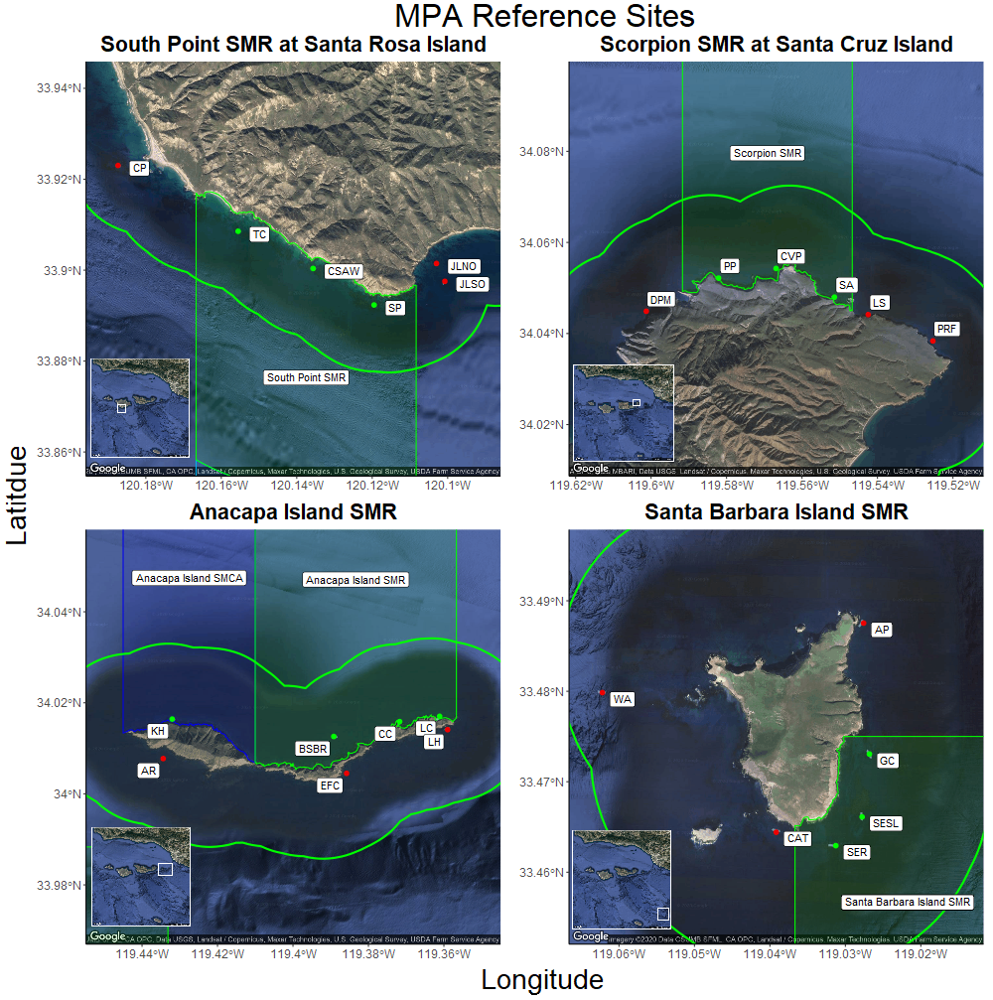

```{r tables, include=FALSE}
knitr::opts_chunk$set(echo = FALSE)
```
# Methods
## Sampling Locations

The 16 sites established in 2005 were located inside or adjacent to the following four SMRs: South Point SMR at Santa Rosa Island, Scorpion SMR at Santa Cruz Island, Santa Barbara Island SMR, and the Anacapa Island SMR. Only four of the 11 newly established MPAs were selected because of limited funding and the logistical constraints of conducting this type of monitoring. The four MPAs chosen are all SMRs. These SMRs were chosen for the following reasons: accessibility, subjected to high fishing pressure prior to MPA implementation, and to make the best use of the KFM Program’s existing baseline data. New sites were established to complement existing sites so that three sites were inside, and three sites were adjacent to each of the four SMRs. Keyhole on Anacapa Island is not used for our analysis. This site was selected for monitoring because it is inside the Anacapa Island SMCA, which allows for take of pelagic finfish and California spiny lobster. This site is important for monitoring, but it was not chosen for our analysis due to the lack of replicate sites. We chose the 24 SMR reference sites to constitute the majority of our analysis. This means 12 no take sites and 12 adjacent unprotected sites. 

In special cases, data from the original 16 sites is used to compare trends inside the old Anacapa island reserve established in 1978 (Source here...) to sites which became protected in 2003 (Source MLPA here...) and to sites which have never been protected. This provides a pseudo before after control impact (BACI) analysis for certain important species. It is also important to note that the old Anacapa island reserve was expanded from BLANK acres to BLANK acres in 2003 along with the implementation of the MPAs established in 2003. 


 `r CHIS_MPA_map_fig` South Point SMR at Santa Rosa Island (top left), Scorpion SMR at Santa Cruz Island (top right), Anacapa Island SMR at Anacapa Island (bottom left), and Santa Barbara Island SMR at Santa Barbara Island (bottom right). Within-MPA sites indicated with green points, and outside-MPA sites indicated with red points. Locations of SMRs relative to the Channel Islands indicated in insets. For a complete list of KFM sites see Appendix BLANK, table BLANK.

## Survey Methods

The Kelp Forest Monitoring Program employs many different survey methods to characterize benthic and fish communities, as well as the surrounding physical environment. Each methodology is aimed at best capturing the most precise and accurate representation of the abundance of the 71 “indicator species” and all additional species of fish. Size measurements of certain invertebrates and size estimates of most species of fish give an idea of the size frequency distribution for a select list of species. 

Given that all surveys are conducted on SCUBA at depths ranging from 4 m to 18 m, there are logistical considerations of data collection that must be taken into account when examining the locations, areas, times, and organisms that were sampled. Since the monitoring program’s inception, monitoring has taken place between May and October each year, with the exception of 2020 due to COVID-19. Each site has a permanent 100 m transect cable used to define the center of the 2,000 m² survey area.

There are seven survey methods which will be are use for this report: 1 m² quadrats, 5 m² quadrats, Band Transects, Roving Diver Fish Counts (RDFC), Fish Size Frequency (FSF), Random Point Contacts (RPC), and Natural Habitat Size Frequency (NHSF). The 1 m², 5 m², and Band surveys all characterize the abundance or percent cover of sedentary and mobile invertebrate species, cryptic fish, and algae. NHSF surveys, yield a size distribution for select invertebrates as well as giant kelp. These size distributions are then used to estimate biomass with a length to weight formula unique to each species (see L-W calculation table with sources). RDFC surveys and FSF surveys characterize the abundance and size frequency of fishes found in all habitats (cryptic, water column and canopy dwelling). From these data, fish biomass can be estimated with a length to weight formula unique to each species (see L-W calculation table with sources). 21 species of fish are chosen to represent the fish populations for biomass calculations. These 21 species were chosen if they met one or more of the following criteria: Prolific, Commonly targeted, Charismatic, or Herbivorous.

In 1 m² Quadrats, two divers sample a 2 m² area, at twelve equidistant, random meter numbers along the 100 m main transect line. Since each quadrat covers an area of 2 m², a total of 24 m² are covered between the two divers. Mean densities can be derived for each species on 1 m² Quadrats by dividing the count by the area surveyed. We multiply the mean density by 2,000 to get an estimated site level count. See table _____ for a list of species monitored by 1 m² Quadrats.

In 5 m² Quadrats, two divers sample forty 1 m wide by 5 m long quadrats, side by side, parallel and tangential to the 100 m main transect line. Since each quadrat covers an area of 5 m², a total of 200 m² are covered between the two divers. Mean densities can be derived for each species on 5 m² Quadrats by dividing the count by the area surveyed. We multiply the mean density by 2,000 to get an estimated site level count. See table _____ for a list of species monitored by 5 m² Quadrats.

In Band Transects, two divers sample a 60 m² area, at twelve equidistant, random meter numbers along the 100 m main transect line. Since each quadrat covers an area of 60 m², a total of 720 m² are covered between the two divers. Mean densities can be derived for each species on Band Transects by dividing the count by the area surveyed. We multiply the mean density by 2,000 to get an estimated site level count. See table _____ for a list of species monitored by Band Transects.

In RPCs, one surface supplied diver randomly samples 40 points, at fifteen equidistant, random meter numbers along the 100 m main transect line. Since each random meter has 40 points, a total of 600 points are covered by the diver. Percent cover can be derived for each species on RPCs by dividing the count by the total number of points and multiplying by 100. See table _____ for a list of species monitored by RPCs.

In RDFC, a minimum of three divers sample the entire transect footprint of 2,000 m², from the benthos to the canopy, in 30 minutes. Since each diver covers the entire site, a total of 2,000 m² are covered by each diver. Mean densities can be derived for each species on RDFC by dividing the sum of the counts by the total number of divers conducting the survey. See table _____ for a list of species monitored by RDFC.

In FSF, one diver samples within the entire transect footprint of 2,000 m², from the benthos to the canopy, with no time limit. Since the diver covers the entire site, a total of 2,000 m² is covered by the diver. Size frequency distributions for each species on FSF are estimated sizes to the nearest cm. All fish species can be entered for FSF, though typically small cryptic fish such as goby sizes are not estimated.

In NHSF, any number of divers sample randomly within transect footprint of 2,000 m², with no time limit. Since the diver samples randomly within the entire site so there is no specific area covered. Size frequency distributions for most species on NHSF are measured with vernier calipers to the nearest mm. Giant kelp stipes are counted per plant at 1 m above the benthos. Gorgonians are measured at the widest point to the nearest cm. See table _____ for a list of species monitored by NHSF

Some species are counted on multiple sampling protocols. Typically these species are added to a new protocol to better asses their density based on an evaluation of the previous methods ability to detect changes for those species as well as to select the "best" protocol to effectively search their habitat. These species continue to be counted on the previous protocol to provide consistency. For this analysis we selected the "best" survey method for each species for each year to include in our count data. The species which are also counted on RPCs were left in for the Simpson index calculation, but were not used for the random forest model.

Table `r Best_Proto_Table`. Protocols used for species monitored on more than one protocol.
```{r Best Protocol, results="asis"}
knitr::kable(Best_Protocol_Table)
```
Year range indicates the protocol that was selected for the species, X indicates it is also counted on that protocol, and NA indicates that species is not monitored on that protocol. See Appendix BLANK for complete species and protocol Information

## Data Analyses and Calculations

In these analyses, we began by analyzing the trends within benthic and fish communities at KFMP MPA reference sites since 2005, using community diversity and community similarity metrics, then used a machine-learning Random Forest model, and Indicator Species Analysis to identify the variables most strongly associated with MPA protection, and which species uniquely characterized each set of communities. We then compared the species identified by each approach, and analyzed biomass or density trends over time for these important species, and also compared biomass or density ratios (inside/outside MPAs) for targeted and non-targeted benthic and fish species.

For the benthic community, we compiled data from each benthic survey type described above - 1m quadrats, 5m quadrats, and band transects, and eliminated redundant species between survey types, using only the "best" survey for each species. We then corrected for sampling areas between survey types by calculating estimated total site abundances, with
$\text{density (#/m²)} * \text{2000 m²} = \text{estimated site count}$
Roving Diver Fish Counts, however, occur over the entirety of the site, so we included these counts directly. Hereafter, this dataset of "site-level" counts for each benthic and fish species, at each site, for each year, is referred to as "community data". Since Random Point Contact surveys (RPCs) are frequency, and not count data, we excluded substrate types (rock, sand, etc) and calculated percent cover for all species and taxonomic categories.

To test for differences in diversity between islands and MPA protection status, we calculated Shannon Index scores from our community dataset ( “Equations Used”) for each site and year combination, using the “vegan” package in R (Oksanen et al. 2019). Similarly, we calculated Simpson’s index (like Shannon Index, commonly used for percent cover data) from the RPCs data to analyze algal diversity. To test whether MPA reserve status, island, their interaction, or seawater temperature anomaly had a significant effect on community diversity over time, we used a pair of generalized linear mixed models with Shannon or Simpson Indices as the independent variables, Reserve Status, Island, Oceanic Nino Index (ONI), and the interaction of Reserve Status and Island as fixed effects, and Survey Year as a random effect, using the “lme4” package in R (Bates et al. 2015). From our community dataset, we then conducted non-metric multidimensional scaling (nMDS) to visualize the structure and grouping of site communities, and used analysis of similarity (ANOSIM) to test for significant differences in groupings between islands. To conduct these analyses, we used the “vegan” package in R (Oksanen et al. 2019).

Random Forest analysis is a machine-learning approach based on classification, or “decision” trees, which operate by repeatedly splitting data into two groups that are as homogeneous as possible, selecting the predictor which best discriminates amongst the data at each split, or “node”, and combines the results from this hierarchal process into a “tree” (Breiman 2001 a, b, James et al 2017). To measure which variables result in splits that are homogeneous as possible at each node, or minimize “impurity”, the model uses the Gini index, which reflects the proportion of responses in each level of a categorical variable - if the observations fall into few categories, the Gini index is low (James et al 2017). Because even a single classification tree will likely overfit the data, The Random Forest method uses an aggregation of many individual classification trees, created using bootstrap aggregation, or “bagging” (Breiman 1996), and the process described above, assigns a class for each observation based on which leaf it fell in, and after repeating this process 1000-5000 times, calculates the proportion of times each observation is assigned to a given class, and makes a final assignment for each observation based on the majority proportion (Breiman 2001b, James et al 2017). Since the model is derived from bootstrap aggregation (“bagging”), the set of data not selected in the bootstrap, known as the “out of bag” sample, is used to validate the tree by tallying the number of misclassifications, resulting in an out-of-bag error rate (Breiman 2001b, James et al 2017), which can be interpreted similarly to measures of model fit . Random Forest analyses return predictor variables ranked by their Gini Index (measure of impurity), as well as the decrease in accuracy, which measures how much worse the model performs without that variable included. Since Random Forests are a “black box” type of model (Breiman 2001b, James et al 2017), their process is often visualized using Partial dependence plots, which display the range of the predictor variable along the x axis (Breiman 2001a), and the line converges either at the top or bottom of the plot, depending on the level of the response variable. These curves can be interpreted to show the values at which a predictor variable becomes associated with levels of the response variable (James et al 2017). We used a random forest analysis on our fish and benthic community data, using biomass, or counts for species which did not have computed biomasses, as well as the RPC data measuring percent benthic cover. Since the analysis automatically accounts for the interactions between predictor variables based on the hierarchal nature of the classification tree (Breiman 2001a, James et al 2017), we also included Shannon and Simpson’s indices as measures of diversity, Island, and survey year. This process allowed us to determine the relative importance of each variable for accurately predicting reserve status based on the data, the corollary of which indicates the species most correlated with reserve status.

To complement our Random Forest analysis, we also used Indicator Species Analyses (ISA), a data-modelling approach, on the inside-MPA and outside-MPA data, respectively, to identify the species significantly associated with each island and MPA protection grouping, for each year. ISA assigns strength of association and significance values by comparing species occurrence to a permuted association level likely to occur by chance (De Caceres and Legendre, 2009). One of the advantages of ISA is that it accounts for both the abundance and frequency of species, is calculated separately for each species in the assemblage, and can be applied to many experimental designs, including a priori classifications like levels of a categorical variable (Bakker 2008, Dufrêne & Legendre 1997; McGeoch & Chown 1998). We then compiled the results from ISA from each year, and assembled paired heatmaps of inside- and outside-MPA data for each island, where a given species in a given year displays as red if it was not significant, or if significant displays as shades of green indicating the strength of association statistic. Thus, these heatmaps identify and visualize the trends in species importance over time associated with changes in community diversity and similarity. We conducted ISA tests using the “indicspecies” package in R (De Caceres and Legendre, 2009).  Rather than the Random Forest model approach, where in order to identify the most important variables associated with Reserve Status, all data were tested as explanatory variables in a tree ensemble predicting Reserve Status, the ISA can include nested factors (which allows for assumption of an underlying stochastic data process), and returns unique series’ of indicator species for inside and outside MPA communities at each island.

The value and benefits of algorithmic modeling approaches like Random Forest are that instead of assuming that the black box has an internal stochastic data process arising from nature that generates responses from predictors, as is done in the data modeling culture (Breiman 2001b), the algorithmic modeling culture considers the black box unknown and complex, making no assumptions about the data mechanism, which allows the use of large, complex datasets while providing more accurate and informative conclusions (Breiman 2001b). However, the goal of statistics is to use data to predict information about an underlying data mechanism, and “nowhere is it written on a stone tablet what kind of model should be used to solve problems involving data” (Breiman 2001b). Thus, using both algorithmic modeling and data modeling approaches (Breiman 2001b) combined provides us better insight into which species are important in terms of MPA effects – the random forest approach allows the widest range of data to be used and provides insight into the relative strength of association with Reserve Status between many variables, while the ISA returns results for fish and benthic species specific to each combination of Island and Reserve Status, allowing for more direct insight into the changing community structures at each Reserve Status and Island, and how these trends compare to those shown in community diversity and similarity over time.

Following our community-level analyses, we calculated biomass (“Equations Used”, Appendix #) for the top several species identified as significant from Random Forest and ISA. These species corresponded closely to those identified during our literature review (e.g. kelp declines, urchin proliferation, SSWD-associated star declines, and abalone declines, spiny lobster fishery effects), as well as some “iconic” and fishery-important species (e.g. garibaldi, California sheephead, kelp bass). To test whether MPA reserve status, island, their interaction, or seawater temperature anomaly had a significant effect on these species’ biomasses over time, we used a series of generalized linear mixed models with Biomass as the independent variable, Reserve Status, Island, Oceanic Nino Index (ONI), and the interaction of Reserve Status and Island as fixed effects, and Survey Year as a random effect, using the “lme4” package in R (Bates et al. 2015). We also used bootstrapping to derive 95% confidence intervals for fish and invertebrate biomass ratios between Reserve statuses (i.e. inside biomass/outside biomass) and compared these ratios between targeted and non-targeted fishery species. The bootstrapping process randomly resamples the dataset with replacement, calculates a user-defined statistic (such as the biomass ratio), iterates through this process many times, and derives a 95% confidence interval using the derived distribution’s 2.5th and 97.5th percentiles, known as the Percentile Method (Diciccio and Romano 1988). Since bootstrapping is a non-parametric process, it is capable of estimating 95% confidence intervals without requiring data transformations, and provides a more accurate estimate of the data’s underlying distribution than lumped averages based on small sample sizes that would otherwise arise using traditional methods (n=4, one inside/outside ratio calculated per island per year). For our bootstrapping process, we calculated biomass ratios for each bootstrap subsample (equal numbers of inside and outside MPA sites were sampled in each bootstrap iteration) for 1000 iterations using the “boot” package in R (Canty and Ripley 2020), and assessed significance by comparing whether our confidence intervals contained 1 (equal biomasses inside and outside reserves). Since dividing by or with zero results in undefined values, we removed any species each year where biomass was zero for all inside or outside- MPA sites. We arranged these results by fishery-targeted and non-targeted species, as well as trophic level, which provided further insight into the effects of fishing protection on fish community structure.

While the main thrust of this report was to quantify the effects of MPAs since their implementation, understanding the changes following implementation requires also understanding the trends prior. To visualize these changes, we filtered density data for the original 16 study sites, and included all years' data since the program began in 1982. We produced density plots with data separated by island, which is an analogous visualization to the center plots in the sets shown for the quanitative analyses post-2005, except that they also include San Miguel Island. 


### Equations Used

$\text{Shannon's Diversity Index} = -\sum\limits_{i=1}^{s} \ P_i * ln(P_i)$

Where

+ $s$ is the total number of species in the community (species richness)
+ $P_i$ is the proportion of the total # of individuals in the community of species $i$

$\text{Biomass} = \sum\limits_{i=1}^{n} \frac{c}{n} * b * d$

Where

+ $c$ is the total number at a given size
+ $n$ is the total number measured
+ $b$ is the biomass in grams for an individual at a given size (Appendix #)
+ $d$ is the density in #/$m^{2}$ for a given site, species, and year

$\text{Foliar Standing Crop} = 0.0848*\sum\limits_{i=1}^{n} \frac{c}{n} * d$

Where

+ $0.0848$ is the regression coefficient relating stipe density to foliar standing crop (after Rassweiler et al. 2018)
+ $c$ is the total stipe count at a given size
+ $n$ is the total stipe count
+ $d$ is the density in #/$m^{2}$ for a given site, species, and year

MODELS section ---- See package "equatiomatic" for doing this automatically

